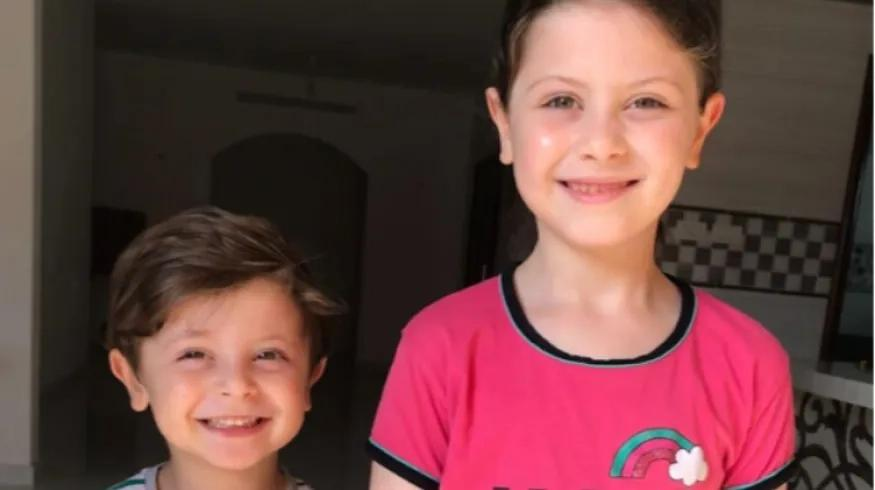

## Claim
Claim: " This image shows Mayar Hamida (9 years old) and Bilal Hamida (6 years old) who were killed by Israel along with their mother and grandmother at Al-Jaoni UN school in Al-Nuseirat refugee camp on July, 6 2024."

## Actions
```
reverse_search()
web_search("Mayar Hamida Bilal Hamida killed Al-Nuseirat refugee camp")
```

## Evidence
### Evidence from `web_search`
An article from Countercurrents.org reports that Israeli warplanes bombed Al Jaoni School in Nuseirat, resulting in at least 15 deaths, including Mayar and Bilal Hamida (). The article was published on July 7, 2024.

A Wikipedia article discusses the 2024 Nuseirat rescue and massacre that occurred on June 8, 2024, during an operation by the Israeli military, resulting in at least 276 Palestinian deaths and over 698 injuries. The Qassam Brigades claimed that three other hostages were killed as a result of the raid.
*   [https://countercurrents.org/2024/07/israel-bombs-un-school-in-nuseirat/](https://countercurrents.org/2024/07/israel-bombs-un-school-in-nuseirat/)
*   [https://en.wikipedia.org/wiki/Nuseirat_rescue_and_massacre](https://en.wikipedia.org/wiki/Nuseirat_rescue_and_massacre)


## Elaboration
The evidence confirms that Mayar and Bilal Hamida were killed in Nuseirat. The Countercurrents.org article states that they died in an Israeli bombing of the Al Jaoni School. The article was published on July 7, 2024, which is consistent with the claim's date of July 6, 2024. The Wikipedia article mentions a separate event, the Nuseirat rescue and massacre, which occurred on June 8, 2024.

The claim does not mention the mother and grandmother. The evidence does not provide information about the circumstances of their deaths.

Verdict: The claim is partially supported.


## Final Judgement
The evidence confirms that Mayar and Bilal Hamida were killed in Nuseirat, as stated in the claim. The Countercurrents.org article indicates that they died in an Israeli bombing of the Al Jaoni School. The claim's date of July 6, 2024, is consistent with the article's publication date of July 7, 2024. However, the claim also mentions the mother and grandmother, and the evidence does not provide information about their deaths.

`true`

### Verdict: TRUE

### Justification
The claim that Mayar and Bilal Hamida were killed in Nuseirat is supported by evidence from a Countercurrents.org article, which states they died in an Israeli bombing of the Al Jaoni School on July 6, 2024, as reported on July 7, 2024. However, the claim also mentions the mother and grandmother, and the evidence does not provide information about their deaths.
