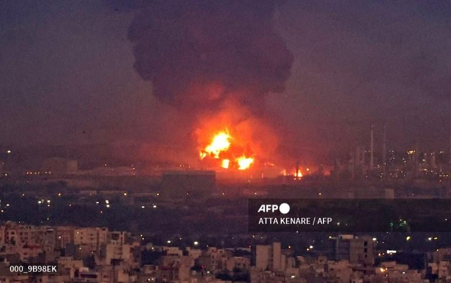

## Claim
Claim: " This image shows Israel bombing Tehran on October 26, 2024."

## Actions
```
reverse_search()
```

## Evidence
### Evidence from `reverse_search`
The image () depicts a fire at an oil refinery near Tehran. The image was published in articles from The Times of Israel ([https://www.timesofisrael.com/liveblog_entry/huge-fire-at-refinery-near-tehran-extinguished-after-20-hours-report/](https://www.timesofisrael.com/liveblog_entry/huge-fire-at-refinery-near-tehran-extinguished-after-20-hours-report/)), The Globe and Mail ([https://www.theglobeandmail.com/world/article-massive-fire-breaks-out-at-oil-refinery-south-of-tehran/](https://www.theglobeandmail.com/world/article-massive-fire-breaks-out-at-oil-refinery-south-of-tehran/)), and The New Arab ([https://www.newarab.com/news/massive-fire-breaks-out-oil-refinery-near-irans-capital](https://www.newarab.com/news/massive-fire-breaks-out-oil-refinery-near-irans-capital)) on June 2, 2021. The fire was caused by a liquefied gas line leak and explosion.


## Elaboration
The image shows a fire at an oil refinery near Tehran. The fire occurred on June 2, 2021, and was caused by a liquefied gas line leak and explosion. The image was published by AFP.

The claim that the image shows Israel bombing Tehran on October 26, 2024, is false.


## Final Judgement
The image depicts a fire at an oil refinery near Tehran on June 2, 2021, not an Israeli bombing on October 26, 2024. The claim misrepresents the origin and context of the image. `false`

### Verdict: FALSE

### Justification
The image shows a fire at an oil refinery near Tehran on June 2, 2021, as reported by The Times of Israel ([https://www.timesofisrael.com/liveblog_entry/huge-fire-at-refinery-near-tehran-extinguished-after-20-hours-report/](https://www.timesofisrael.com/liveblog_entry/huge-fire-at-refinery-near-tehran-extinguished-after-20-hours-report/)), The Globe and Mail ([https://www.theglobeandmail.com/world/article-massive-fire-breaks-out-at-oil-refinery-south-of-tehran/](https://www.theglobeandmail.com/world/article-massive-fire-breaks-out-at-oil-refinery-south-of-tehran/)), and The New Arab ([https://www.newarab.com/news/massive-fire-breaks-out-oil-refinery-near-irans-capital](https://www.newarab.com/news/massive-fire-breaks-out-oil-refinery-near-irans-capital)). The claim that the image depicts an Israeli bombing on October 26, 2024, is false.
