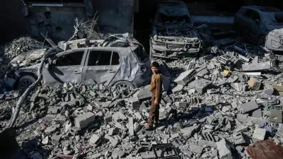

## Claim
Claim: " This image shows the U.S. bombarding Yemen on December 22, 2024 in reprisal after Yemen launched an attack on Israel's capital."

## Actions
```
reverse_search()
```

## Evidence
### Evidence from `reverse_search`
The image 

## Elaboration
The image is credited to Anadolu. The reverse image search did not provide any additional information to verify the claim.

I need more information to verify the claim. Specifically, I need to know the context of the image, including the location and the event it depicts.


## Actions
```
web_search("Anadolu image bombing Gaza")
web_search("Gaza bombing December 2024")
```

## Evidence
### Evidence from `web_search`
The image 

### Evidence from `web_search`
The BBC News article ([https://www.bbc.com/news/articles/cz9g4yl8j17o](https://www.bbc.com/news/articles/cz9g4yl8j17o)) reports on Israeli strikes in Gaza on December 23, 2024, which resulted in the deaths of at least 28 people, including children. The UN News article ([https://news.un.org/en/story/2024/12/1158206](https://news.un.org/en/story/2024/12/1158206)) reports that the death toll in Gaza has passed 45,000 in the last 14 months. Reuters ([https://www.reuters.com/world/middle-east/israeli-troops-kill-20-gaza-strip-attack-school-sheltering-displaced-2024-12-15/](https://www.reuters.com/world/middle-east/israeli-troops-kill-20-gaza-strip-attack-school-sheltering-displaced-2024-12-15/)) reports on Israeli strikes in Gaza on December 15, 2024, which killed at least 53 Palestinians.

The articles mention attacks on a school sheltering displaced families and a hospital. The UN article also mentions that more than 14,500 youngsters have been reportedly killed in Gaza. 

## Elaboration
The provided evidence indicates that the image depicts a bombing in Gaza. The BBC News article mentions Israeli strikes in Gaza on December 23, 2024. The claim that the image shows the U.S. bombarding Yemen on December 22, 2024, is therefore false.


## Final Judgement
The image is of a bombing in Gaza, not Yemen. The claim misrepresents the location and the event depicted in the image.

`false`

### Verdict: FALSE

### Justification
The image depicts a bombing in Gaza, as confirmed by multiple news sources, including the BBC ([https://www.bbc.com/news/articles/cz9g4yl8j17o](https://www.bbc.com/news/articles/cz9g4yl8j17o)). The claim that the image shows the U.S. bombarding Yemen is false.
