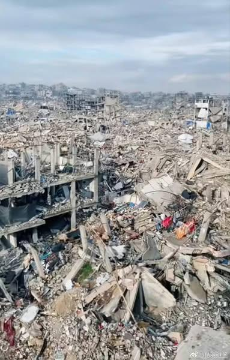

## Claim
Claim: "In March 2025, U.S. Immigration and Customs Enforcement (ICE) agents arrested and detained Palestinian activist Mahmoud Khalil, a lawful permanent resident of the U.S."

## Actions
```
web_search("Mahmoud Khalil ICE arrest March 2025")
web_search("Mahmoud Khalil Palestinian activist ICE")
```

## Evidence
### Evidence from `web_search`
According to Wikipedia, U.S. Immigration and Customs Enforcement (ICE) agents arrested and detained Palestinian activist Mahmoud Khalil on March 8, 2025, who is a lawful permanent resident of the U.S. [https://en.wikipedia.org/wiki/Detention_of_Mahmoud_Khalil]. The ACLU published a press release stating that ICE arrested Mahmoud Khalil in March 2025, and his legal team said that ICE unconstitutionally arrested Khalil in retaliation for his defense of Palestinian rights [https://www.aclu.org/press-releases/new-footage-confirms-ice-lied-and-had-no-reason-to-detain-mahmoud-khalil].

CNN published an article on July 11, 2025, discussing the ICE detention of Palestinian activist Mahmoud Khalil , , . The article mentions protests against his arrest and his claims of being treated poorly in detention.


### Evidence from `web_search`
The BBC published an article on June 20, 2025, about Mahmoud Khalil, a Palestinian activist and Columbia University graduate, facing deportation from the U.S. after being arrested by immigration agents (, , ). The arrest was linked to Trump's promise to crack down on student demonstrators. Khalil was arrested in 2024 and held for three months before a judge ruled he must be released. [Source](https://www.bbc.com/news/articles/cgj5nlxz44yo)

CNN published an article on June 13, 2025, stating that Mahmoud Khalil, a Palestinian activist and lawful permanent resident, remains in ICE detention (<image:k>). The article mentions that Khalil was arrested outside his apartment on Columbia University’s campus in March. [Source](https://www.cnn.com/2025/06/13/us/mahmoud-khalil-detention-ice-court)


## Elaboration
The claim is supported by the evidence. Multiple sources, including Wikipedia, the ACLU, and CNN, confirm that ICE arrested Mahmoud Khalil, a lawful permanent resident, in March 2025. The BBC article states that Khalil was arrested by immigration agents and was facing deportation.


## Final Judgement
The evidence from multiple sources, including Wikipedia, the ACLU, CNN, and the BBC, confirms that ICE arrested Palestinian activist Mahmoud Khalil, a lawful permanent resident, in March 2025. The BBC article also mentions that Khalil was facing deportation.

`true`


### Verdict: TRUE

### Justification
Multiple sources, including Wikipedia ([https://en.wikipedia.org/wiki/Detention_of_Mahmoud_Khalil](https://en.wikipedia.org/wiki/Detention_of_Mahmoud_Khalil)), the ACLU ([https://www.aclu.org/press-releases/new-footage-confirms-ice-lied-and-had-no-reason-to-detain-mahmoud-khalil](https://www.aclu.org/press-releases/new-footage-confirms-ice-lied-and-had-no-reason-to-detain-mahmoud-khalil)), and CNN, confirm that ICE arrested Mahmoud Khalil, a lawful permanent resident, in March 2025. The BBC also reported on his arrest and potential deportation.
