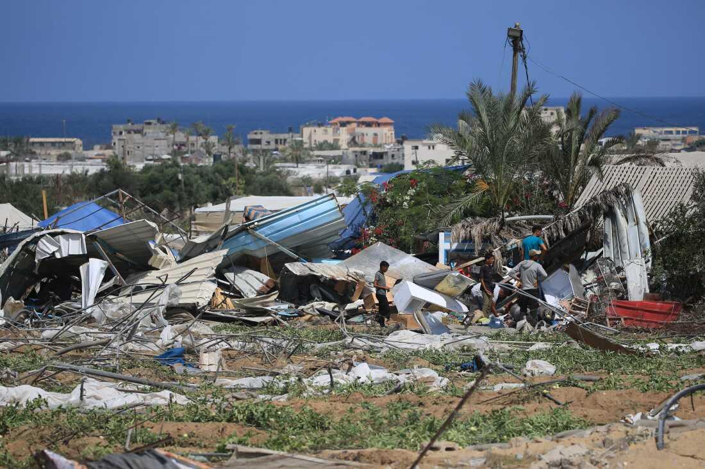
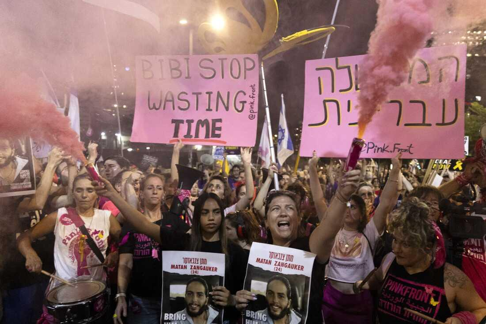
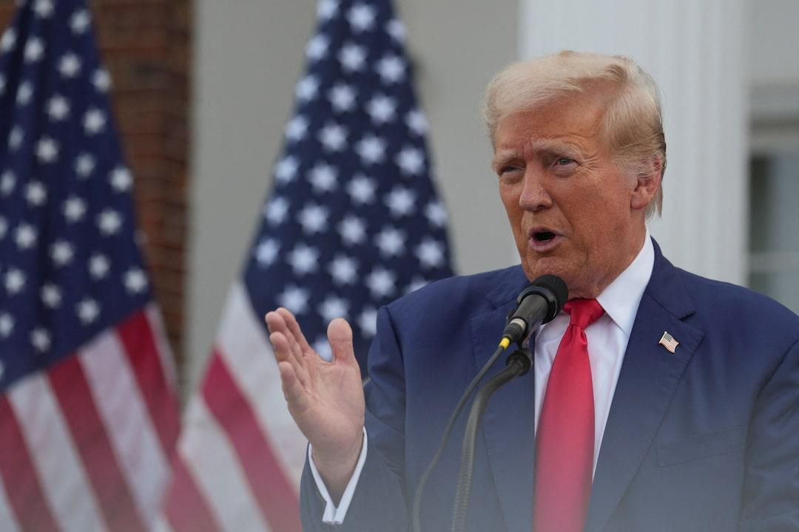

## Claim
Claim: "In a phone call with Benjamin Netanyahu on August 14, 2024, Donald Trump told the Israeli prime minister to stop a Gaza ceasefire deal because it would help Vice President Kamala Harris' 2024 presidential campaign."

## Actions
```
web_search("Donald Trump Benjamin Netanyahu phone call August 14 2024 Gaza ceasefire")
web_search("Donald Trump told Netanyahu stop Gaza ceasefire Kamala Harris 2024")
```

## Evidence
### Evidence from `web_search`
Reuters ([Source](https://www.reuters.com/world/trump-netanyahu-speak-about-gaza-hostage-ceasefire-deal-axios-reports-2024-08-15/)) reports that Donald Trump and Benjamin Netanyahu spoke on August 14, 2024, discussing a Gaza ceasefire and hostage release deal . Newsweek ([Source](https://www.newsweek.com/donald-trump-accused-crime-benjamin-netanyahu-call-ceasefire-hamas-1942248)) states that Trump was accused of violating federal law for allegedly urging Netanyahu not to make a deal because it would help Kamala Harris' campaign, but both Trump and Netanyahu denied the call. NPR ([Source](https://www.npr.org/2024/08/14/g-s1-16958/gaza-ceasefire-talks-israel-hamas)) published an article on August 14, 2024, discussing the resumption of Gaza cease-fire talks , , .


### Evidence from `web_search`
According to The Times of Israel, Donald Trump told Benjamin Netanyahu he wants the war in Gaza to end before he returns to office if he wins the election. This message was first conveyed in July at Mar-a-Lago. The article does not mention a phone call on August 14, 2024, nor does it mention Kamala Harris's 2024 presidential campaign. ([https://www.timesofisrael.com/trump-told-netanyahu-he-wants-gaza-war-over-by-time-he-enters-office-sources/](https://www.timesofisrael.com/trump-told-netanyahu-he-wants-gaza-war-over-by-time-he-enters-office-sources/)) , 

Reuters reports that on August 15, 2024, Trump criticized calls for a ceasefire in Gaza by Biden and Harris. Trump and Netanyahu denied an Axios report that they spoke about a Gaza ceasefire the previous day. ([https://www.reuters.com/world/netanyahu-denies-report-he-spoke-trump-about-gaza-talks-2024-08-15/](https://www.reuters.com/world/netanyahu-denies-report-he-spoke-trump-about-gaza-talks-2024-08-15/))  The BBC reports that on July 26, 2024, Benjamin Netanyahu visited Donald Trump at Mar-a-Lago. The article does not mention a phone call on August 14, 2024, or Trump telling Netanyahu to stop a Gaza ceasefire deal. ([https://www.bbc.com/news/articles/czq6v9jx939o](https://www.bbc.com/news/articles/czq6v9jx939o))


## Elaboration
The evidence indicates that Donald Trump and Benjamin Netanyahu spoke on August 14, 2024, and discussed a Gaza ceasefire and hostage release deal. However, both Trump and Netanyahu denied the report that they spoke about a Gaza ceasefire. Newsweek states that Trump was accused of urging Netanyahu not to make a deal because it would help Kamala Harris' campaign, but this is an accusation, and the claim is denied.

The evidence does not confirm that Trump told Netanyahu to stop a Gaza ceasefire deal because it would help Kamala Harris' 2024 presidential campaign.


## Final Judgement
The claim is not supported by the evidence. While there was a phone call between Trump and Netanyahu on August 14, 2024, the claim that Trump told Netanyahu to stop a Gaza ceasefire deal because it would help Kamala Harris' 2024 presidential campaign is an accusation that both Trump and Netanyahu denied. `false`

### Verdict: FALSE

### Justification
The claim is not supported by the evidence. While there was a phone call between Donald Trump and Benjamin Netanyahu on August 14, 2024, discussing a Gaza ceasefire, both Trump and Netanyahu denied the report that Trump told Netanyahu to stop a Gaza ceasefire deal because it would help Kamala Harris' 2024 presidential campaign, as reported by [Newsweek](https://www.newsweek.com/donald-trump-accused-crime-benjamin-netanyahu-call-ceasefire-hamas-1942248).
