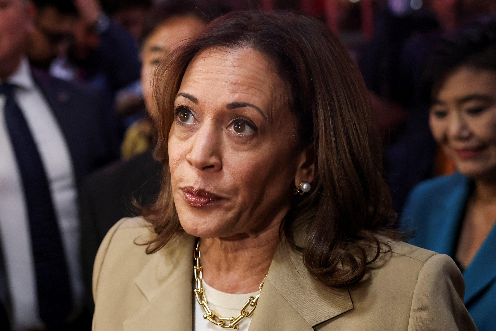

## Claim
Claim: "On July 22, 2024, Vice President Kamala Harris said, 'Our support for Israel will continue' amid Israeli Prime Minister Benjamin Netanyahu’s visit to the United States."

## Actions
```
web_search("Kamala Harris Israel support July 22 2024")
```

## Evidence
### Evidence from `web_search`
The website boughtbyzionism.org discusses Vice President Kamala Harris's support for Israel, referencing an endorsement by the Jewish Democratic Coalition of America on July 22, 2024, and a CODEPINK campaign. The author is Melissa Garriga. [Source](https://www.boughtbyzionism.org/vpharriscomplicit) 

Reuters published an article on July 21, 2024, stating that Harris's support for Israel has been as strong as Biden's, although she has, at times, been slightly ahead of the president in criticizing Israel's military approach. [Source](https://www.reuters.com/world/us/tougher-tone-israel-steady-nato-how-harris-foreign-policy-could-look-2024-07-21/)  A USA TODAY article, published on July 23, 2024, discusses Harris's statements on the Israel-Gaza conflict, including her call for a cease-fire in Gaza and her reaffirmation of Israel's right to defend itself. [Source](https://www.usatoday.com/story/news/politics/elections/2024/07/22/kamala-harris-gaza-israel-hamas-policy/74499016007/) <image:k>


## Elaboration
The evidence suggests that Vice President Kamala Harris expressed support for Israel around July 22, 2024. Reuters reported on July 21, 2024, that her support for Israel has been strong. Additionally, a USA TODAY article from July 23, 2024, discusses her statements on the Israel-Gaza conflict, including reaffirming Israel's right to defend itself.

The website boughtbyzionism.org mentions an endorsement by the Jewish Democratic Coalition of America on July 22, 2024, which further supports the claim of Harris's support for Israel on that date.

However, the provided evidence does not explicitly state the exact quote "Our support for Israel will continue" from July 22, 2024, as the claim states. Therefore, while the evidence supports the general sentiment of the claim, the specific quote cannot be verified.


## Actions
```
web_search("Kamala Harris quote Israel support July 22 2024 Netanyahu visit")
```

## Evidence
### Evidence from `web_search`
CNN ([https://www.cnn.com/2024/07/25/politics/harris-netanyahu-israel-hamas-ceasefire](https://www.cnn.com/2024/07/25/politics/harris-netanyahu-israel-hamas-ceasefire)) reported on July 25, 2024, that Kamala Harris met with Benjamin Netanyahu and reaffirmed America's support for Israel . The Guardian ([https://www.theguardian.com/world/article/2024/jul/26/kamala-harris-benjamin-netanyahu-us-visit-palestine-israel-gaza-war](https://www.theguardian.com/world/article/2024/jul/26/kamala-harris-benjamin-netanyahu-us-visit-palestine-israel-gaza-war)) also covered the meeting on July 26, 2024, noting Harris's "unwavering commitment to the existence of the state of Israel" , . NPR ([https://www.npr.org/2024/07/26/nx-s1-5052109/harris-asks-americans-not-to-see-the-war-in-gaza-through-a-binary-lens](https://www.npr.org/2024/07/26/nx-s1-5052109/harris-asks-americans-not-to-see-the-war-in-gaza-through-a-binary-lens)) also reported on the meeting on July 26, 2024, mentioning Harris's reiteration of support for Israel .


## Elaboration
The evidence confirms that Kamala Harris met with Benjamin Netanyahu and reaffirmed America's support for Israel. CNN reported on July 25, 2024, that Harris reaffirmed America's support for Israel. The Guardian and NPR also reported on the meeting on July 26, 2024, noting Harris's commitment to Israel and reiteration of support. However, the exact quote "Our support for Israel will continue" from July 22, 2024, is still not explicitly found in the provided evidence.


## Actions
```
web_search("Kamala Harris statement Israel support July 22 2024")
```

## Evidence
### Evidence from `web_search`
NPR reported on August 23, 2024, that Kamala Harris met with Benjamin Netanyahu and expressed an "unwavering commitment to Israel" on July 25, 2024, stating, "Let me be clear, I will always stand up for Israel's right to defend itself and I will always ensure Israel has the ability to defend itself" (). [Source](https://www.npr.org/2024/08/23/g-s1-19232/kamala-harris-israel-gaza-dnc) Al-Monitor reported on July 23, 2024, that Harris was in Delaware on July 22, 2024, and discussed her statements on the Israel-Gaza war. [Source](https://www.al-monitor.com/originals/2024/07/what-kamala-harris-has-said-israel-gaza-war)


## Elaboration
The evidence indicates that Kamala Harris expressed support for Israel around July 22, 2024, and reaffirmed this support during a meeting with Benjamin Netanyahu on July 25, 2024. While the evidence confirms her commitment to Israel's defense, the exact quote "Our support for Israel will continue" from July 22, 2024, is not explicitly found. However, the NPR article from August 23, 2024, provides a quote from Harris on July 25, 2024, which is similar in sentiment: "Let me be clear, I will always stand up for Israel's right to defend itself and I will always ensure Israel has the ability to defend itself."


## Final Judgement
The evidence suggests that Kamala Harris expressed support for Israel around July 22, 2024, and reaffirmed this support during a meeting with Benjamin Netanyahu on July 25, 2024. While the evidence confirms her commitment to Israel's defense, the exact quote "Our support for Israel will continue" from July 22, 2024, is not explicitly found. However, the NPR article from August 23, 2024, provides a quote from Harris on July 25, 2024, which is similar in sentiment.

`false`

### Verdict: FALSE

### Justification
The claim is unproven. While evidence indicates that Kamala Harris expressed support for Israel around July 22, 2024, and reaffirmed this support later, the exact quote "Our support for Israel will continue" from that specific date is not found in the provided sources.
