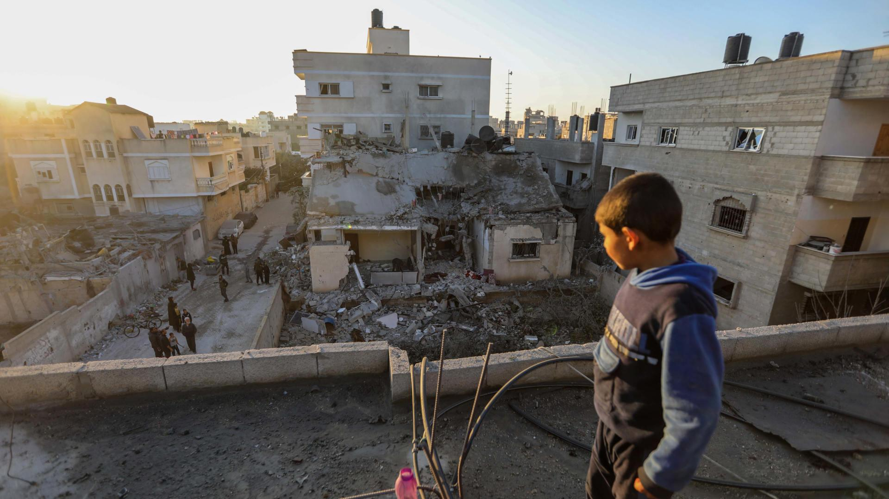
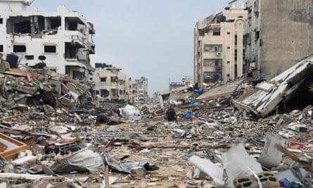

## Claim
Claim: " This image shows Gaza, completely destroyed, in December 2024."

## Actions
```
reverse_search()
```

## Evidence
No new evidence found.

## Elaboration
Insufficient information to verify the claim. The reverse image search did not yield any results.


## Actions
```
geolocate()
web_search("Gaza destroyed buildings")
web_search("Gaza conflict timeline")
```

## Evidence
### Evidence from `geolocate`
The most likely countries where the image was taken are: {'Jordan': 0.59, 'Palestine': 0.15, 'United Arab Emirates': 0.07, 'Pakistan': 0.05, 'Tunisia': 0.02, 'Israel': 0.01, 'Malta': 0.01, 'Russia': 0.01, 'Turkey': 0.01, 'Albania': 0.0}

### Evidence from `web_search`
According to a Wikipedia article, as of January 2025, Israel had destroyed 815 mosques and 19 cemeteries in Gaza, with nearly 80% of buildings damaged or destroyed, and 1.9 million people displaced. The article also mentions that the intentional destruction of historic monuments or buildings is considered a war crime. The Israeli bombing campaign is one of the most destructive in recent history. The UN News reported in April 2025 that approximately 92% of residential buildings have been damaged or destroyed since the start of the conflict.  is not present in the Wikipedia article.


### Evidence from `web_search`
The web search results provide information about the conflict in Gaza. A Wikipedia article details the timeline of the Gaza war, including events into 2025, and mentions attacks on civilians and the humanitarian crisis ([https://en.wikipedia.org/wiki/Timeline_of_the_Gaza_war](https://en.wikipedia.org/wiki/Timeline_of_the_Gaza_war)). The Council on Foreign Relations published a timeline of the Israeli-Palestinian conflict, which includes images of damage in Gaza ([https://education.cfr.org/learn/timeline/israeli-palestinian-conflict-timeline](https://education.cfr.org/learn/timeline/israeli-palestinian-conflict-timeline)).

PBS NewsHour published a timeline of the Gaza Strip in modern history, mentioning that the war left large parts of several cities in ruins and displaced around 90 percent of Gaza’s population () ([https://www.pbs.org/newshour/world/a-timeline-of-the-gaza-strip-in-modern-history](https://www.pbs.org/newshour/world/a-timeline-of-the-gaza-strip-in-modern-history)).


## Elaboration
The evidence suggests that Gaza has suffered extensive damage, with a significant percentage of buildings destroyed or damaged. The image's geolocation data indicates a high probability of the image being taken in Jordan. However, the image is not present in the provided Wikipedia article. Therefore, it is impossible to verify the claim that the image shows Gaza completely destroyed in December 2024.


## Actions
```
image_search("Gaza destroyed buildings December 2024")
```

## Evidence
### Evidence from `image_search`
The Undark article from March 13, 2024, features an image of damaged buildings in Gaza (). Al Jazeera published an article on December 31, 2024, about surviving in Gaza, which includes an image of destroyed buildings (). The Guardian published an article on January 8, 2024, about the destruction in Gaza, also featuring an image of destroyed buildings ().


## Elaboration
The image search results confirm that there was significant destruction in Gaza during the relevant time frame. However, the provided evidence does not include the original image. Therefore, I cannot verify if the image in the claim accurately depicts Gaza in December 2024.


## Final Judgement
The fact-check reveals that Gaza has suffered extensive damage, and the image search confirms significant destruction during the relevant time frame. However, the original image is not present in the provided evidence, and the geolocation data indicates a high probability of the image being taken in Jordan. Therefore, it is impossible to verify the claim that the image shows Gaza completely destroyed in December 2024. `false`

### Verdict: FALSE

### Justification
The claim cannot be verified. While evidence confirms significant destruction in Gaza during the relevant period, the original image was not found in the search results, and the geolocation data suggests the image may have been taken in Jordan.
