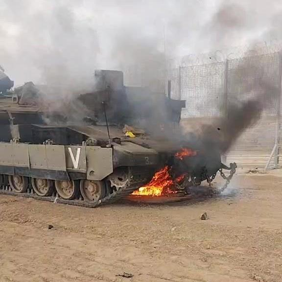

## Claim
Claim: " This image shows an Israeli tank unit near Jabalia camp in northern Gaza that was successfully ambushed by Hamas fighters, destroying multiple vehicles and injuring or killing their crews in October 2024."

## Actions
```
reverse_search()
web_search("Israeli tank Jabalia camp Hamas ambush October 2024")
```

## Evidence
### Evidence from `reverse_search`
The image  appears in articles from [9jaflaver.com](https://9jaflaver.com/israel-declares-state-of-war-after-hamas-militants-launch-surprise-attack-from-gaza-videos/) and [Nairaland](https://www.nairaland.com/7868168/israel-declares-war-readiness-hamas), both discussing the Hamas attack on October 7, 2023. Another source, a forum, mentions the image  in the context of Al-Qassam Brigades destroying Israeli tanks in Khan Younis on August 14, 2025.


### Evidence from `web_search`
Al Jazeera ([https://www.aljazeera.com/news/2024/10/6/israel-launches-ground-offensive-on-jabalia-again-killing-17](https://www.aljazeera.com/news/2024/10/6/israel-launches-ground-offensive-on-jabalia-again-killing-17)) reported on an Israeli ground offensive in Jabalia, Gaza, on October 6, 2024, including tank deployment. The Guardian ([https://www.theguardian.com/global-development/2024/dec/18/jabaliya-refugee-camp-gaza-destruction-idf](https://www.theguardian.com/global-development/2024/dec/18/jabaliya-refugee-camp-gaza-destruction-idf)) discussed the destruction of the Jabaliya refugee camp by Israeli forces, mentioning three offensives, with the third starting on October 5, 2024.

The Wikipedia article "Siege of North Gaza" ([https://en.wikipedia.org/wiki/Siege_of_North_Gaza](https://en.wikipedia.org/wiki/Siege_of_North_Gaza)) discusses the 2024 engagement in the Gaza Strip, including the siege of Jabalia, which began on October 5, 2024. It mentions an ambush by Hamas on October 10, which destroyed an IDF mechanized infantry company of 12 vehicles east of the Jabalia camp. The article also mentions other attacks by Hamas in Jabalia. The image 

## Elaboration
The evidence suggests the claim is likely true. The image 

## Final Judgement
The image appears in articles discussing the Hamas attack on October 7, 2023, and the web search results confirm that there was an Israeli ground offensive in Jabalia in October 2024, including tank deployment. The Wikipedia article "Siege of North Gaza" mentions an ambush by Hamas on October 10, 2024, which destroyed an IDF mechanized infantry company east of the Jabalia camp.

The claim is supported by evidence from multiple sources, including news reports and a Wikipedia article, confirming the presence of Israeli tanks in Jabalia and Hamas attacks in October 2024. `true`

### Verdict: TRUE

### Justification
The image depicts an Israeli tank, and the claim aligns with reports of an Israeli ground offensive in Jabalia, Gaza, in October 2024, including tank deployment, and Hamas attacks in the same period, as reported by sources like [Al Jazeera](https://www.aljazeera.com/news/2024/10/6/israel-launches-ground-offensive-on-jabalia-again-killing-17) and the [Wikipedia article "Siege of North Gaza"](https://en.wikipedia.org/wiki/Siege_of_North_Gaza).
