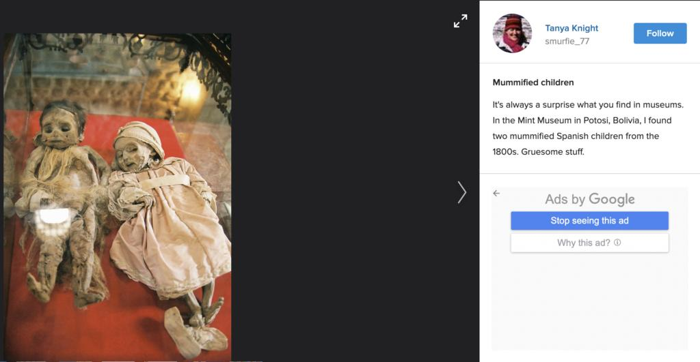

## Claim
Claim: " This image shows two children in Gaza in April 2025 found dead under the rubble of their home two months after an Israeli airstrike destroyed it."

## Actions
```
reverse_search()
web_search("children found rubble home Gaza Israeli airstrike")
```

## Evidence
### Evidence from `reverse_search`
From [Source](https://kashif.ps/en/index.php/2025/04/14/image-of-two-mummified-children-in-a-bolivian-museum-goes-viral-as-from-gaza/): Found exact image on website with title: Image of two mummified children in a Bolivian museum goes viral as ...
Content: The image in the claim is of two mummified children in a Bolivian museum, not children found in Gaza. The image was posted on Instagram with the caption "Two children found two months later under the rubble of their home." The image was originally posted on Fliker on December 25, 2006, and shows two mummified Spanish children from the 19th century at the Mint Museum in Potosi, Bolivia. , , . The article was published on April 14, 2025.


### Evidence from `web_search`
The PBS News article from March 20, 2025, discusses an Israeli airstrike in Khan Younis, Gaza, that killed at least 16 people, mostly women and children, and mentions a month-old girl was pulled from the rubble (). The New Arab published on June 3, 2025, reports on a baby rescued from the rubble of a home in Gaza after an Israeli airstrike (<image:i>). The BBC News article from January 31, 2024, discusses the situation of orphaned children in Gaza due to the ongoing war, mentioning that many children have been found under the rubble or have lost their parents in bombings, and includes images of a newborn baby girl () and an orphaned child, Abed Hussein ().

The articles can be found at the following URLs: [https://www.pbs.org/newshour/world/month-old-girl-pulled-from-rubble-in-gaza-after-airstrike-killed-her-parents](https://www.pbs.org/newshour/world/month-old-girl-pulled-from-rubble-in-gaza-after-airstrike-killed-her-parents), [https://www.newarab.com/news/baby-pulled-alive-rubble-after-israeli-strike-gaza](https://www.newarab.com/news/baby-pulled-alive-rubble-after-israeli-strike-gaza), and [https://www.bbc.com/news/world-middle-east-68141039](https://www.bbc.com/news/world-middle-east-68141039).


## Elaboration
The claim is false. The image in the claim is of mummified children from a Bolivian museum, not children found in Gaza. The image was originally posted on Flickr in 2006.


## Final Judgement
The image in the claim is of mummified children from a Bolivian museum, not children found in Gaza. The image was originally posted on Flickr in 2006. Therefore, the claim is not factually accurate. `false`

### Verdict: FALSE

### Justification
The claim is false. The image depicts mummified children from a Bolivian museum, not children found in Gaza, as evidenced by a reverse image search ([Source](https://kashif.ps/en/index.php/2025/04/14/image-of-two-mummified-children-in-a-bolivian-museum-goes-viral-as/)).
