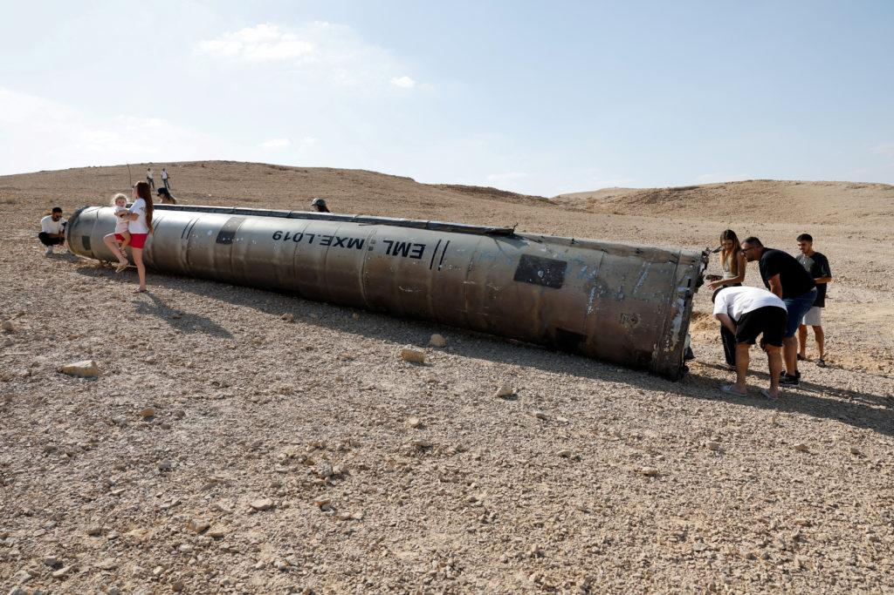

## Claim
Claim: "The Iron Dome intercepted 90% of ballistic missiles fired at Israel in Iran's attack on October 1, 2024."

## Actions
```
web_search("Iron Dome interception rate Iran attack October 1 2024")
```

## Evidence
### Evidence from `web_search`
The PBS News Hour reported on October 2, 2024, that the Iron Dome had a success rate of over 90% in intercepting missiles during the Iranian attack, which involved over 180 missiles. () [Source](https://www.pbs.org/newshour/world/israels-air-defense-system-passes-test-in-fending-off-iranian-missile-strike)

An Associated Press article from June 19, 2025, notes that while the Iron Dome's interception rates are generally high, it is not foolproof. [Source](https://apnews.com/article/israel-air-defense-f0e72fa1c1dba6bc08fcc0bfb0c5a9f0)


## Elaboration
The PBS News Hour reported that the Iron Dome had a success rate of over 90% in intercepting missiles during the Iranian attack on October 1, 2024. This aligns with the claim. However, an Associated Press article from June 19, 2025, states that the Iron Dome is not foolproof, which implies that the interception rate can vary.

Based on the evidence, the claim is likely true, as the PBS News Hour specifically mentions the 90% success rate.


## Final Judgement
The evidence from PBS News Hour supports the claim that the Iron Dome intercepted over 90% of missiles during the Iranian attack on October 1, 2024. While the Associated Press article mentions that the Iron Dome is not foolproof, it does not contradict the specific claim about the October 1, 2024 attack.

`true`


### Verdict: TRUE

### Justification
The claim is supported by a PBS News Hour report stating that the Iron Dome intercepted over 90% of missiles during the Iranian attack on October 1, 2024, which involved over 180 missiles ([Source](https://www.pbs.org/newshour/world/israels-air-defense-system-passes-test-in-fending-off-iranian-missile-strike)).
