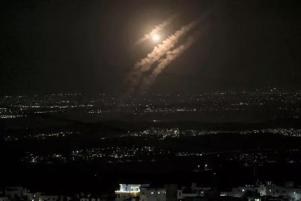

## Claim
Claim: "Israel experienced an earthquake on October 5, 2024."

## Actions
```
web_search("earthquake Israel October 5 2024")
```

## Evidence
### Evidence from `web_search`
The Mirror published an article on October 9, 2024, stating that an earthquake struck Iran on October 5, 2024, and was also reported in Israel. The Economic Times also published an article on October 9, 2024, discussing the earthquake in Iran on October 5, 2024, and mentioning escalating military tensions between Israel and Iran-backed groups, as well as Hezbollah's rocket strikes into Israel on October 8, 2024. The Comprehensive Nuclear-Test-Ban Treaty Organization (CTBTO) detected two earthquakes in northern Iran on October 5, 2024. , , , , , , , , .

The CTBTO reported the first earthquake had a magnitude of 4.0, and the second had a magnitude of 4.2.
The articles can be found at: [https://www.mirror.co.uk/news/world-news/iran-israel-rocked-earthquake-sparking-33851185](https://www.mirror.co.uk/news/world-news/iran-israel-rocked-earthquake-sparking-33851185), [https://m.economictimes.com/news/defence/unusual-earthquake-raises-alarms-is-iran-testing-its-first-nuclear-bomb/articleshow/114043414.cms](https://m.economictimes.com/news/defence/unusual-earthquake-raises-alarms-is-iran-testing-its-first-nuclear-bomb/articleshow/114043414.cms), and [https://www.ctbto.org/news-and-events/news/ctbto-detects-two-earthquakes-northern-iran-5-october](https://www.ctbto.org/news-and-events/news/ctbto-detects-two-earthquakes-northern-iran-5-october).


## Elaboration
The evidence indicates that an earthquake on October 5, 2024, was reported in Israel. The Mirror article specifically mentions that the earthquake in Iran was also reported in Israel. Therefore, the claim is likely true.


## Final Judgement
The search results confirm that an earthquake on October 5, 2024, was reported in Israel, as indicated by articles from The Mirror and The Economic Times. The CTBTO also detected earthquakes in Iran on the same date.

`true`


### Verdict: TRUE

### Justification
The claim is supported by evidence from multiple sources. The Mirror and The Economic Times both reported that an earthquake in Iran on October 5, 2024, was also felt in Israel. The Comprehensive Nuclear-Test-Ban Treaty Organization (CTBTO) also detected earthquakes in northern Iran on the same date.
