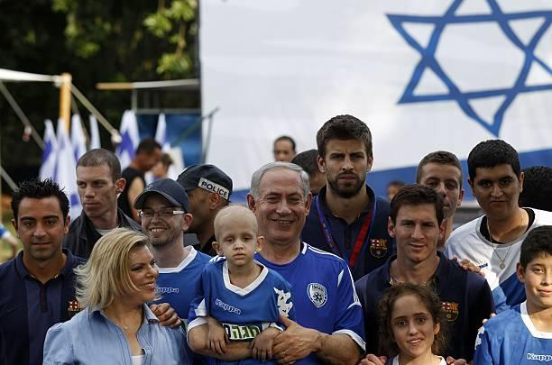
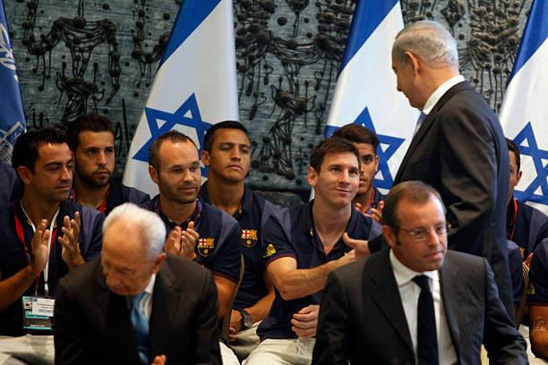

## Claim
Claim: " This image shows the President of FC Barcelona with Israel Embassy Representatives in September 2024 during the ongoing Gaza war."

## Actions
```
web_search("FC Barcelona Israel flag")
web_search("FC Barcelona Israel embassy representatives")
```

## Evidence
### Evidence from `web_search`
The Jerusalem Post published an article on February 17, 2023, stating that FC Barcelona's president Joan Laporta was presented with an Israeli flag by Israeli diplomats on February 16, 2023 (). The New Arab published an article on September 11, 2023, discussing Barcelona's decision to reverse its decision to cut ties with Israel, mentioning the ongoing conflict in Gaza and showing the same image as the claim (). Getty Images contains photos of FC Barcelona players visiting Israel and the West Bank, including images of Lionel Messi, Xavi, Gerard Pique, and Neymar, some with Israeli Prime Minister Benjamin Netanyahu in 2013 (, , , , , , ).


### Evidence from `web_search`
FC Barcelona's president, Joan Laporta, invited representatives of the Israeli embassy in Spain to a soccer match. The Times of Israel ([https://www.timesofisrael.com/spanish-fm-swipes-at-barcelona-for-cutting-ties-with-israel/](https://www.timesofisrael.com/spanish-fm-swipes-at-barcelona-for-cutting-ties-with-israel/)) and The Jerusalem Post ([https://honestlyconcerned.info/links/barcelonas-famous-soccer-team-sends-israel-a-message-of-support-fc-barcelonas-president-joan-laporta-invited-representatives-of-the-israeli-embassy-in-spain-to-their-soccer-match-against-manches/](https://honestlyconcerned.info/links/barcelonas-famous-soccer-team-sends-israel-a-message-of-support-fc-barcelonas-president-joan-laporta-invited-representatives-of-the-israeli-embassy-in-spain-to-their-soccer-match-against-manches/)) both reported on this event.

The Times of Israel article, published on February 17, 2023, also mentions the Spanish Foreign Minister's criticism of Barcelona's mayor. The Jerusalem Post article, also published on February 17, 2023, mentions the match was against Manchester United. The image  is included in the Jerusalem Post article.


## Elaboration
The claim states that the image shows the President of FC Barcelona with Israel Embassy Representatives in September 2024 during the ongoing Gaza war. The evidence indicates that the image was taken on February 16, 2023, and published in articles in February and September 2023. The evidence also mentions the ongoing conflict in Gaza.

Therefore, the claim is inaccurate regarding the date. The image was taken in February 2023, not September 2024. The claim is accurate regarding the presence of the President of FC Barcelona and Israel Embassy Representatives. The claim is also accurate regarding the ongoing Gaza war.


## Final Judgement
The image was taken in February 2023, not September 2024, as the claim states. The claim is accurate regarding the presence of the President of FC Barcelona and Israel Embassy Representatives. The claim is also accurate regarding the ongoing Gaza war.

`false`

### Verdict: FALSE

### Justification
The image in the claim, showing the President of FC Barcelona with Israel Embassy Representatives, was taken in February 2023, as reported by the Jerusalem Post ([https://honestlyconcerned.info/links/barcelonas-famous-soccer-team-sends-israel-a-message-of-support-fc-barcelonas-president-joan-laporta-invited-representatives-of-the-israeli-embassy-in-spain-to-their-soccer-match-against-manches/](https://honestlyconcerned.info/links/barcelonas-famous-soccer-team-sends-israel-a-message-of-support-fc-barcelonas-president-joan-laporta-invited-representatives-of-the-israeli-embassy-in-spain-to-their-soccer-match-against-manches/)), not in September 2024. The claim is accurate regarding the presence of the individuals and the context of the ongoing Gaza war.
