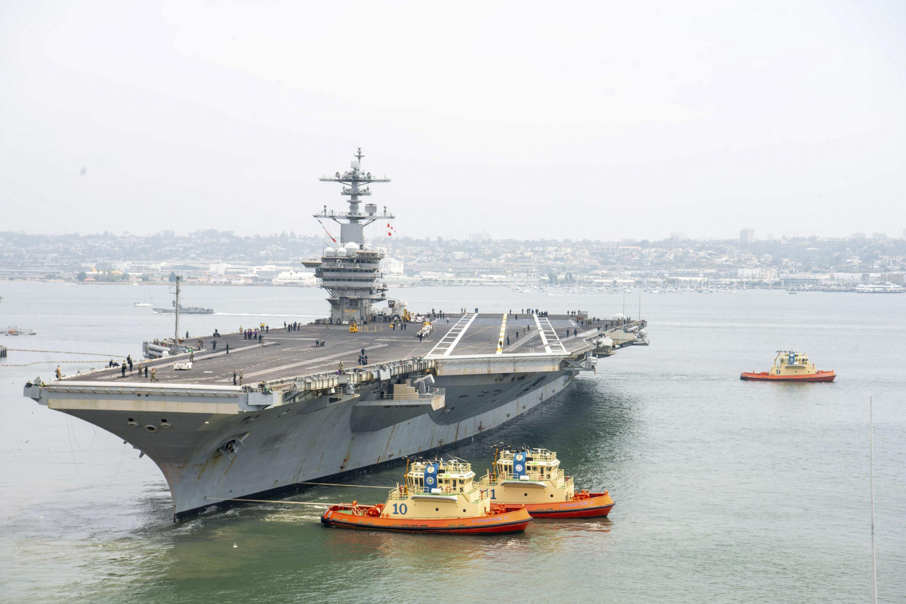

## Claim
Claim: " This image shows U.S. warships being en route to the Lebanon coast in August 2024 to support the Israel Defence Forces (IDF)."

## Actions
```
reverse_search()
web_search("US warships Lebanon coast August 2024")
```

## Evidence
### Evidence from `reverse_search`
The image shows the USS Mount Whitney (LCC 20) arriving in Kiel, Germany, on June 19, 2024, after completing BALTOPS 24, which took place in the Baltic Sea on June 8, 2024.  The image is also found on a U.S. government website and is related to the Baltic Operations 2024 exercise.

The image is not related to U.S. warships en route to the Lebanon coast in August 2024 to support the Israel Defence Forces (IDF).


### Evidence from `web_search`
NPR reported on August 3, 2024, that the U.S. is sending more warships to the Middle East as Israel steps up attacks, with Israel expecting an attack from Iran and its allies ([https://www.npr.org/2024/08/03/nx-s1-5061738/the-u-s-is-sending-more-warships-to-the-middle-east-as-israel-steps-up-attacks](https://www.npr.org/2024/08/03/nx-s1-5061738/the-u-s-is-sending-more-warships-to-the-middle-east-as-israel-steps-up-attacks)). USNI News reported on August 2, 2024, that the USS Abraham Lincoln is heading to the Middle East in response to threats from Iran, and a three-ship Wasp Amphibious Ready Group is in the Eastern Mediterranean ([https://news.usni.org/2024/08/02/carrier-uss-abraham-lincoln-heads-to-middle-east-as-iran-threatens-strikes-against-israel](https://news.usni.org/2024/08/02/carrier-uss-abraham-lincoln-heads-to-middle-east-as-iran-threatens-strikes-against-israel)). The Military Times reported on August 26, 2024, that two U.S. aircraft carriers will remain in the Middle East after a Hezbollah attack ([https://www.militarytimes.com/news/pentagon-congress/2024/08/26/two-us-aircraft-carriers-to-stay-in-middle-east-after-hezbollah-attack/](https://www.militarytimes.com/news/pentagon-congress/2024/08/26/two-us-aircraft-carriers-to-stay-in-middle-east-after-hezbollah-attack/)). , , 


## Elaboration
The image does not depict U.S. warships en route to the Lebanon coast in August 2024 to support the Israel Defence Forces (IDF). The image is related to the Baltic Operations 2024 exercise.

However, the U.S. did send more warships to the Middle East in August 2024. The USS Abraham Lincoln was heading to the Middle East, and a three-ship Wasp Amphibious Ready Group was in the Eastern Mediterranean. Two U.S. aircraft carriers were to remain in the Middle East after a Hezbollah attack.


## Final Judgement
The image provided in the claim is not related to the U.S. warships en route to the Lebanon coast in August 2024 to support the Israel Defence Forces (IDF). The image is related to the Baltic Operations 2024 exercise. While the U.S. did send more warships to the Middle East in August 2024, the image does not depict this.

`false`

### Verdict: FALSE

### Justification
The image in the claim is not related to U.S. warships en route to the Lebanon coast in August 2024. Reverse image search reveals the image is associated with the Baltic Operations 2024 exercise. While the U.S. did deploy warships to the Middle East in August 2024, as reported by [NPR](https://www.npr.org/2024/08/03/nx-s1-5061738/the-u-s-is-sending-more-warships-to-the-middle-east-as-israel-steps-up-attacks), the image does not depict this.
