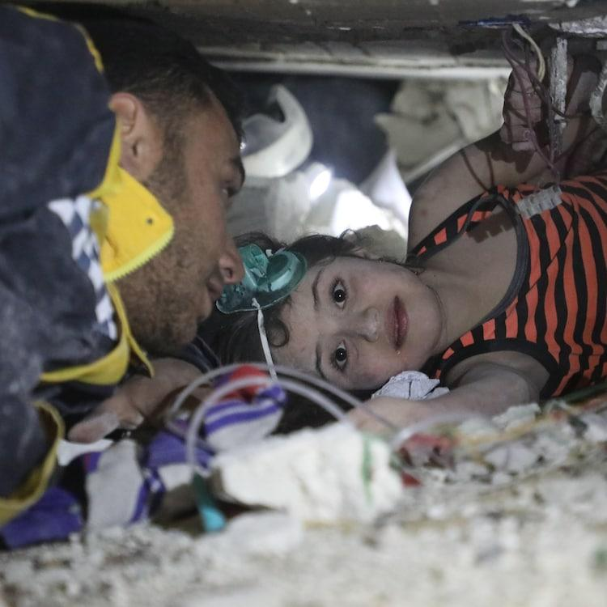

## Claim
Claim: " This image shows a palestinian child stuck under the rubble in Gaza after an Israeli airstrike in July 2024."

## Actions
```
reverse_search()
web_search("Israeli airstrike Gaza July 2024")
```

## Evidence
### Evidence from `reverse_search`
The image shows a Syrian child named Sham who was rescued from the rubble in Armanaz, Syria, after an earthquake on February 6 or 7, 2023. The child was later transferred to hospitals in Turkey and Abu Dhabi for treatment. The image was found on the following websites:  [https://english.enabbaladi.net/archives/2023/03/shams-journey-from-under-the-rubble-to-abu-dhabis-burjeel-hospital/](https://english.enabbaladi.net/archives/2023/03/shams-journey-from-under-the-rubble-to-abu-dhabis-burjeel-hospital/), [https://uaetimes.ae/shams-journey-from-under-the-rubble-to-abu-dhabis-burjeel-hospital/](https://uaetimes.ae/shams-journey-from-under-the-rubble-to-abu-dhabis-burjeel-hospital/), and [https://english.elpais.com/international/2023-07-20/the-manual-of-repression-shared-by-modern-tyrants.html](https://english.elpais.com/international/2023-07-20/the-manual-of-repression-shared-by-modern-tyrants.html).

The El País article, published on July 20, 2023, uses the image in a discussion about repression. , , , 


### Evidence from `web_search`
The Wikipedia article discusses the 13 July 2024 al-Mawasi attack in the Gaza Strip, which resulted in at least 90 Palestinian deaths and over 300 injuries. The attack, involving airstrikes by the Israeli Air Force, targeted an area where civilians had been told was safe. The CNN article, published on July 27, 2024, reports on an Israeli airstrike on a school in Deir-al Balah, central Gaza, where at least 30 people were killed. The NPR article, published on July 13, 2024, reports on Israeli airstrikes in Gaza that killed 90 Palestinians. The strikes targeted Hamas commander Mohammed Deif. 

## Elaboration
The claim is demonstrably false. The image depicts a Syrian child, Sham, rescued from the rubble following an earthquake in Syria in February 2023, not a Palestinian child in Gaza after an Israeli airstrike in July 2024. The image was used in an article about repression published in July 2023. The web search confirms that there were Israeli airstrikes in Gaza in July 2024. However, the image is not related to these events.


## Final Judgement
The claim is false because the image is of a Syrian child rescued after an earthquake in Syria in February 2023, not a Palestinian child in Gaza after an Israeli airstrike in July 2024. `false`

### Verdict: FALSE

### Justification
The image in the claim depicts a Syrian child, Sham, rescued from the rubble after an earthquake in Syria in February 2023, as evidenced by multiple sources ([https://english.enabbaladi.net/archives/2023/03/shams-journey-from-under-the-rubble-to-abu-dhabis-burjeel-hospital/](https://english.enabbaladi.net/archives/2023/03/shams-journey-from-under-the-rubble-to-abu-dhabis-burjeel-hospital/), [https://uaetimes.ae/shams-journey-from-under-the-rubble-to-abu-dhabis-burjeel-hospital/](https://uaetimes.ae/shams-journey-from-under-the-rubble-to-abu-dhabis-burjeel-hospital/), and [https://english.elpais.com/international/2023-07-20/the-manual-of-repression-shared-by-modern-tyrants.html](https://english.elpais.com/international/2023-07-20/the-manual-of-repression-shared-by-modern-tyrants.html)). Therefore, the claim that the image shows a Palestinian child in Gaza after an Israeli airstrike in July 2024 is false.
