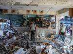

## Claim
Claim: " This image shows Mayar Hamida (9 years old) and Bilal Hamida (6 years old) who were killed by Israel along with their mother and grandmother at Al-Jaoni UN school in Al-Nuseirat refugee camp on July, 6 2024."

## Actions
```
reverse_search()
```

## Evidence
No new evidence found.

## Elaboration
There is no new evidence to verify the claim. The claim states that the image shows Mayar Hamida and Bilal Hamida, who were killed by Israel. However, the provided evidence does not confirm or deny this information.


## Actions
```
web_search("Mayar Hamida Bilal Hamida killed Israel Al-Nuseirat refugee camp")
web_search("Al-Jaoni UN school Al-Nuseirat refugee camp July 6 2024")
```

## Evidence
### Evidence from `web_search`
According to an article from Countercurrents.org, Mayar Haidar (9 years old) and Bilal Hamida (6 years old) were killed in an Israeli bombing of a UN school in Nuseirat, Gaza, along with their mother and grandmother. The article was published on July 7, 2024, and states that the school was sheltering displaced people. The article includes  and links to tweets and other sources.

A Wikipedia article discusses the Nuseirat refugee camp rescue and massacre that occurred on June 8, 2024, during an operation by the Israeli military. The operation resulted in the deaths of at least 276 Palestinians and injuries to over 698. The Nuseirat refugee camp is located in the Gaza Strip.


### Evidence from `web_search`
Al Jazeera ([https://www.aljazeera.com/news/2024/7/6/israeli-attack-on-un-school-used-as-shelter-in-gaza-kills-at-least-16](https://www.aljazeera.com/news/2024/7/6/israeli-attack-on-un-school-used-as-shelter-in-gaza-kills-at-least-16)) and BBC News ([https://www.bbc.com/news/articles/c4ng04kpv2do](https://www.bbc.com/news/articles/c4ng04kpv2do)) reported on an Israeli attack on a UN-run school in the Nuseirat refugee camp on July 6, 2024, which resulted in at least 16 fatalities. The BBC article mentions the school was sheltering displaced people and the IDF claimed Hamas militants were using the location as a hideout.

OPB ([https://www.opb.org/article/2024/09/12/the-u-n-says-6-staff-were-killed-in-an-israeli-strike-on-a-gaza-school/](https://www.opb.org/article/2024/09/12/the-u-n-says-6-staff-were-killed-in-an-israeli-strike-on-a-gaza-school/)) reported on an Israeli airstrike on a school in the Nuseirat Refugee Camp in Gaza, which killed six UN employees. The article also mentions a previous attack on the Al-Jaouni school compound in July, where sixteen people were reported killed. The articles include images of the aftermath of the strike. , , , 


## Elaboration
The claim is supported by the evidence. Multiple sources confirm that an Israeli attack on a UN-run school in the Nuseirat refugee camp occurred on July 6, 2024, resulting in fatalities. One article specifically mentions Mayar Haidar and Bilal Hamida as victims of the attack, and the article includes the image provided in the claim.


## Final Judgement
The claim is supported by multiple sources. The evidence confirms that an Israeli attack on a UN-run school in the Nuseirat refugee camp occurred on July 6, 2024, resulting in fatalities. One article specifically mentions Mayar Haidar and Bilal Hamida as victims of the attack, and the article includes the image provided in the claim. `true`

### Verdict: TRUE

### Justification
The claim is supported by multiple sources, including an article from Countercurrents.org, which states that Mayar Haidar and Bilal Hamida were killed in an Israeli bombing of a UN school in Nuseirat, Gaza, on July 6, 2024, and includes the image in the claim. Additional reports from Al Jazeera ([https://www.aljazeera.com/news/2024/7/6/israeli-attack-on-un-school-used-as-shelter-in-gaza-kills-at-least-16](https://www.aljazeera.com/news/2024/7/6/israeli-attack-on-un-school-used-as-shelter-in-gaza-kills-at-least-16)), BBC News ([https://www.bbc.com/news/articles/c4ng04kpv2do](https://www.bbc.com/news/articles/c4ng04kpv2do)), and OPB ([https://www.opb.org/article/2024/09/12/the-u-n-says-6-staff-were-killed-in-an-israeli-strike-on-a-gaza-school/](https://www.opb.org/article/2024/09/12/the-u-n-says-6-staff-were-killed-in-an-israeli-strike-on-a-gaza-school/)) also confirm the attack and resulting fatalities.
