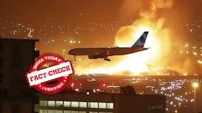

## Claim
Claim: " This is an authentic image of Israel bombing Beirut's International Airport in October 2024."

## Actions
```
reverse_search()
web_search("Beirut International Airport bombing")
```

## Evidence
### Evidence from `reverse_search`
The image () of a plane landing at Beirut International Airport amid explosions is AI-generated, according to fact-check articles from [India Today](https://www.indiatoday.in/fact-check/story/fact-check-photo-middle-east-airlines-flight-israel-airstrikes-beirut-lebanon-ai-generated-2622766-2024-10-24) and [Factly.in](https://factly.in/an-ai-generated-image-of-a-plane-landing-at-beirut-international-airport-surrounded-by-fire-and-smoke-is-falsely-shared-as-real/). The image was posted on Instagram on October 21, 2024, with a caption confirming it as AI-generated. AI detection tools were used to confirm the image's AI origin. , , , , , 


### Evidence from `web_search`
The U.S. Marine Corps website discusses the 40th anniversary of the Beirut barracks bombing, which occurred on October 23, 1983, and the Defense Intelligence Agency (DIA) responded to the Marine barracks bombing in Beirut, Lebanon in 1983. The article mentions the 1981 siege of Beirut by Israel. (

## Elaboration
The image is AI-generated, according to fact-check articles from India Today and Factly.in. The image was posted on Instagram on October 21, 2024, with a caption confirming it as AI-generated. AI detection tools were used to confirm the image's AI origin. The claim that the image is authentic is therefore false.


## Final Judgement
The claim is demonstrably false because the image is AI-generated, as confirmed by multiple fact-checking sources. The claim misrepresents the image's origin. `false`

### Verdict: FALSE

### Justification
The image depicting a plane landing at Beirut International Airport amid explosions is AI-generated, as confirmed by fact-check articles from [India Today](https://www.indiatoday.in/fact-check/story/fact-check-photo-middle-east-airlines-flight-israel-airstrikes-beirut-lebanon-ai-generated-2622766-2024-10-24) and [Factly.in](https://factly.in/an-ai-generated-image-of-a-plane-landing-at-beirut-international-airport-surrounded-by-fire-and-smoke-is-falsely-shared-as-real/). The image was posted on Instagram with a caption confirming it as AI-generated.
