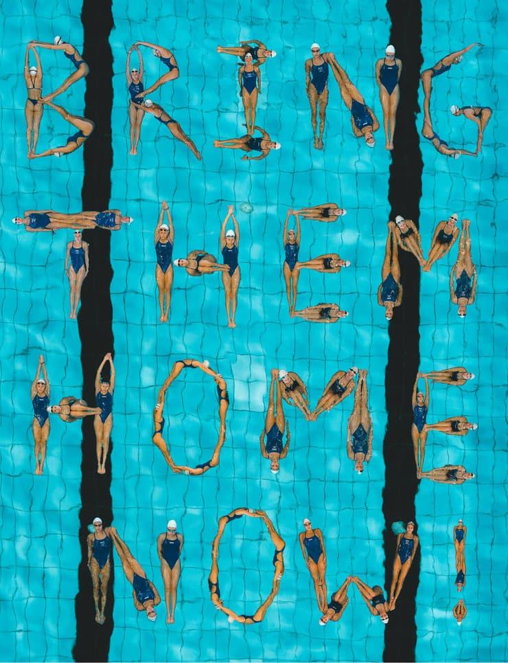
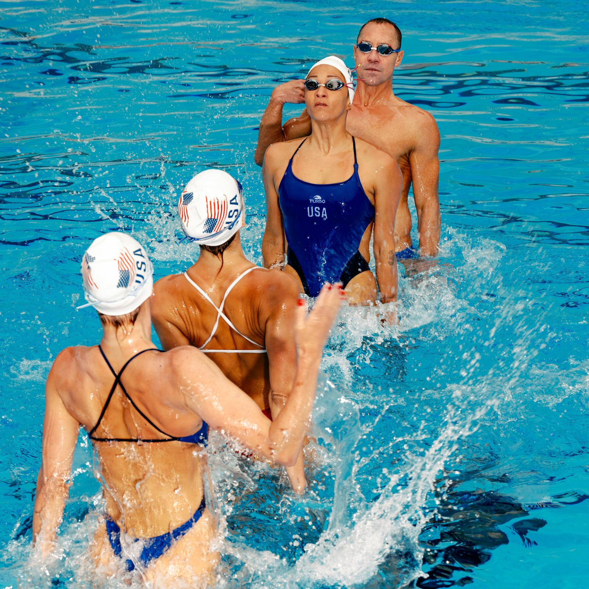

## Claim
Claim: " This image shows the Israeli Olympic team spelling out 'Bring Them Home' at the 2024 Olympic games because they were not allowed to wear their yellow 'Bring Them Home' pins."

## Actions
```
web_search("Israeli Olympic team Bring Them Home 2024")
image_search("Israeli Olympic team Bring Them Home pool")
```

## Evidence
### Evidence from `image_search`
The image shows the Israeli Olympic team spelling out "Bring Them Home" in a pool (). One source from Ynetnews.com contains an image of synchronized swimmers in a pool (). Another source, from thv11.com, states that the image is not from the 2024 Olympics (). The New York Times published an article about synchronized swimming at the Olympics ().

The sources are: [https://www.ynetnews.com/culture/article/skmg5e5ma](https://www.ynetnews.com/culture/article/skmg5e5ma), [https://www.thv11.com/article/news/verify/olympics-verify/image-israeli-swimmers-bring-them-home-not-from-paris-2024-olympics/536-5f25fcff-c857-495b-8eba-3d6c5fb46ce9](https://www.thv11.com/article/news/verify/olympics-verify/image-israeli-swimmers-bring-them-home-not-from-paris-2024-olympics/536-5f25fcff-c857-495b-8eba-3d6c5fb46ce9), and [https://www.nytimes.com/2024/06/06/us/synchronized-swimming-olympics.html](https://www.nytimes.com/2024/06/06/us/synchronized-swimming-olympics.html).


## Elaboration
The image search results confirm that the image depicts the Israeli Olympic team spelling out "Bring Them Home" in a pool. However, the evidence explicitly states that the image is *not* from the 2024 Olympics. Therefore, the claim that the image is from the 2024 Olympics is false.


## Final Judgement
The image does show the Israeli Olympic team spelling out "Bring Them Home" in a pool. However, the evidence indicates that the image is not from the 2024 Olympics.

`false`

### Verdict: FALSE

### Justification
The image does show the Israeli Olympic team spelling out "Bring Them Home" in a pool, but evidence from thv11.com ([https://www.thv11.com/article/news/verify/olympics-verify/image-israeli-swimmers-bring-them-home-not-from-paris-2024-olympics/536-5f25fcff-c857-495b-8eba-3d6c5fb46ce9](https://www.thv11.com/article/news/verify/olympics-verify/image-israeli-swimmers-bring-them-home-not-from-paris-2024-olympics/536-5f25fcff-c857-495b-8eba-3d6c5fb46ce9)) confirms that the image is not from the 2024 Olympics.
