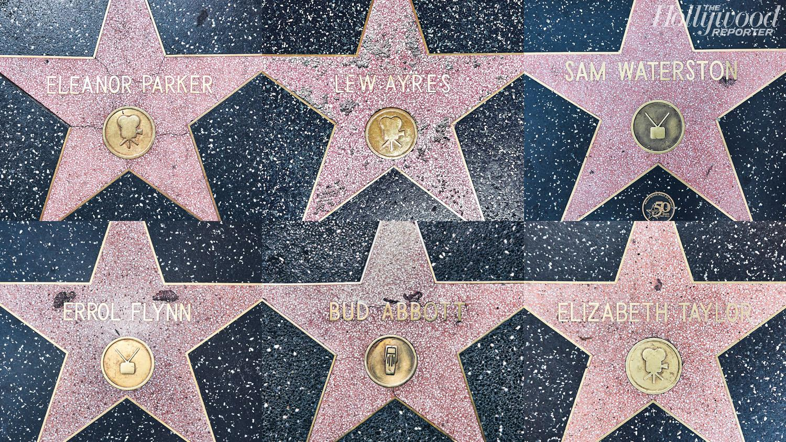

## Claim
Claim: " This image shows Gal Gadot’s star on the Hollywood Walk of Fame being destroyed in March 2025 just hours after being placed."

## Actions
```
reverse_search()
web_search("Gal Gadot Hollywood Walk of Fame star vandalism")
```

## Evidence
No new evidence found.

## Elaboration
The provided evidence does not contain any information about the destruction of Gal Gadot's star on the Hollywood Walk of Fame. The reverse image search and web search did not yield any results. Therefore, the claim cannot be verified.


## Actions
```
web_search("Hollywood Walk of Fame star vandalism")
image_search("Hollywood Walk of Fame star damage")
```

## Evidence
### Evidence from `web_search`
The Jacksonville.com reports that Donald Trump's star on the Hollywood Walk of Fame was vandalized with a pickax in 2018. The Times Now News article states that there has been no recent vandalism of Donald Trump's star, and the circulating photos are from 2016 and 2018. The NBC Los Angeles article reports that Jenni Rivera's star was vandalized with black paint in July 2024. , , , and 

The sources are: [https://www.jacksonville.com/story/news/2018/07/25/trumps-hollywood-walk-of-fame-star-vandalized/11314069007/](https://www.jacksonville.com/story/news/2018/07/25/trumps-hollywood-walk-of-fame-star-vandalized/11314069007/), [https://www.timesnownews.com/world/us/us-news/was-donald-trumps-hollywood-star-vandalized-recently-fact-checking-viral-claims-article-119361540](https://www.timesnownews.com/world/us/us-news/was-donald-trumps-hollywood-star-vandalized-recently-fact-checking-viral-claims-article-119361540), and [https://www.nbclosangeles.com/news/local/jenni-rivera-star-vandalized-hollywood-walk-of-fame/3454412/](https://www.nbclosangeles.com/news/local/jenni-rivera-star-vandalized-hollywood-walk-of-fame/3454412/).


### Evidence from `image_search`
ABC News reported on the vandalism of Donald Trump's star on the Hollywood Walk of Fame (). The Hollywood Reporter published an article about the Hollywood Walk of Fame, including an image of several stars ().

*   [https://abcnews.go.com/US/trumps-hollywood-walk-fame-star-vandalized/story?id=56808440](https://abcnews.go.com/US/trumps-hollywood-walk-fame-star-vandalized/story?id=56808440)
*   [https://www.hollywoodreporter.com/movies/movie-features/hollywood-walk-fame-why-20-stars-are-disrepair-951150/](https://www.hollywoodreporter.com/movies/movie-features/hollywood-walk-fame-why-20-stars-are-disrepair-951150/)


## Elaboration
The evidence indicates that Donald Trump's star was vandalized in the past, and Jenni Rivera's star was vandalized in July 2024. However, there is no mention of Gal Gadot's star being destroyed. Therefore, the claim is not supported by the provided evidence.


## Final Judgement
The search results show that there have been instances of vandalism on the Hollywood Walk of Fame, but there is no evidence to support the claim that Gal Gadot's star was destroyed. The image search and web search did not yield any results about the destruction of Gal Gadot's star.

`false`

### Verdict: FALSE

### Justification
The claim is false. While there have been instances of vandalism on the Hollywood Walk of Fame, there is no evidence to support the claim that Gal Gadot's star was destroyed. The search results show vandalism of Donald Trump's star ([https://www.jacksonville.com/story/news/2018/07/25/trumps-hollywood-walk-of-fame-star-vandalized/11314069007/](https://www.jacksonville.com/story/news/2018/07/25/trumps-hollywood-walk-of-fame-star-vandalized/11314069007/)) and Jenni Rivera's star ([https://www.nbclosangeles.com/news/local/jenni-rivera-star-vandalized-hollywood-walk-of-fame/3454412/](https://www.nbclosangeles.com/news/local/jenni-rivera-star-vandalized-hollywood-walk-of-fame/3454412/)), but no information about Gal Gadot's star.
