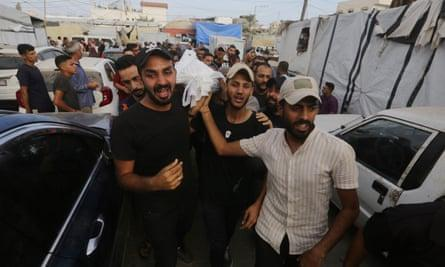

## Claim
Claim: "UK Prime Minister Keir Starmer said in October 2024 that the UK will boycott all diplomatic relations with Israel due to its long lasting war in Gaza."

## Actions
```
web_search("Keir Starmer Israel boycott Gaza October 2024")
```

## Evidence
### Evidence from `web_search`
The search results include articles discussing Keir Starmer's statements on the situation in Gaza. One article from map.org.uk, published on October 30, 2024, reports that Starmer stated that Israel is exterminating Palestinians in Gaza, but does not mention a boycott of diplomatic relations with Israel ().

Another article from The Guardian, published on October 6, 2024, discusses Starmer's call for a ceasefire in Gaza and his urging for unity in Britain (, , ). A BBC article from June 4, 2024, mentions pressure on Starmer to take stronger action against Israel, including considering sanctions ().
*   [https://www.map.org.uk/news/archive/post/1655-keir-starmer-you-canat-say-you-donat-know-that-israel-is-exterminating-palestinians-in-gaza](https://www.map.org.uk/news/archive/post/1655-keir-starmer-you-canat-say-you-donat-know-that-israel-is-exterminating-palestinians-in-gaza)
*   [https://www.theguardian.com/politics/2024/oct/06/starmer-urges-unity-at-home-and-reiterates-call-for-ceasefire-in-middle-east](https://www.theguardian.com/politics/2024/oct/06/starmer-urges-unity-at-home-and-reiterates-call-for-ceasefire-in-middle-east)
*   [https://www.bbc.com/news/articles/cewd7elz749o](https://www.bbc.com/news/articles/cewd7elz749o)


## Elaboration
The evidence does not support the claim. While Keir Starmer has made statements regarding the situation in Gaza, including calling for a ceasefire and acknowledging the extermination of Palestinians, none of the provided articles mention a boycott of diplomatic relations with Israel. The BBC article mentions pressure for stronger action, including sanctions, but not a complete diplomatic boycott.

Therefore, based on the available evidence, the claim is not verified.


## Final Judgement
The search results show that Keir Starmer has made statements about the situation in Gaza, including calling for a ceasefire and acknowledging the extermination of Palestinians. However, none of the provided articles mention a boycott of diplomatic relations with Israel.

The claim is not supported by the evidence. While Starmer has discussed the conflict in Gaza, there is no mention of a diplomatic boycott. Therefore, the claim is demonstrably false. `false`


### Verdict: FALSE

### Justification
The claim is demonstrably false. While Keir Starmer has commented on the situation in Gaza, including calling for a ceasefire, there is no evidence from the provided sources, such as the [map.org.uk article](https://www.map.org.uk/news/archive/post/1655-keir-starmer-you-canat-say-you-donat-know-that-israel-is-exterminating-palestinians-in-gaza) and [The Guardian article](https://www.theguardian.com/politics/2024/oct/06/starmer-urges-unity-at-home-and-reiterates-call-for-ceasefire-in-middle-east), to support the assertion that he advocated for a boycott of diplomatic relations with Israel.
