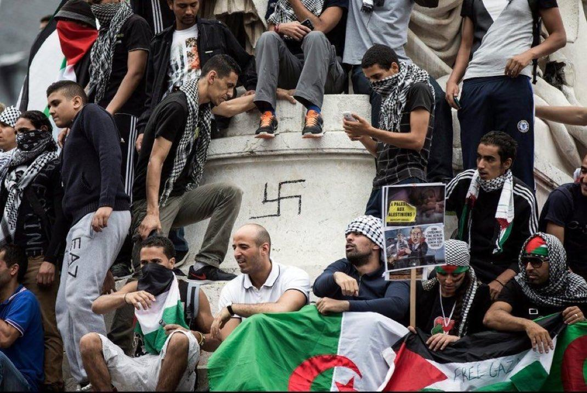

## Claim
Claim: " This image shows the 'French' Left who is rioting against Le Pen's victory in the first round of the French parliamentary elections in 2024."

## Actions
```
reverse_search()
web_search("French Left protest Le Pen 2024")
```

## Evidence
### Evidence from `reverse_search`
The image () appears in a Vanity Fair article discussing antisemitism in France, specifically a 2014 pro-Palestinian demonstration in Paris where a swastika was painted on a statue. The same image is also found in an article on the World Jewish Congress website and in a Jerusalem Post article by Adam Milstein, which discusses antisemitism in Europe and mentions the 2014 protest. The Jerusalem Post article was published on July 27, 2023.

*   [https://www.vanityfair.com/news/2015/07/anti-semitism-france-hostage-hyper-cacher-kosher-market](https://www.vanityfair.com/news/2015/07/anti-semitism-france-hostage-hyper-cacher-kosher-market)
*   [https://www.worldjewishcongress.org/en/news/german-tv-agrees-to-air-anti-semitism-documentary-following-cries-of-censorship-6-1-2017](https://www.worldjewishcongress.org/en/news/german-tv-agrees-to-air-anti-semitism-documentary-following-cries-of-censorship-6-1-2017)
*   [https://www.jpost.com/tags/adam-milstein](https://www.jpost.com/tags/adam-milstein)


### Evidence from `web_search`
The Wikipedia article discusses the 2024 French protests against the National Rally, which began on June 9, 2024, following the National Rally's victory in the European Parliament election and the subsequent call for legislative elections. The protests were organized by various left-wing political parties, unions, and activist groups across France. The protests included public demonstrations, vandalism, and rioting. The protests involved various causes, including anti-fascism, environmentalism, pro-immigration, and pro-Palestinian messages.  is not present in the search result.

The Guardian published an article on April 5, 2025, discussing rallies planned by both far-right and left-wing parties in France following Marine Le Pen's conviction. The BBC published an article on September 7, 2024, discussing protests in France against the appointment of Michel Barnier as the new prime minister. The protests were organized by parties on the political left. The article mentions that the left-wing candidate for prime minister, Lucie Castets, was rejected by President Emmanuel Macron. The article also mentions that Marine Le Pen and Jordan Bardella from the National Rally have stated they will not join the Barnier government.


## Elaboration
The image is from a 2014 pro-Palestinian demonstration in Paris, not a 2024 protest against Le Pen. The image shows a swastika, which is associated with antisemitism. The 2024 protests were against the National Rally, and involved various causes, including anti-fascism and pro-Palestinian messages.


## Final Judgement
The image is from a 2014 pro-Palestinian demonstration in Paris, not a 2024 protest against Le Pen's victory. The claim misrepresents the context of the image. `false`

### Verdict: FALSE

### Justification
The image in question is from a 2014 pro-Palestinian demonstration in Paris, as evidenced by a Vanity Fair article ([https://www.vanityfair.com/news/2015/07/anti-semitism-france-hostage-hyper-cacher-kosher-market](https://www.vanityfair.com/news/2015/07/anti-semitism-france-hostage-hyper-cacher-kosher-market)) and other sources, not a 2024 protest against Le Pen's victory. The claim is therefore false.
