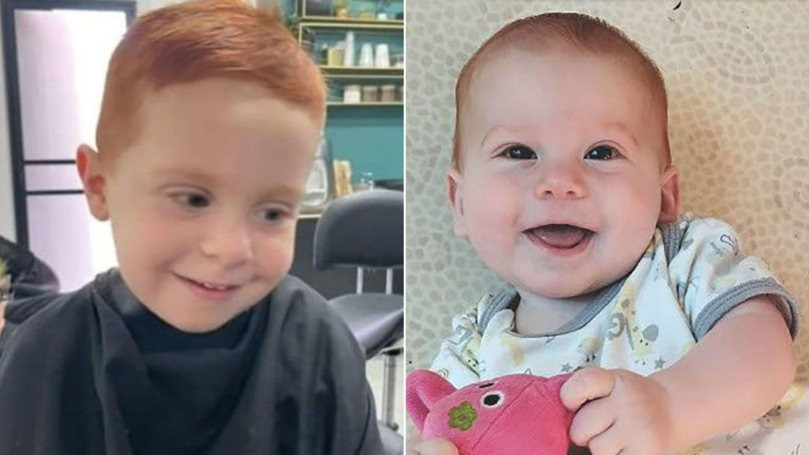

## Claim
Claim: " This image shows a screenshot of an authentic BBC article from February 2025 with the title 'Hamas just wanted to protect the Bibas family but Israel killed them - Hamas said.'"

## Actions
```
web_search("BBC Hamas Bibas family")
image_search("Bibas family Hamas Israel")
```

## Evidence
### Evidence from `web_search`
From [Source](https://www.bbc.com/news/articles/cjry3jzedl1o): 
Content: The BBC published an article on February 21, 2025, discussing the Bibas family. The article states that Israel said the children Ariel and Kfir Bibas were killed by their captors in Gaza. , . Hamas said the children and their mother were killed by Israeli bombing. The article also mentions that the father, Yarden Bibas, was released by Hamas on February 1, and that Shiri, Ariel, and Kfir Bibas were kidnapped during the Hamas attacks on Israel on October 7, 2023. The article also mentions that the bodies of the two boys were returned to Israel on Thursday, alongside the body of another hostage, Oded Lifschitz. The article also mentions that Israel has confirmed it expects eight bodies will be handed over. The article was written by George Wright & Mallory Moench.


### Evidence from `image_search`
NBC News reports on the Bibas family (). The Guardian published an article on January 31, 2025, about Hamas releasing the Israeli hostage Yarden Bibas, his wife, and children (). CNN published an article on February 18, 2025, about the Bibas family ().

*   [https://www.nbcnews.com/news/world/kfir-bibas-hostage-killed-hamas-gaza-israeli-bombing-rcna127187](https://www.nbcnews.com/news/world/kfir-bibas-hostage-killed-hamas-gaza-israeli-bombing-rcna127187)
*   [https://www.theguardian.com/world/2025/jan/31/hamas-to-release-israeli-hostage-yarden-bibas-wife-children-family](https://www.theguardian.com/world/2025/jan/31/hamas-to-release-israeli-hostage-yarden-bibas-wife-children-family)
*   [https://www.cnn.com/2025/02/18/middleeast/hamas-israel-hostages-to-release-bibas-family-intl](https://www.cnn.com/2025/02/18/middleeast/hamas-israel-hostages-to-release-bibas-family-intl)


## Elaboration
The BBC did publish an article on February 21, 2025, discussing the Bibas family, as stated in the evidence. The article mentions that Israel said the children Ariel and Kfir Bibas were killed by their captors in Gaza, while Hamas said the children and their mother were killed by Israeli bombing.

The evidence does not confirm the exact wording of the article's title as presented in the claim. Therefore, the claim's veracity cannot be fully determined.

More information is needed to verify the exact title of the BBC article.


## Actions
```
reverse_search()
```

## Evidence
### Evidence from `reverse_search`
The BBC published an article on February 19, 2025, with the title "Hamas says it will return bodies of four hostages including Bibas family" ([https://www.bbc.com/news/articles/czdnp4ly5d1o](https://www.bbc.com/news/articles/czdnp4ly5d1o)). CNN published an article on June 7, 2025, reporting that Israel killed the leader of the Palestinian Mujahideen Brigades, Asaad Abu Sharia, who was involved in the October 7, 2023 attacks, and included a photo of the Bibas family ([https://www.cnn.com/2025/06/07/middleeast/israel-killed-leader-palestinian-mujahideen-brigades-gaza-latam-intl](https://www.cnn.com/2025/06/07/middleeast/israel-killed-leader-palestinian-mujahideen-brigades-gaza-latam-intl)). NDTV published an article on December 4, 2023, titled "Gaza's Youngest Hostage: Hamas Says He's Dead, Family Hoping Against Hope" ([https://www.ndtv.com/world-news/gazas-youngest-hostage-hamas-says-hes-dead-family-hoping-against-hope-7557381](https://www.ndtv.com/world-news/gazas-youngest-hostage-hamas-says-hes-dead-family-hoping-against-hope-7557381)). The image was found in these sources. , , , , , .


## Elaboration
The BBC did publish an article on February 19, 2025, with the title "Hamas says it will return bodies of four hostages including Bibas family" ([https://www.bbc.com/news/articles/czdnp4ly5d1o](https://www.bbc.com/news/articles/czdnp4ly5d1o)). This contradicts the claim that the BBC article had the title "Hamas just wanted to protect the Bibas family but Israel killed them - Hamas said."

The claim is therefore false.


## Final Judgement
The claim is demonstrably false because the BBC article's title is different from what is presented in the claim. `false`

### Verdict: FALSE

### Justification
The claim is false. The BBC did publish an article about the Bibas family, but the title provided in the claim, "Hamas just wanted to protect the Bibas family but Israel killed them - Hamas said," is not accurate. The actual title of the BBC article was "Hamas says it will return bodies of four hostages including Bibas family" ([https://www.bbc.com/news/articles/czdnp4ly5d1o](https://www.bbc.com/news/articles/czdnp4ly5d1o)).
