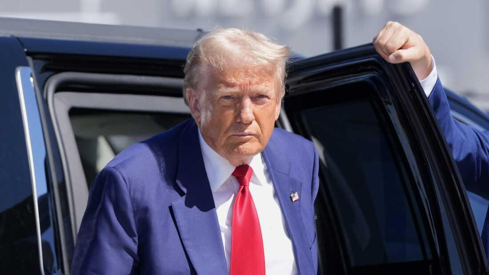

## Claim
Claim: "The assassination plot to kill Donald Trump in 2024 was orchestrated by two Jewish Americans. Israel wants war with Iran but wants American money to fund it and American servicemen to fight it."

## Actions
```
web_search("assassination plot Donald Trump 2024")
web_search("Israel war Iran American money")
```

## Evidence
### Evidence from `web_search`
Multiple sources discuss assassination attempts on Donald Trump in 2024. One source from Wikipedia ([https://en.wikipedia.org/wiki/Attempted_assassination_of_Donald_Trump_in_Pennsylvania](https://en.wikipedia.org/wiki/Attempted_assassination_of_Donald_Trump_in_Pennsylvania)) details an attempt in Pennsylvania by Thomas Matthew Crooks, and mentions increased security due to intelligence about an Iranian plot. CNN ([https://www.cnn.com/2024/11/08/politics/doj-charges-three-iranian-plot-to-kill-donald-trump](https://www.cnn.com/2024/11/08/politics/doj-charges-three-iranian-plot-to-kill-donald-trump)) reports on a thwarted Iranian plot, with charges against Farhad Shakeri, who was also tasked with surveilling and assassinating two Jewish businesspeople.

NPR ([https://www.npr.org/2024/09/16/g-s1-23232/up-first-newsletter-second-apparent-assassination-attempt-trump-emmy-awards-recap](https://www.npr.org/2024/09/16/g-s1-23232/up-first-newsletter-second-apparent-assassination-attempt-trump-emmy-awards-recap)) reports on a second attempt while Trump was golfing in Florida. <image:k>, <image:i>, , 


### Evidence from `web_search`
The search results discuss the economic impact of the Iran-Israel war, including conflicts in 2024 and 2025, mentioning economic burdens on Iran, such as war damage, military spending, and sanctions, as well as the destruction of infrastructure (). One article discusses the economic impact of a 12-day war between Israel and Iran in June 2025, mentioning costs to the US, Israel, and Iran, and a travel ban on Jewish citizens.

Another article discusses the potential impact of an Israel-Iran conflict on the U.S. dollar (<image:k>).

*   [https://en.wikipedia.org/wiki/Economic\_impact\_of\_the\_Iran%E2%80%93Israel\_war](https://en.wikipedia.org/wiki/Economic_impact_of_the_Iran%E2%80%93Israel_war)
*   [https://trt.global/world/article/334e2e1ae7a3](https://trt.global/world/article/334e2e1ae7a3)
*   [https://www.reuters.com/markets/europe/israel-iran-conflict-highlights-dollars-tarnished-safe-haven-appeal-2025-06-16/](https://www.reuters.com/markets/europe/israel-iran-conflict-highlights-dollars-tarnished-safe-haven-appeal-2025-06-16/)

## Elaboration
The evidence indicates that there were assassination attempts on Donald Trump in 2024, including one linked to an Iranian plot. However, the evidence does not mention any Jewish Americans orchestrating these attempts.

Regarding the second part of the claim, the evidence discusses the economic impact of the Iran-Israel war, including costs to the US, but it does not explicitly state that Israel wants American money or servicemen to fight the war.

Therefore, the claim is not supported by the provided evidence.


## Final Judgement
The fact-check reveals that there were assassination attempts on Donald Trump in 2024, with one linked to an Iranian plot. However, there is no evidence to support the claim that Jewish Americans orchestrated these attempts. The evidence also discusses the economic impact of the Iran-Israel war, including costs to the US, but it does not explicitly state that Israel wants American money or servicemen to fight the war.

The claim is demonstrably false because the first part of the claim is not supported by the evidence, and the second part of the claim is not supported by the evidence. `false`


### Verdict: FALSE

### Justification
The claim is demonstrably false. While there were assassination attempts on Donald Trump in 2024, one of which was linked to an Iranian plot, there is no evidence to support the assertion that Jewish Americans orchestrated these attempts. Additionally, although the evidence discusses the economic impact of the Iran-Israel war, it does not support the claim that Israel wants American money or servicemen to fight the war.
