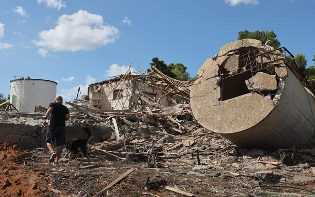

## Claim
Claim: "Gallant, a retired military general and a member of Prime Minister Benjamin Netanyahu’s war cabinet, was killed in the Iranian attack on Israel on October 1, 2024."

## Actions
```
web_search("Yoav Gallant killed October 1 2024")
```

## Evidence
### Evidence from `web_search`
The Times of Israel ([https://www.timesofisrael.com/after-iranian-missiles-hit-base-gallant-says-attack-didnt-even-scratch-air-force/](https://www.timesofisrael.com/after-iranian-missiles-hit-base-gallant-says-attack-didnt-even-scratch-air-force/)) reported that Yoav Gallant, the Defense Minister, visited the Nevatim air force base after an Iranian missile attack and stated the attack "didn't even scratch" the Israeli Air Force's capabilities. The article includes images of the aftermath of the attack on October 2, 2024, and Israelis taking cover during the attack on October 1, 2024 (, ).

The Guardian ([https://www.theguardian.com/world/2024/oct/09/biden-and-netanyahu-to-speak-as-israel-attack-on-iran-expected](https://www.theguardian.com/world/2024/oct/09/biden-and-netanyahu-to-speak-as-israel-attack-on-iran-expected)) reported that Gallant warned of a "deadly, precise and surprising" attack in response to the Iranian missile attack on October 1, which killed one person in the occupied West Bank and hit some Israeli military sites. NPR ([https://www.npr.org/2024/11/05/nx-s1-5179904/israel-defense-minister-gallant-fired-netanyahu](https://www.npr.org/2024/11/05/nx-s1-5179904/israel-defense-minister-gallant-fired-netanyahu)) reported that Benjamin Netanyahu fired Defense Minister Yoav Gallant on November 5, 2024, due to disagreements over the war in Gaza (, ).


## Elaboration
The evidence contradicts the claim. The Times of Israel reported that Yoav Gallant visited the Nevatim air force base after the Iranian attack on October 1, 2024, and The Guardian reported that Gallant warned of a response to the attack. Furthermore, NPR reported that Gallant was fired on November 5, 2024. Therefore, Gallant was not killed in the attack.


## Final Judgement
The evidence indicates that Yoav Gallant was not killed in the Iranian attack on October 1, 2024. Multiple sources confirm that he was alive and active after the attack, and even later, he was fired from his position.

`false`

### Verdict: FALSE

### Justification
The claim is false. Evidence from The Times of Israel ([https://www.timesofisrael.com/after-iranian-missiles-hit-base-gallant-says-attack-didnt-even-scratch-air-force/](https://www.timesofisrael.com/after-iranian-missiles-hit-base-gallant-says-attack-didnt-even-scratch-air-force/)) and The Guardian ([https://www.theguardian.com/world/2024/oct/09/biden-and-netanyahu-to-speak-as-israel-attack-on-iran-expected](https://www.theguardian.com/world/2024/oct/09/biden-and-netanyahu-to-speak-as-israel-attack-on-iran-expected)) shows that Yoav Gallant was alive and active after the attack on October 1, 2024. Furthermore, NPR ([https://www.npr.org/2024/11/05/nx-s1-5179904/israel-defense-minister-gallant-fired-netanyahu](https://www.npr.org/2024/11/05/nx-s1-5179904/israel-defense-minister-gallant-fired-netanyahu)) reported that Gallant was fired on November 5, 2024.
