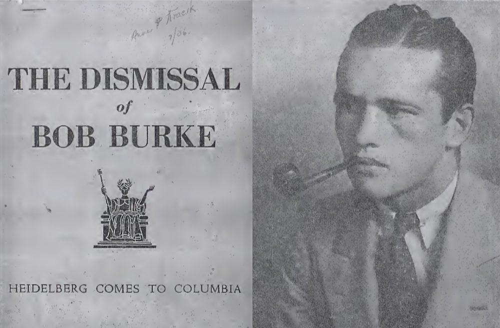

## Claim
Claim: "In June 1936, Columbia University expelled student activist Robert Burke for leading an anti-Nazi demonstration."

## Actions
```
web_search("Columbia University Robert Burke expelled June 1936")
```

## Evidence
### Evidence from `web_search`
In 1936, Robert Burke was expelled from Columbia University for leading anti-Nazi protests. According to the Wikipedia article "Student activism at Columbia University" ([https://en.wikipedia.org/wiki/Student_activism_at_Columbia_University](https://en.wikipedia.org/wiki/Student_activism_at_Columbia_University)), Burke led a rally to protest Columbia's relationship with the Nazis.

The Medium article "When Columbia University Expelled Robert Burke for Anti-Nazi Protests in 1936" ([https://medium.com/@blurredbylines/when-columbia-university-expelled-robert-burke-for-anti-nazi-protests-in-1936-d9f236c91794](https://medium.com/@blurredbylines/when-columbia-university-expelled-robert-burke-for-anti-nazi-protests-in-1936-d9f236c91794)) by Shari Rose, states that Burke was expelled in 1936 after leading anti-Nazi protests. The article mentions that Burke led a group of 300 students onto South Field on the evening of May 12, 1936. The Blurred Bylines search result ([https://blurredbylines.com/articles/robert-burke-columbia-university-expulsion-1936-protest/](https://blurredbylines.com/articles/robert-burke-columbia-university-expulsion-1936-protest/)) states that Burke was expelled on June 16, 1936, after leading an anti-Nazi protest. , 


## Elaboration
The evidence confirms the claim. Robert Burke was expelled from Columbia University in June 1936 for leading anti-Nazi protests. The Medium article states that Burke was expelled in 1936 after leading anti-Nazi protests. The Blurred Bylines search result specifies that Burke was expelled on June 16, 1936, after leading an anti-Nazi protest.


## Final Judgement
The evidence from multiple sources confirms that Robert Burke was expelled from Columbia University in June 1936 for leading an anti-Nazi demonstration. The Wikipedia article and the Medium article both support this claim, with the latter providing a specific date for the expulsion.

`true`


### Verdict: TRUE

### Justification
Robert Burke was expelled from Columbia University in June 1936 for leading anti-Nazi protests, as confirmed by the Wikipedia article "Student activism at Columbia University" ([https://en.wikipedia.org/wiki/Student_activism_at_Columbia_University](https://en.wikipedia.org/wiki/Student_activism_at_Columbia_University)) and the Medium article "When Columbia University Expelled Robert Burke for Anti-Nazi Protests in 1936" ([https://medium.com/@blurredbylines/when-columbia-university-expelled-robert-burke-for-anti-nazi-protests-in-1936-d9f236c91794](https://medium.com/@blurredbylines/when-columbia-university-expelled-robert-burke-for-anti-nazi-protests-in-1936-d9f236c91794)).
