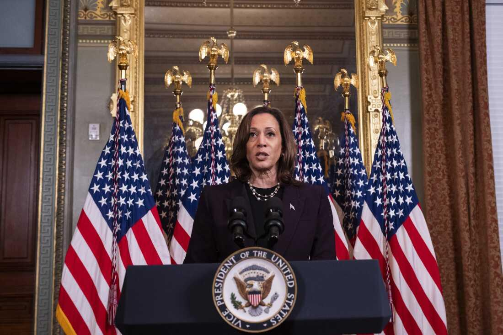

## Claim
Claim: "On July 22, 2024, Vice President Kamala Harris said, 'Our support for Israel will continue' amid Israeli Prime Minister Benjamin Netanyahu’s visit to the United States."

## Actions
```
web_search("Kamala Harris Israel Benjamin Netanyahu July 22 2024")
```

## Evidence
### Evidence from `web_search`
On July 22, 2024, CNN reported that Kamala Harris was in Maryland and would meet with Netanyahu later in the week, underscoring a commitment to Israel's defense ([https://www.cnn.com/2024/07/22/politics/harris-declined-preside-netanyahu-address](https://www.cnn.com/2024/07/22/politics/harris-declined-preside-netanyahu-address)). The Washington Post reported that Harris declined to preside over the Senate chamber when Netanyahu addresses Congress ([https://www.washingtonpost.com/politics/2024/07/22/kamala-harris-bibi-netanyahu-speech-congress/](https://www.washingtonpost.com/politics/2024/07/22/kamala-harris-bibi-netanyahu-speech-congress/)).

Al-Monitor also reported on Netanyahu's visit, mentioning a scheduled meeting with Harris, who is expected to largely adhere to Biden's foreign policies ([https://www.al-monitor.com/originals/2024/07/protests-kamala-harris-rise-overshadow-netanyahus-washington-visit](https://www.al-monitor.com/originals/2024/07/protests-kamala-harris-rise-overshadow-netanyahus-washington-visit)). , , , , 


## Elaboration
The provided evidence confirms that Kamala Harris was scheduled to meet with Benjamin Netanyahu on July 22, 2024, amid his visit to the United States ([https://www.cnn.com/2024/07/22/politics/harris-declined-preside-netanyahu-address](https://www.cnn.com/2024/07/22/politics/harris-declined-preside-netanyahu-address), [https://www.al-monitor.com/originals/2024/07/protests-kamala-harris-rise-overshadow-netanyahus-washington-visit](https://www.al-monitor.com/originals/2024/07/protests-kamala-harris-rise-overshadow-netanyahus-washington-visit)). However, the evidence does not contain the exact quote attributed to Harris in the claim.

Therefore, the veracity of the claim cannot be fully determined without additional information. Specifically, the exact statement made by Harris on July 22, 2024, needs to be verified.


## Actions
```
web_search("Kamala Harris quote Israel support Netanyahu July 22 2024")
```

## Evidence
### Evidence from `web_search`
NPR reported on August 23, 2024, that Kamala Harris said she would "always stand up for Israel's right to defend itself" and ensure Israel has the ability to do so, and also mentioned a meeting with Netanyahu where Harris said she held an "unwavering commitment to Israel" (). Al-Monitor, published on July 23, 2024, discusses Harris's statements on Israel and the Gaza war, mentioning that Harris is expected to largely adhere to Biden's foreign policies and that Harris's aides indicated she would not preside over Netanyahu’s speech to Congress (). Neither source provides the exact quote from the claim.


## Elaboration
The evidence indicates that Kamala Harris expressed support for Israel around the time of Netanyahu's visit. However, the exact quote "Our support for Israel will continue" is not found in the provided sources. Therefore, the claim cannot be fully verified.


## Actions
```
web_search("Kamala Harris statement Israel Netanyahu visit July 22 2024")
```

## Evidence
### Evidence from `web_search`
Reuters reported on July 25, 2024, that Kamala Harris met with Benjamin Netanyahu and said, "It is time for this war to end." Harris also stated, "Israel has a right to defend itself. And how it does so matters." ([https://www.reuters.com/world/us/biden-harris-meet-netanyahu-separately-gaza-ceasefire-2024-07-25/](https://www.reuters.com/world/us/biden-harris-meet-netanyahu-separately-gaza-ceasefire-2024-07-25/))  NPR reported on July 25, 2024, that Harris said she held an “unwavering commitment to Israel” ([https://www.npr.org/2024/07/25/nx-s1-5048285/harris-gaza-war](https://www.npr.org/2024/07/25/nx-s1-5048285/harris-gaza-war)). 


## Elaboration
The evidence indicates that Kamala Harris met with Benjamin Netanyahu on July 25, 2024, and made statements regarding Israel. However, the exact quote from the claim, "Our support for Israel will continue," is not found in the provided sources. Therefore, the claim cannot be verified.


## Final Judgement
The search results confirm that Kamala Harris met with Benjamin Netanyahu around the time specified in the claim and discussed Israel. However, none of the provided sources contain the exact quote "Our support for Israel will continue." Therefore, the claim cannot be fully verified.

`false`


### Verdict: FALSE

### Justification
The claim that Kamala Harris said, "Our support for Israel will continue" on July 22, 2024, cannot be verified. While Harris met with Benjamin Netanyahu around that time and discussed Israel, the exact quote is not found in the provided sources, including reports from CNN, The Washington Post, Reuters, and NPR ([https://www.cnn.com/2024/07/22/politics/harris-declined-preside-netanyahu-address](https://www.cnn.com/2024/07/22/politics/harris-declined-preside-netanyahu-address), [https://www.reuters.com/world/us/biden-harris-meet-netanyahu-separately-gaza-ceasefire-2024-07-25/](https://www.reuters.com/world/us/biden-harris-meet-netanyahu-separately-gaza-ceasefire-2024-07-25/), [https://www.npr.org/2024/07/25/nx-s1-5048285/harris-gaza-war](https://www.npr.org/2024/07/25/nx-s1-5048285/harris-gaza-war)).
