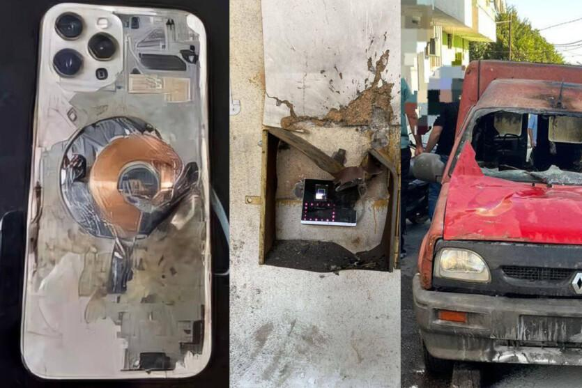
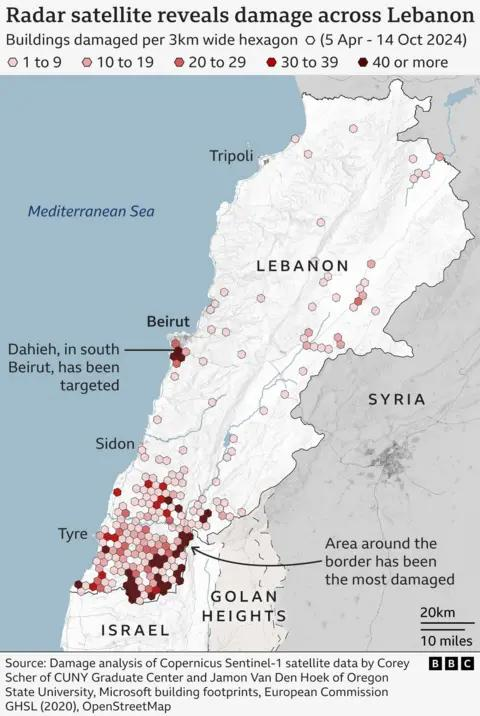
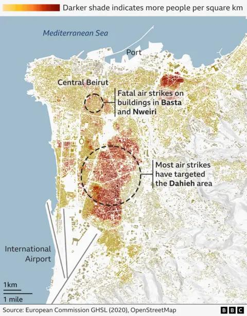
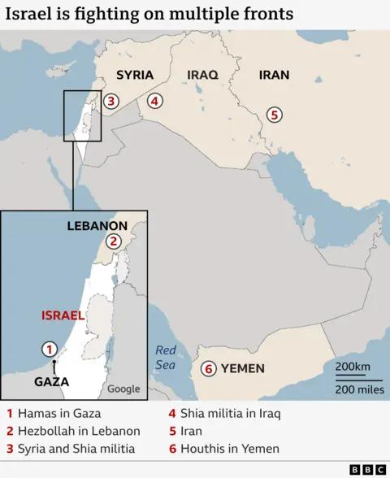
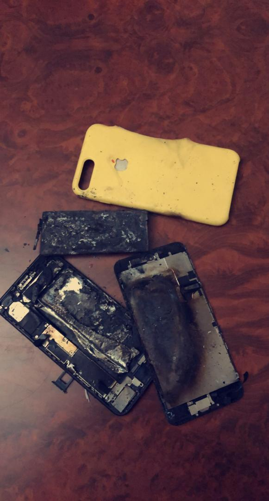

## Claim
Claim: " This image shows an Iphone that exploded during the pager attacks on Hezbollah devices in Lebanon in September 2024, blowing up random people."

## Actions
```
reverse_search()
web_search("Hezbollah Lebanon September 2024")
image_search("exploded iphone")
```

## Evidence
### Evidence from `reverse_search`
The image in the claim () appears in multiple articles discussing explosions in Lebanon in September 2024. One article from DW.com ([https://www.dw.com/en/fact-check-no-iphones-solar-panels-laptops-exploded-in-lebanon/a-70281061](https://www.dw.com/en/fact-check-no-iphones-solar-panels-laptops-exploded-in-lebanon/a-70281061)) fact-checks the claim, stating the image is unrelated to the attacks.

Other sources, such as ITC.ua ([https://itc.ua/en/news/not-just-pagers-iphones-laptops-electronic-locks-and-other-devices-exploded-in-lebanon-today/](https://itc.ua/en/news/not-just-pagers-iphones-laptops-electronic-locks-and-other-devices-exploded-in-lebanon-today/)) and The China Academy ([https://thechinaacademy.org/israels-pager-attack-has-cooked-western-led-globalization/](https://thechinaacademy.org/israels-pager-attack-has-cooked-western-led-globalization/)), also feature the image () and discuss the attacks, with the ITC.ua article including another image (). These articles report that the attacks targeted electronic devices, including iPhones, and resulted in casualties.


### Evidence from `web_search`
The web sources discuss the September 2024 Israeli attacks against Lebanon, including airstrikes and the "2024 Lebanon pager explosions". The Wikipedia article ([https://en.wikipedia.org/wiki/September_2024_Israeli_attacks_against_Lebanon](https://en.wikipedia.org/wiki/September_2024_Israeli_attacks_against_Lebanon)) mentions the attacks and the pager explosions, which resulted in casualties.

The CNN article ([https://www.cnn.com/2024/09/24/middleeast/israel-strikes-lebanon-hezbollah-explainer-intl-hnk](https://www.cnn.com/2024/09/24/middleeast/israel-strikes-lebanon-hezbollah-explainer-intl-hnk)) also discusses the Israeli airstrikes and the explosion of paging devices. The BBC article ([https://www.bbc.com/news/articles/c9vp7dg3ml1o](https://www.bbc.com/news/articles/c9vp7dg3ml1o)) discusses the ceasefire between Israel and Hezbollah and includes maps of the conflict areas (, , , , ). None of the articles mention the image .


### Evidence from `image_search`
The Apple Support Community discusses an iPhone that exploded ([https://discussions.apple.com/thread/252212685](https://discussions.apple.com/thread/252212685)). The Free Press Journal published an article about an iPhone 13 exploding in a youth's pocket ([https://www.freepressjournal.in/tech/iphone-users-beware-apple-iphone-13-mobile-explodes-inside-youths-pocket-in-ups-aligarh-causes-serious-burn-injuries-video](https://www.freepressjournal.in/tech/iphone-users-beware-apple-iphone-13-mobile-explodes-inside-youths-pocket-in-ups-aligarh-causes-serious-burn-injuries-video)).

AppleInsider published an article about an iPhone X that exploded after updating to iOS 12.1 ([https://appleinsider.com/articles/18/11/14/apple-investigating-iphone-x-that-exploded-after-updating-to-ios-121](https://appleinsider.com/articles/18/11/14/apple-investigating-iphone-x-that-exploded-after-updating-to-ios-121)). The provided sources show images of exploded iPhones (, , ).


## Elaboration
The claim is partially supported. The image (

## Final Judgement
The image in the claim has been used in articles discussing the September 2024 attacks in Lebanon, but a fact-check from DW.com states that the image is unrelated to the attacks. Other sources confirm the attacks targeted electronic devices, including iPhones, and resulted in casualties.

The claim is partially false because the image is not directly related to the attacks, even though the attacks did involve exploding devices. `false`

### Verdict: FALSE

### Justification
The claim is partially false. While the image (