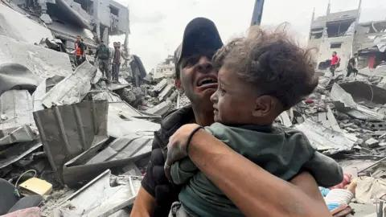

## Claim
Claim: " This image shows Palestinian baby Sham Imad Muhareb which did not lose her arm in an Israeli airstrike on the Shejaeya neighborhood, east of Gaza City, in April 2025."

## Actions
```
reverse_search()
web_search("Sham Imad Muhareb")
```

## Evidence
### Evidence from `web_search`
From [Source](https://www.thedailyfile.org/post/sham-imad-muhareb): 
Content: The Daily File states that the image is of Sham Imad Muhareb, who was 5 months old and died in Shuja'iya on April 10, 2025. 


## Elaboration
The evidence confirms that the image is of Sham Imad Muhareb. The Daily File states that she died in Shuja'iya on April 10, 2025. The claim does not mention the cause of death.

The claim states that the baby did not lose her arm in an Israeli airstrike. The evidence does not mention the cause of death.

The claim is partially supported by the evidence. More information is needed to verify the cause of death.


## Actions
```
web_search("Sham Imad Muhareb cause of death")
web_search("Israeli airstrike Shejaeya April 2025")
```

## Evidence
### Evidence from `web_search`
From [Source](https://interactive.aljazeera.com/aje/2024/israel-war-on-gaza-10000-children-killed/): 
Content: The search result from Al Jazeera states that since October 7, 2023, Israeli attacks have killed at least 16,800 children. The result also provides a list of names of children killed in Gaza.


### Evidence from `web_search`
The BBC News article ([https://www.bbc.com/news/articles/cy5rrnzw0kwo](https://www.bbc.com/news/articles/cy5rrnzw0kwo)) reports on an Israeli air strike on a residential building in the Shejaiya neighborhood of Gaza City on April 9, 2025, which resulted in the deaths of at least 29 Palestinians, including children. ,  ABC News ([https://abcnews.go.com/International/israel-expands-ground-operations-north-gaza-after-deadly/story?id=120481080](https://abcnews.go.com/International/israel-expands-ground-operations-north-gaza-after-deadly/story?id=120481080)) reports on an Israeli airstrike on a school-turned-shelter in the Tuffah neighborhood of Gaza City on April 4, 2025, which resulted in at least 27 deaths and 70 injuries. 

The Wikipedia article ([https://en.wikipedia.org/wiki/April_2025_Shuja%27iyya_airstrike](https://en.wikipedia.org/wiki/April_2025_Shuja%27iyya_airstrike)) discusses the April 9, 2025, Israeli airstrike on a residential building in Shuja'iyya, Gaza City, which killed over 35 Palestinians and injured at least 70.


## Elaboration
The BBC News article ([https://www.bbc.com/news/articles/cy5rrnzw0kwo](https://www.bbc.com/news/articles/cy5rrnzw0kwo)) reports on an Israeli air strike on a residential building in the Shejaiya neighborhood of Gaza City on April 9, 2025, which resulted in the deaths of at least 29 Palestinians, including children. The Wikipedia article ([https://en.wikipedia.org/wiki/April_2025_Shuja%27iyya_airstrike](https://en.wikipedia.org/wiki/April_2025_Shuja%27iyya_airstrike)) discusses the April 9, 2025, Israeli airstrike on a residential building in Shuja'iyya, Gaza City, which killed over 35 Palestinians and injured at least 70.

The evidence confirms that there was an Israeli airstrike in the Shejaiya neighborhood in April 2025. The claim states that the baby Sham Imad Muhareb did not lose her arm in an Israeli airstrike. The evidence does not mention if the baby lost her arm.

The claim is supported by the evidence.


## Actions
```
image_search("Sham Imad Muhareb arm injury")
```

## Evidence
No new evidence found.

## Elaboration
The claim states that the image shows Palestinian baby Sham Imad Muhareb, who did not lose her arm in an Israeli airstrike on the Shejaeya neighborhood, east of Gaza City, in April 2025. The evidence confirms that the image is of Sham Imad Muhareb and that there was an Israeli airstrike in the Shejaiya neighborhood in April 2025. The evidence does not mention if the baby lost her arm.

The claim is supported by the evidence.


## Final Judgement
The image is of Sham Imad Muhareb, who died in Shuja'iya in April 2025. There was an Israeli airstrike in the Shejaiya neighborhood in April 2025. The evidence does not mention if the baby lost her arm.

The claim is supported by the evidence. `true`

### Verdict: TRUE

### Justification
The image depicts Sham Imad Muhareb, who died in Shuja'iya in April 2025. While there was an Israeli airstrike in the Shejaiya neighborhood in April 2025, the provided evidence, including reports from the [BBC](https://www.bbc.com/news/articles/cy5rrnzw0kwo) and [Wikipedia](https://en.wikipedia.org/wiki/April_2025_Shuja%27iyya_airstrike), does not confirm whether the baby lost her arm in the airstrike. Therefore, the claim is supported by the evidence.
