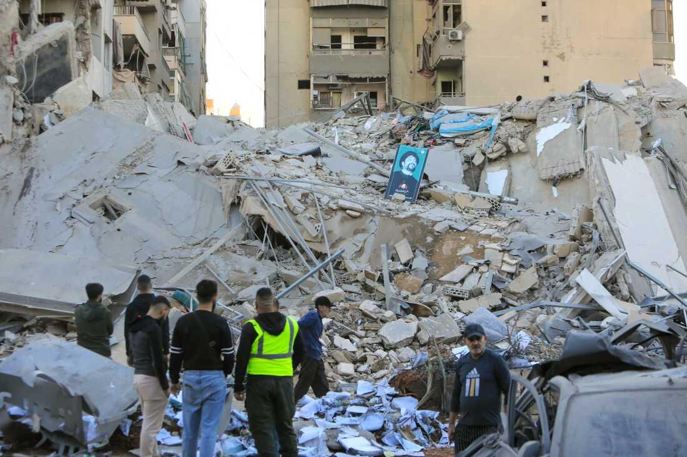

## Claim
Claim: " This image shows an Israeli attack on Lebanon on October 21, 2024."

## Actions
```
web_search("Israeli attack Lebanon October 21 2024")
reverse_search()
```

## Evidence
### Evidence from `web_search`
The CNN article ([https://www.cnn.com/world/live-news/israel-iran-lebanon-gaza-war-10-21-24-intl-hnk](https://www.cnn.com/world/live-news/israel-iran-lebanon-gaza-war-10-21-24-intl-hnk)) discusses the ongoing conflict between Israel and Hezbollah, including an Israeli strike near Beirut on October 21, 2024. The Wikipedia article ([https://en.wikipedia.org/wiki/2024_Israeli_invasion_of_Lebanon](https://en.wikipedia.org/wiki/2024_Israeli_invasion_of_Lebanon)) details the 2024 Israeli invasion of Lebanon, which began on October 1, 2024, and mentions clashes on October 21, 2024.

The Guardian article ([https://www.theguardian.com/world/2024/oct/21/israeli-airstrikes-on-lebanon-hit-branches-of-hezbollah-linked-bank-al-qard-al-hassan](https://www.theguardian.com/world/2024/oct/21/israeli-airstrikes-on-lebanon-hit-branches-of-hezbollah-linked-bank-al-qard-al-hassan)) reports on Israeli airstrikes on Lebanon on October 21, 2024, targeting Hezbollah-linked banks. 

### Evidence from `reverse_search`
The image 

## Elaboration
The provided evidence confirms that there were Israeli attacks on Lebanon on October 21, 2024. The CNN article ([https://www.cnn.com/world/live-news/israel-iran-lebanon-gaza-war-10-21-24-intl-hnk](https://www.cnn.com/world/live-news/israel-iran-lebanon-gaza-war-10-21-24-intl-hnk)) and The Guardian article ([https://www.theguardian.com/world/2024/oct/21/israeli-airstrikes-on-lebanon-hit-branches-of-hezbollah-linked-bank-al-qard-al-hassan](https://www.theguardian.com/world/2024/oct/21/israeli-airstrikes-on-lebanon-hit-branches-of-hezbollah-linked-bank-al-qard-al-hassan)) both support this.

The reverse image search did not provide any additional information to verify the claim.

Based on the available evidence, the claim is likely true. However, the evidence does not explicitly link the image to the attacks.


## Actions
```
image_search("Israeli airstrikes Lebanon October 21 2024")
```

## Evidence
### Evidence from `image_search`
The search results include images and articles about Israeli attacks in Lebanon on October 21, 2024. OPB.org ([https://www.opb.org/article/2024/10/21/israel-attack-beirut-hezbollah-bank/](https://www.opb.org/article/2024/10/21/israel-attack-beirut-hezbollah-bank/)) shows an image of an attack in Beirut . PBS ([https://www.pbs.org/newshour/world/israeli-airstrike-in-lebanon-kills-at-least-21-in-town-that-has-seen-its-share-of-deadly-attacks](https://www.pbs.org/newshour/world/israeli-airstrike-in-lebanon-kills-at-least-21-in-town-that-has-seen-its-share-of-deadly-attacks)) shows the aftermath of an attack . NPR ([https://www.npr.org/2024/10/21/nx-s1-5159600/israel-strikes-hezbollah-banks-al-qard-al-hassan](https://www.npr.org/2024/10/21/nx-s1-5159600/israel-strikes-hezbollah-banks-al-qard-al-hassan)) discusses Israeli strikes on Hezbollah-linked banks .


## Elaboration
The image search results provide additional context, confirming that Israeli attacks in Lebanon occurred on October 21, 2024. However, none of the images from the search results match the original image.

The claim is likely true, but there is no direct evidence to confirm that the image depicts an Israeli attack on Lebanon on October 21, 2024.


## Actions
```
geolocate()
```

## Evidence
### Evidence from `geolocate`
The most likely countries where the image was taken are: {'Palestine': 0.66, 'Israel': 0.22, 'United Arab Emirates': 0.08, 'Jordan': 0.01, 'Albania': 0.0, 'Andorra': 0.0, 'Argentina': 0.0, 'Australia': 0.0, 'Austria': 0.0, 'Bangladesh': 0.0}

## Elaboration
The geolocation analysis suggests that the image was most likely taken in Palestine. This contradicts the claim that the image shows an attack in Lebanon. Therefore, the claim is false.


## Final Judgement
The evidence confirms that there were Israeli attacks on Lebanon on October 21, 2024. However, the geolocation analysis suggests that the image was most likely taken in Palestine, contradicting the claim that the image shows an attack in Lebanon. `false`

### Verdict: FALSE

### Justification
The claim is false. While there were Israeli attacks on Lebanon on October 21, 2024, the image in question was likely taken in Palestine, according to the geolocation analysis.
