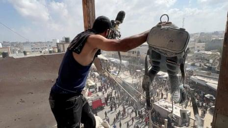

## Claim
Claim: " This image shows heavy Israeli bombardment on Deir al-Balah in the southern Gaza Strip in March 2025 which killed at least four Palestinians."

## Actions
```
reverse_search()
web_search("Deir al-Balah bombardment March 2025")
```

## Evidence
### Evidence from `reverse_search`
The image 

### Evidence from `web_search`
The UN News article from March 19, 2025, reports an explosion at two UN guesthouses in Deir al Balah, Gaza Strip, resulting in the death of at least one UN staff member and injuries to five others. The Israeli military denied attacking the compound. The Wikipedia article discusses the March 2025 Israeli attacks on the Gaza Strip, which included airstrikes and artillery barrages, targeting various locations in the Gaza Strip, including Deir al-Balah. The attacks resulted in numerous casualties. 

The Guardian published an article on August 25, 2025, reporting on an Israeli strike on a Gaza hospital that killed at least 20 people, including five journalists. , , , , 


## Elaboration
The evidence confirms that there was Israeli bombardment in Deir al-Balah in March 2025. The UN News article mentions an explosion at UN guesthouses, and the Wikipedia article discusses Israeli attacks in the Gaza Strip, including Deir al-Balah, during that period. However, the evidence does not explicitly state that the bombardment killed at least four Palestinians. Therefore, the claim is partially supported but lacks specific confirmation of the casualty count.


## Final Judgement
The claim is partially supported by the evidence, as it confirms the Israeli bombardment in Deir al-Balah in March 2025. However, the evidence does not explicitly verify the claim that at least four Palestinians were killed. Therefore, the claim is not fully accurate. `false`

### Verdict: FALSE

### Justification
The claim is partially supported. Evidence from web searches confirms Israeli bombardment in Deir al-Balah in March 2025, as reported by the [UN News](https://news.un.org/en/story/2025/03/1160072) and [Wikipedia](https://en.wikipedia.org/wiki/2025_Gaza_Strip_attacks). However, the evidence does not explicitly verify the claim that at least four Palestinians were killed.
