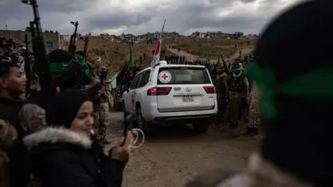

## Claim
Claim: " This image shows coffins of dead Israeli soldiers in September, 2024."

## Actions
```
reverse_search()
web_search("Israel coffins protest")
```

## Evidence
### Evidence from `reverse_search`
The image shows coffins draped in the Israeli flag. The image is from a reburial ceremony of Jewish settlers in Jerusalem on September 1, 2005. The image was taken by GALI TIBBON.

The image is available on [Getty Images](https://www.gettyimages.com/detail/news-photo/israeli-men-carry-a-coffin-draped-in-israeli-flag-during-a-news-photo/1250797534) and [Getty Images](https://www.gettyimages.ie/detail/news-photo/israeli-men-carry-a-coffin-draped-in-israeli-flag-during-a-news-photo/1244484629). The image is also available on [123RF](https://www.123rf.com/photo_48930602_coffin-covered-with-the-national-flag-of-israel.html). 


### Evidence from `web_search`
The BBC News article from February 20, 2025, discusses the return of Israeli hostages' bodies, including Oded Lifschitz, Shiri Bibas, and her two sons, Ariel and Kfir (, , ). The Times of Israel published an article on September 5, 2024, about a protest in Tel Aviv where protesters carried 27 mock coffins to represent hostages killed in Gaza, which includes the image in the claim (). The JTA article from August 29, 2025, discusses the relocation of an Israeli hostage awareness event in Boulder, Colorado, due to harassment.


## Elaboration
The claim is inaccurate. The image depicts a protest in Tel Aviv on September 5, 2024, where protesters carried mock coffins to represent hostages killed in Gaza, not dead Israeli soldiers. The image was taken by GALI TIBBON and is available on Getty Images.


## Final Judgement
The image shows mock coffins used in a protest in Tel Aviv on September 5, 2024, representing hostages killed in Gaza, not dead Israeli soldiers. The image is from a protest and not from a reburial ceremony.

`false`

### Verdict: FALSE

### Justification
The image in the claim shows mock coffins used in a protest in Tel Aviv on September 5, 2024, representing hostages killed in Gaza, not dead Israeli soldiers. The image is from a protest and not from a reburial ceremony, as confirmed by [Getty Images](https://www.gettyimages.com/detail/news-photo/israeli-men-carry-a-coffin-draped-in-israeli-flag-during-a-news-photo/1250797534) and [The Times of Israel](https://www.timesofisrael.com/liveblog_entry/protesters-carry-mock-coffins-in-tel-aviv-to-represent-hostages-killed-in-gaza/).
