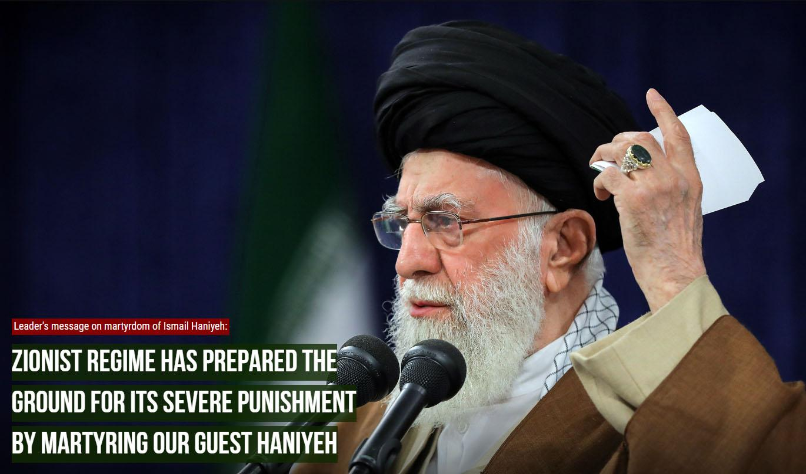

## Claim
Claim: "For the assassination on July 31, 2024, Israeli intelligence tracked Hamas leader Ismail Haniyeh through WhatsApp."

## Actions
```
web_search("Israeli intelligence Ismail Haniyeh WhatsApp July 31 2024")
```

## Evidence
### Evidence from `web_search`
The bne Gulf bureau reported on August 1, 2024, about the assassination of Ismail Haniyeh on July 31, mentioning unconfirmed reports of location tracking via spyware, possibly through WhatsApp, and that the attack occurred in Tehran. ([https://www.intellinews.com/did-whatsapp-give-away-hamas-leader-s-location-336529/](https://www.intellinews.com/did-whatsapp-give-away-hamas-leader-s-location-336529/)) 

SpecialEurasia OSINT Unit reported on July 31, 2024, that Ismail Haniyeh was assassinated in Tehran, Iran, with Hamas blaming Israel. ([https://www.specialeurasia.com/2024/07/31/ismail-haniyehs-assassination/](https://www.specialeurasia.com/2024/07/31/ismail-haniyehs-assassination/)) <image:k> The Jerusalem Center for Public Affairs (JCPA) reported on August 1, 2024, that Haniyeh was killed in Tehran on July 31, mentioning that Israeli intelligence sources reported Haniyeh was aware of the planned attacks by Hamas on October 7. ([https://jcpa.org/the-preemptive-targeting-of-ismail-haniyeh-in-tehran/](https://jcpa.org/the-preemptive-targeting-of-ismail-haniyeh-in-tehran/)) , , , , , , , 


## Elaboration
The evidence suggests that Ismail Haniyeh was assassinated in Tehran on July 31, 2024. One source mentions unconfirmed reports of location tracking via spyware, possibly through WhatsApp, but this is not confirmed.

Therefore, the claim that Israeli intelligence tracked Haniyeh through WhatsApp is unconfirmed.

The evidence does not provide enough information to verify the claim.


## Actions
```
web_search("Ismail Haniyeh assassination WhatsApp tracking details")
```

## Evidence
### Evidence from `web_search`
The Jerusalem Post reported on June 17, 2025, that Iranian state media warned that Israel uses cell phone tracking to assassinate leaders in Iran, mentioning the killing of Ismail Haniyeh in Tehran. ([https://www.jpost.com/israel-news/defense-news/article-858067](https://www.jpost.com/israel-news/defense-news/article-858067)) <image:k> Modern Diplomacy, on August 4, 2024, discussed the assassination of Haniyeh and the potential use of spyware, including AI, for surveillance and assassination, suggesting that Israeli agents may have identified Haniyeh's location through intercepted communications. ([https://moderndiplomacy.eu/2024/08/04/the-assassination-of-ismail-haniyeh-silent-digital-strikes/](https://moderndiplomacy.eu/2024/08/04/the-assassination-of-ismail-haniyeh-silent-digital-strikes/))


## Elaboration
The new evidence reinforces the claim that Haniyeh was assassinated in Tehran. It also provides additional context regarding the methods potentially used by Israeli intelligence.

Specifically, the Jerusalem Post indicates that Iranian state media warned about Israel's use of cell phone tracking for assassinations, referencing Haniyeh's killing. Modern Diplomacy suggests the use of spyware, including AI, for surveillance and assassination, implying that Israeli agents may have identified Haniyeh's location through intercepted communications.

While the evidence does not explicitly confirm WhatsApp was used, it supports the possibility of cell phone tracking and intercepted communications, which aligns with the claim. However, the exact method remains unconfirmed.


## Actions
```
web_search("Ismail Haniyeh assassination WhatsApp tracking evidence")
```

## Evidence
No new evidence found.

## Elaboration
The evidence suggests that Israeli intelligence may have used cell phone tracking or intercepted communications to locate Ismail Haniyeh for the assassination. However, there is no direct evidence confirming that WhatsApp was used for tracking. The claim remains unconfirmed.


## Final Judgement
The evidence indicates that Haniyeh was assassinated in Tehran, and there are suggestions of cell phone tracking or intercepted communications. However, there is no direct confirmation that WhatsApp was used for tracking. Therefore, the claim is not factually accurate because there is not enough evidence to verify it. `false`

### Verdict: FALSE

### Justification
The claim that Israeli intelligence tracked Hamas leader Ismail Haniyeh through WhatsApp for his assassination on July 31, 2024, is not confirmed. While reports indicate Haniyeh was assassinated in Tehran and suggest the use of cell phone tracking or intercepted communications by Israeli intelligence, there is no direct evidence to verify that WhatsApp was specifically used for tracking, as indicated by sources like the [bne Gulf bureau](https://www.intellinews.com/did-whatsapp-give-away-hamas-leader-s-location-336529/) and [Modern Diplomacy](https://moderndiplomacy.eu/2024/08/04/the-assassination-of-ismail-haniyeh-silent-digital-strikes/).
