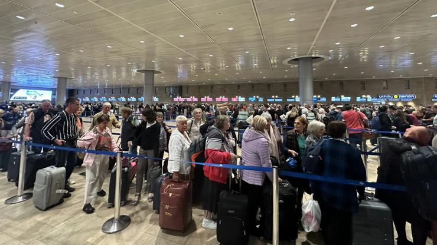

## Claim
Claim: " This image shows Israelis fleeing the airport after the Houthis attack on July 19, 2024."

## Actions
```
geolocate()
web_search("Houthis attack airport July 19 2024")
reverse_search()
```

## Evidence
### Evidence from `geolocate`
The most likely countries where the image was taken are: {'Israel': 0.89, 'Palestine': 0.06, 'Jordan': 0.01, 'United Arab Emirates': 0.01, 'Albania': 0.0, 'Andorra': 0.0, 'Argentina': 0.0, 'Australia': 0.0, 'Austria': 0.0, 'Bangladesh': 0.0}

### Evidence from `web_search`
On July 19, 2024, a Houthi drone attack hit Tel Aviv, Israel. The attack was reported by Reuters ([https://www.reuters.com/world/middle-east/israeli-military-says-tel-aviv-blast-apparently-caused-by-drone-2024-07-19/](https://www.reuters.com/world/middle-east/israeli-military-says-tel-aviv-blast-apparently-caused-by-drone-2024-07-19/)), The Guardian ([https://www.theguardian.com/world/article/2024/jul/19/yemen-houthis-claim-deadly-drone-attack-on-tel-aviv-israel](https://www.theguardian.com/world/article/2024/jul/19/yemen-houthis-claim-deadly-drone-attack-on-tel-aviv-israel)), and The New York Times ([https://www.nytimes.com/2024/07/19/world/middleeast/houthis-drone-strike-tel-aviv.html](https://www.nytimes.com/2024/07/19/world/middleeast/houthis-drone-strike-tel-aviv.html)).

The New York Times also included the image in the claim (). The Guardian mentioned that police urged residents to "respect safety instructions".


### Evidence from `reverse_search`
The image in the claim () appears in a Business Insider article from October 10, 2023, discussing flight cancellations and chaos at Ben Gurion Airport in Israel due to the war with Gaza. The image also appears in Getty Images stock photos of Ben Gurion Airport. Some images are dated from 2022, 2023, and 2024, and some are related to attacks by Palestinian factions, the Houthi group, and Iran. One image shows an Israeli security force taking measures after Yemen's Houthi group attacked Ben Gurion Airport on May 04, 2025.

The Getty Images search results can be found here: [Source](https://www.gettyimages.com/photos/israel-airport) and [Source](https://www.gettyimages.dk/photos/israel-airport). The Business Insider article can be found here: [Source](https://www.businessinsider.com/israel-flight-cancelations-ben-gurion-airport-2023-10).


## Elaboration
The claim is likely false. The image was taken at Ben Gurion Airport in Israel. While there was a Houthi attack on Tel Aviv on July 19, 2024, the image appears in a Business Insider article from October 10, 2023, and Getty Images stock photos, some of which predate the claimed event. The image is also associated with flight cancellations and chaos at Ben Gurion Airport due to the war with Gaza.


## Final Judgement
The image is of Ben Gurion Airport in Israel. While there was a Houthi attack on Tel Aviv on July 19, 2024, the image predates the claimed event and is associated with flight cancellations and chaos at Ben Gurion Airport due to the war with Gaza. Therefore, the claim is misleading. `false`

### Verdict: FALSE

### Justification
The image depicts Ben Gurion Airport in Israel, and while a Houthi attack on Tel Aviv occurred on July 19, 2024, the image predates this event and is associated with flight disruptions due to the war with Gaza, making the claim misleading. The image appears in a Business Insider article from October 2023 and Getty Images stock photos.
