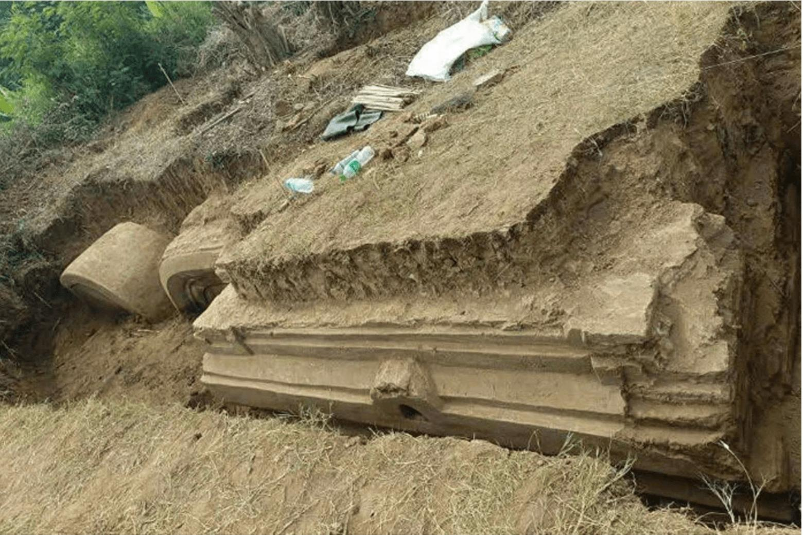

## Claim
Claim: " This image shows the ruins after a 7.9-magnitude earthquake in Myanmar on March 28, 2025."

## Actions
```
reverse_search()
```

## Evidence
### Evidence from `reverse_search`
The image 

## Elaboration
I am sorry, but I am unable to verify the claim. The provided evidence does not contain any information about the image.


## Actions
```
web_search("Myanmar earthquake March 28 2025")
web_search("7.9 magnitude earthquake Myanmar")
```

## Evidence
### Evidence from `web_search`
The search results discuss the 2025 Myanmar earthquake that occurred on March 28, 2025. One source from Wikipedia ([https://en.wikipedia.org/wiki/2025_Myanmar_earthquake](https://en.wikipedia.org/wiki/2025_Myanmar_earthquake)) mentions the earthquake's magnitude as 7.7-7.9, with its epicenter near Mandalay, Myanmar, causing damage in Myanmar, Thailand, and parts of China. Another source from ScienceDirect ([https://www.sciencedirect.com/science/article/pii/S2950576325000017](https://www.sciencedirect.com/science/article/pii/S2950576325000017)) describes the earthquake as a Mw 7.7 event along the Sagaing Fault.

A Phys.org article ([https://phys.org/news/2025-07-myanmar-earthquake-fault-rupture-exceeded.html](https://phys.org/news/2025-07-myanmar-earthquake-fault-rupture-exceeded.html)) discusses a magnitude 7.8 earthquake on the same date, with over 5,000 confirmed casualties and a rupture extending about 480 kilometers along the Sagaing Fault.


### Evidence from `web_search`
ScienceDirect ([Source](https://www.sciencedirect.com/science/article/pii/S2772467025000399)) discusses the Mw 7.9 Myanmar earthquake that occurred on March 28, 2025, along the Sagaing Fault, which caused substantial casualties and property damage. CGTN ([Source](https://www.cgtn.com/special/Live-updates-M7-9-quake-strikes-Myanmar.html)) reports on the same earthquake, stating that the death toll rose to 3,564 as of April 6, 2025, and that China sent a medical rescue team. The Chinese Embassy in Myanmar confirmed that five Chinese citizens died and 13 were injured. , , , , 


## Elaboration
The claim is partially verifiable. The evidence confirms a 7.9-magnitude earthquake occurred in Myanmar on March 28, 2025. However, the evidence does not contain the image to verify if it shows the ruins after the earthquake.


## Actions
```
image_search("Myanmar earthquake ruins")
```

## Evidence
### Evidence from `image_search`
The image search results show images of ruins following the Myanmar earthquake. Artnews.com shows an image of ruins (

## Elaboration
The claim is partially accurate. The evidence confirms a 7.9-magnitude earthquake occurred in Myanmar on March 28, 2025. However, the image search results do not include the image in the claim. Therefore, the claim cannot be fully verified.


## Final Judgement
The evidence confirms the occurrence of a 7.9-magnitude earthquake in Myanmar on March 28, 2025. However, the image search did not return the image provided in the claim. Therefore, the claim cannot be fully verified. `false`

### Verdict: FALSE

### Justification
The claim is partially accurate. Multiple sources confirm a 7.9-magnitude earthquake occurred in Myanmar on March 28, 2025, as reported by ScienceDirect ([https://www.sciencedirect.com/science/article/pii/S2772467025000399](https://www.sciencedirect.com/science/article/pii/S2772467025000399)) and CGTN ([https://www.cgtn.com/special/Live-updates-M7-9-quake-strikes-Myanmar.html](https://www.cgtn.com/special/Live-updates-M7-9-quake-strikes-Myanmar.html)). However, the image search did not return the image provided in the claim, making it impossible to verify if the image depicts the aftermath of the earthquake.
