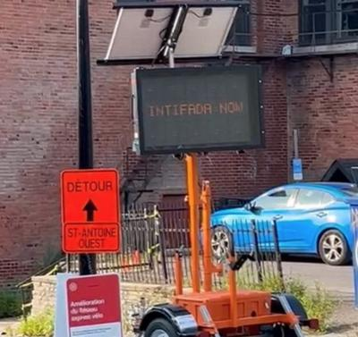

## Claim
Claim: " This image shows a traffic sign in Montreal in July 2024 which displays a 'Free Palestine. Escalate now' message and was authorized by Montreal's Mayor Valérie Plante."

## Actions
```
web_search("Montreal traffic sign Free Palestine")
web_search("Valérie Plante Free Palestine sign")
```

## Evidence
### Evidence from `web_search`
Electronic traffic signs in Montreal displayed pro-Palestinian slogans, including "Free Palestine" and "Escalate now" (). The City of Montreal called the incident an act of vandalism and the Montreal police are investigating. A group called Clash Mtl claimed responsibility.

The CBC News ([https://www.cbc.ca/news/canada/montreal/montreal-traffic-signs-pro-palestinian-slogans-1.7274809](https://www.cbc.ca/news/canada/montreal/montreal-traffic-signs-pro-palestinian-slogans-1.7274809)) and The Canadian Press ([https://www.coastreporter.net/quebec-news/montreal-electronic-traffic-signs-altered-to-display-pro-palestinian-slogans-9264153](https://www.coastreporter.net/quebec-news/montreal-electronic-traffic-signs-altered-to-display-pro-palestinian-slogans-9264153)) reported on the incident. The Montreal Gazette ([https://montrealgazette.com/news/local-news/montreal-traffic-signs-apparently-hacked-to-display-pro-palestinian-political-slogans](https://montrealgazette.com/news/local-news/montreal-traffic-signs-apparently-hacked-to-display-pro-palestinian-political-slogans)) also covered the story.


### Evidence from `web_search`
The Suburban published an article about legal action against Montreal Mayor Valérie Plante regarding pro-Palestinian electronic signs, which displayed messages like "Free Palestine" and "INTIFADA NOW" . The legal action was initiated by Hampstead Mayor Jeremy Levi. The Montreal Gazette reported that electronic roadwork billboards in Montreal displayed anti-Israel messages, including "Free Palestine," "Escalate Now," and "Globalize the Intifada" . Montreal officials stated the signs were vandalized.

The Maple discussed the City of Montreal's removal of pro-Palestine signs. The signs were put up by LaSalle-Émard-Verdun pour la Palestine (LEV4P). The article includes a tweet from Jeremy Levi, who called the signs "hate propaganda" .

*   [https://www.thesuburban.com/news/city\_news/plante-served-over-pro-palestinian-electronic-signs/article\_e0143fdc-d532-5ecf-9a66-095ad0ee8ab9.html](https://www.thesuburban.com/news/city_news/plante-served-over-pro-palestinian-electronic-signs/article_e0143fdc-d532-5ecf-9a66-095ad0ee8ab9.html)
*   [https://www.readthemaple.com/city-of-montreal-illegally-seized-pro-palestine-signs-activists-allege/](https://www.readthemaple.com/city-of-montreal-illegally-seized-pro-palestine-signs-activists-allege/)
*   [https://montrealgazette.com/news/local-news/montreal-mayor-warned-to-act-on-anti-israel-messages-on-road-signs](https://montrealgazette.com/news/local-news/montreal-mayor-warned-to-act-on-anti-israel-messages-on-road-signs)


## Elaboration
The evidence confirms that electronic traffic signs in Montreal displayed pro-Palestinian slogans, including "Free Palestine" and "Escalate now" (). However, the evidence indicates that the City of Montreal considered the signs to be the result of vandalism. Furthermore, there is no evidence to support the claim that Montreal's Mayor Valérie Plante authorized the messages. In fact, legal action was taken against her regarding the signs.

Therefore, the claim is partially inaccurate. The signs did display the message, but the claim that the mayor authorized them is not supported by the evidence.


## Final Judgement
The claim is partially accurate. While the signs did display the message "Free Palestine," the assertion that Montreal's Mayor Valérie Plante authorized the message is not supported by the evidence. The city considered the signs to be the result of vandalism. `false`

### Verdict: FALSE

### Justification
The claim is partially inaccurate. While electronic traffic signs in Montreal displayed "Free Palestine" and other pro-Palestinian slogans, the evidence indicates that the city considered this an act of vandalism, and there is no evidence that Montreal's Mayor Valérie Plante authorized the messages; in fact, legal action was taken against her regarding the signs, as reported by the [Montreal Gazette](https://montrealgazette.com/news/local-news/montreal-mayor-warned-to-act-on-anti-israel-messages-on-road-signs) and [The Suburban](https://www.thesuburban.com/news/city_news/plante-served-over-pro-palestinian-electronic-signs/article_e0143fdc-d532-5ecf-9a66-095ad0ee8ab9.html).
