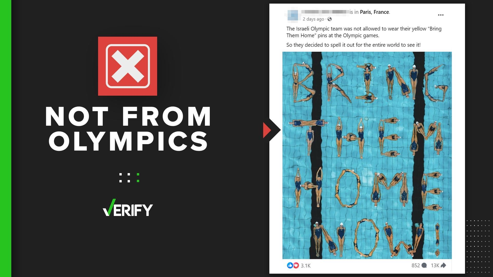

## Claim
Claim: " This image shows the Israeli Olympic team spelling out 'Bring Them Home' at the 2024 Olympic games because they were not allowed to wear their yellow 'Bring Them Home' pins."

## Actions
```
web_search("Israeli Olympic team Bring Them Home 2024")
image_search("Israeli Olympic team Bring Them Home pool")
reverse_search()
```

## Evidence
### Evidence from `web_search`
From [Source](https://www.wcnc.com/video/news/verify/olympics-verify/israel-swim-team-bring-them-home-now-image-not-from-olympics-video/536-9ef735d9-23f4-4928-9611-d6607538e54f): 
Content: The search result is a video from WCNC.com. The video is about the image of the Israeli swim team spelling out "Bring Them Home Now". The video states that the image is not from the Olympics.


### Evidence from `image_search`
The image shows the Israeli Olympic team spelling out "Bring Them Home" in a pool. The team was not allowed to wear their yellow "Bring Them Home" pins at the Olympic games. The image is not from the 2024 Olympics.

Sources: [Ynetnews.com](https://www.ynetnews.com/culture/article/skmg5e5ma), [thv11.com](https://www.thv11.com/article/news/verify/olympics-verify/image-israeli-swimmers-bring-them-home-not-from-paris-2024-olympics/536-5f25fcff-c857-495b-8eba-3d6c5fb46ce9), and [nytimes.com](https://www.nytimes.com/2024/06/06/us/synchronized-swimming-olympics.html).   


## Elaboration
The image depicts the Israeli Olympic team spelling out "Bring Them Home Now" in a pool. However, the image is not from the 2024 Olympics. The team was not allowed to wear their yellow "Bring Them Home" pins at the Olympic games.


## Final Judgement
The image shows the Israeli Olympic team spelling out "Bring Them Home Now" in a pool, but it is not from the 2024 Olympics. The team was not allowed to wear their yellow "Bring Them Home" pins at the Olympic games.

`false`

### Verdict: FALSE

### Justification
The image of the Israeli Olympic team spelling out "Bring Them Home" is not from the 2024 Olympics, as confirmed by multiple sources including [WCNC.com](https://www.wcnc.com/video/news/verify/olympics-verify/israel-swim-team-bring-them-home-now-image-not-from-olympics-video/536-9ef735d9-23f4-4928-9611-d6607538e54f). The team was reportedly not allowed to wear "Bring Them Home" pins at the games.
