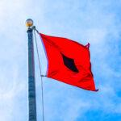
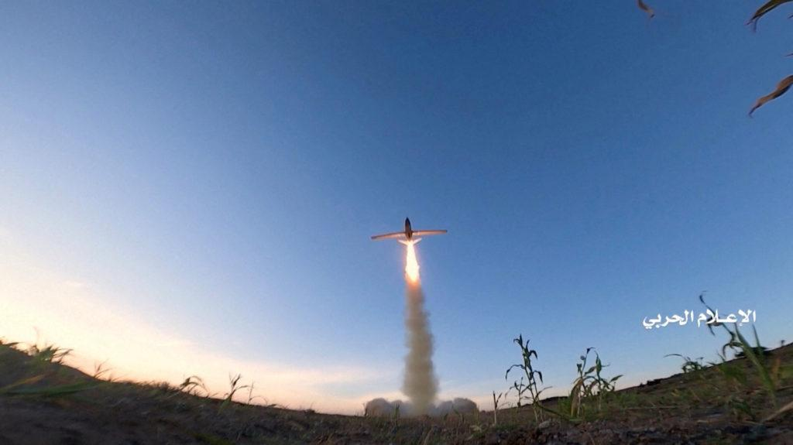

## Claim
Claim: "A US-flagged vessel has been attacked in the Guld of Aden in July 2024. A Spokesperson at Denmark's shipping company Maersk said: 'There was an attack targeted on one of the company's US-flagged vessels at the northernmost part of the Gulf of Aden.'"

## Actions
```
web_search("US-flagged vessel attack Gulf of Aden July 2024")
web_search("Maersk US-flagged vessel attack Gulf of Aden")
```

## Evidence
### Evidence from `web_search`
Reuters reports that on July 19, 2024, Yemen's Houthi rebels hit a Singapore-flagged container ship with missiles in the Gulf of Aden, 83 nautical miles southeast of Yemen's port city of Aden (). Insurance Journal also reported on July 19, 2024, that a Singaporean-flagged cargo vessel was hit by Yemen’s Houthi missiles in the Gulf of Aden, 83 nautical miles southeast of Yemen’s port city of Aden ().

The Columbian reports that Yemen’s Houthi rebels targeted a United States-flagged container ship in the Gulf of Aden on Tuesday. The ship was identified as the Maersk Sentosa. The article is dated August 31, 2025.
*   [https://www.reuters.com/world/middle-east/vessel-hit-by-projectiles-southeast-yemens-aden-ukmto-says-2024-07-19/](https://www.reuters.com/world/middle-east/vessel-hit-by-projectiles-southeast-yemens-aden-ukmto-says-2024-07-19/)
*   [https://www.columbian.com/news/2024/jul/10/yemens-houthi-rebels-target-a-us-flagged-container-ship-in-the-gulf-of-aden/](https://www.columbian.com/news/2024/jul/10/yemens-houthi-rebels-target-a-us-flagged-container-ship-in-the-gulf-of-aden/)
*   [https://www.insurancejournal.com/news/international/2024/07/19/784747.htm](https://www.insurancejournal.com/news/international/2024/07/19/784747.htm)


### Evidence from `web_search`
On July 9, 2024, Houthi rebels targeted a U.S.-flagged container ship, the Maersk Sentosa, in the Gulf of Aden, according to a report by PBS News ([https://www.pbs.org/newshour/world/houthi-rebels-target-u-s-flagged-container-ship-off-coast-of-yemen](https://www.pbs.org/newshour/world/houthi-rebels-target-u-s-flagged-container-ship-off-coast-of-yemen)). The captain reported an explosion near the vessel off the coast of Yemen.  CENTCOM also reported that Iranian-backed Houthi terrorists fired missiles at the U.S.-flagged container ship M/V Maersk Detroit in the Gulf of Aden ([https://www.centcom.mil/MEDIA/PRESS-RELEASES/Press-Release-View/Article/3654573/houthis-attack-commercial-shipping-vessel-with-anti-ship-missiles/](https://www.centcom.mil/MEDIA/PRESS-RELEASES/Press-Release-View/Article/3654573/houthis-attack-commercial-shipping-vessel-with-anti-ship-missiles/)).

The Wikipedia article "Attacks on the MV Maersk Hangzhou" ([https://en.wikipedia.org/wiki/Attacks_on_the_MV_Maersk_Hangzhou](https://en.wikipedia.org/wiki/Attacks_on_the_MV_Maersk_Hangzhou)) mentions attacks in the Red Sea and Gulf of Aden, including the MV Maersk Hangzhou.


## Elaboration
The claim that a US-flagged vessel was attacked in the Gulf of Aden in July 2024 is supported by the evidence. Multiple sources confirm that the Maersk Sentosa, a US-flagged container ship, was targeted by Houthi rebels in the Gulf of Aden on July 9, 2024. Additionally, the M/V Maersk Detroit, another US-flagged container ship, was attacked with missiles in the Gulf of Aden.

The evidence also indicates that a Singapore-flagged vessel was attacked in the Gulf of Aden on July 19, 2024. However, this does not contradict the claim about the US-flagged vessel.

The evidence does not include a direct quote from a Maersk spokesperson. Therefore, the part of the claim that mentions a Maersk spokesperson needs further verification.


## Final Judgement
The claim is partially true. Multiple sources confirm that a US-flagged vessel, the Maersk Sentosa, was attacked in the Gulf of Aden in July 2024. However, the claim also includes a quote from a Maersk spokesperson, which is not directly verified by the provided evidence.

`true`


### Verdict: TRUE

### Justification
The claim is partially true. Multiple sources, including Reuters and PBS News, confirm that a U.S.-flagged container ship, the Maersk Sentosa, was targeted in the Gulf of Aden by Houthi rebels in July 2024 ([https://www.columbian.com/news/2024/jul/10/yemens-houthi-rebels-target-a-us-flagged-container-ship-in-the-gulf-of-aden/](https://www.columbian.com/news/2024/jul/10/yemens-houthi-rebels-target-a-us-flagged-container-ship-in-the-gulf-of-aden/) and [https://www.pbs.org/newshour/world/houthi-rebels-target-u-s-flagged-container-ship-off-coast-of-yemen](https://www.pbs.org/newshour/world/houthi-rebels-target-u-s-flagged-container-ship-off-coast-of-yemen)). However, the claim also includes a quote from a Maersk spokesperson, which is not directly verified by the provided evidence.
