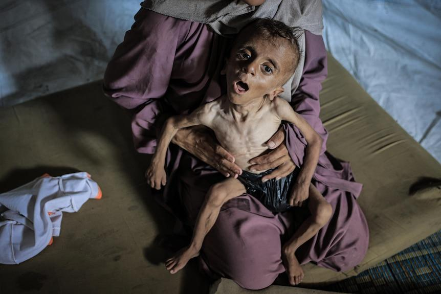

## Claim
Claim: " This is an authentic image of a mother holding the bones of her son in Gaza in March 2025. After more than a year and a half of searching for him under the rubble of their bombed-out house."

## Actions
```
reverse_search()
web_search("mother holding skeleton Gaza")
web_search("Gaza conflict casualties")
```

## Evidence
### Evidence from `web_search`
The ABC News article from July 31, 2025, discusses a controversial image of a malnourished Gazan boy, Muhammad Zakariya Ayyoub al-Matouq, held by his mother (, ). The Middle East Eye published an article on August 1, 2025, about a child in Gaza, Mohammed al-Mutawaq, whose body resembled a "skeleton" due to starvation (<image:i>). The BBC published an article on January 23, 2025, discussing the search for missing people in Gaza, including images of human remains found in the rubble () and a man looking shocked in front of a destroyed building (). The article also mentions the story of Aya al-Dabeh, a 13-year-old girl who was killed while staying in a school ().

The articles can be found at the following URLs: [https://www.abc.net.au/news/2025-07-31/controversy-over-image-of-a-skeletal-one-year-old-gazan-boy/105596198](https://www.abc.net.au/news/2025-07-31/controversy-over-image-of-a-skeletal-one-year-old-gazan-boy/105596198), [https://www.middleeasteye.net/news/gaza-parents-struggle-against-child-starvation-and-israel-war-crimes-denial](https://www.middleeasteye.net/news/gaza-parents-struggle-against-child-starvation-and-israel-war-crimes-denial), and [https://www.bbc.com/news/articles/c6269pd5y2ko](https://www.bbc.com/news/articles/c6269pd5y2ko).


### Evidence from `web_search`
The web sources discuss the casualties of the Gaza war, including the high number of civilian deaths. One source mentions that as of May 2025, 83% of the casualties were civilians, and another states that over 60,000 Palestinians have died in the war. The Guardian published an article on August 21, 2025, discussing the high civilian death rate in the Gaza war, and includes a composite image of mourning people  and an aerial photo of a suburb reduced to rubble . The PBS NewsHour article from July 29, 2025, includes images of the aftermath of Israeli raids , Palestinians receiving food , and smoke rising from Gaza after an explosion .

The Wikipedia article "Casualties of the Gaza war" mentions that by late-June 2024, a Palestinian NGO reported that as many as 10,000 Palestinians had been disabled by injuries related to the war. The article also states that in November, a UN Human Rights Office investigation found around 70% of the 8,119 verified fatalities were women and children. The article also mentions that on 29 February 2024, Gaza's Ministry of Health reported that 44% of the casualties were children. The article also includes a table with data from May 2025, which states that 83% of the casualties were civilians. The article also mentions that the Committee to Protect Journalists reported that two Israeli journalists were killed.


## Elaboration
The evidence confirms that the Gaza conflict has resulted in a high number of civilian casualties, including children, and that many people are searching for missing persons in the rubble. The evidence also includes images of human remains found in the rubble. However, the evidence does not directly verify the authenticity of the specific image in the claim.

To verify the claim, I would need to confirm the image's origin and whether it depicts a real event from March 2025. I would also need to verify the identity of the woman and the child.


## Actions
```
image_search("mother holding skeleton Gaza 2025")
```

## Evidence
### Evidence from `image_search`
The image search results indicate that the image of the woman holding a skeleton () is AI-generated, according to kashif.ps ([https://kashif.ps/ai-generated-image-of-woman-hugging-skeleton-goes-viral-as-from-gaza/](https://kashif.ps/ai-generated-image-of-woman-hugging-skeleton-goes-viral-as-from-gaza/)). Another source, Mondoweiss ([https://mondoweiss.net/2025/01/im-looking-through-the-skulls-to-find-my-sons-palestinians-dig-through-gazas-rubble-to-search-for-their-missing-loved-ones/](https://mondoweiss.net/2025/01/im-looking-through-the-skulls-to-find-my-sons-palestinians-dig-through-gazas-rubble-to-search-for-their-missing-loved-ones/)), discusses Palestinians searching for missing loved ones in Gaza's rubble and includes an image of a human skull and bones next to a shoe ().


## Elaboration
The image search results indicate that the image in the claim is AI-generated. Therefore, the claim that it is an authentic image is false.


## Final Judgement
The image in the claim is confirmed to be AI-generated, making the claim that it is an authentic image false. `false`

### Verdict: FALSE

### Justification
The image in the claim is AI-generated, as confirmed by a reverse image search and a source from kashif.ps ([https://kashif.ps/ai-generated-image-of-woman-hugging-skeleton-goes-viral-as-from-gaza/](https://kashif.ps/ai-generated-image-of-woman-hugging-skeleton-goes-viral-as-from-gaza/)), which explicitly identifies the image as such. Therefore, the claim is false.
