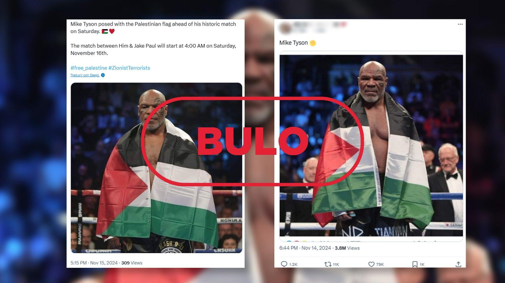

## Claim
Claim: " This is an authentic image of Mike Tyson posing with the Palestinian flag in the ring before his fight against Jake Paul on November, 15, 2024."

## Actions
```
web_search("Mike Tyson Palestinian flag fight")
image_search("Mike Tyson Palestinian flag")
```

## Evidence
### Evidence from `web_search`
The University at Buffalo published an article about a Reuters fact-check article addressing a fake photo of Mike Tyson with a Palestinian flag ([https://engineering.buffalo.edu/computer-science-engineering/news-and-events/news.host.html/content/shared/engineering/home/articles/media-mentions/2024-media-coverage/fact-check--mike-tyson-did-not-pose-with-palestinian-flag-ahead-.detail.html](https://engineering.buffalo.edu/computer-science-engineering/news-and-events/news.host.html/content/shared/engineering/home/articles/media-mentions/2024-media-coverage/fact-check--mike-tyson-did-not-pose-with-palestinian-flag-ahead-.detail.html)).

The New Arab published an article stating that the image of Mike Tyson with the Palestinian flag is an AI-generated "deepfake" ([https://www.newarab.com/news/mike-tyson-palestinian-flag-image-exposed-ai-deepfake](https://www.newarab.com/news/mike-tyson-palestinian-flag-image-exposed-ai-deepfake)). The article mentions that Tyson has never publicly supported the Palestinian cause and that the image was analyzed by Newschecker and an AI detection tool, both of which found evidence of manipulation. 


### Evidence from `image_search`
From [Source](https://www.rtve.es/noticias/20241118/exboxeador-mike-tyson-no-posa-bandera-palestina-imagenes-creadas-ia/16335603.shtml): 
Content: The search result from RTVE.es shows an image of Mike Tyson with the Palestinian flag, but it is labeled as "FAKE". 


## Elaboration
The evidence indicates that the image of Mike Tyson with the Palestinian flag is not authentic. Multiple sources, including a Reuters fact-check article and The New Arab, identify the image as an AI-generated "deepfake." The New Arab article also mentions that Tyson has not publicly supported the Palestinian cause. Additionally, an image search result from RTVE.es labels the image as "FAKE."


## Final Judgement
The claim that the image is authentic is false. Multiple sources confirm the image is a manipulated "deepfake" and not a genuine photograph of Mike Tyson.

`false`

### Verdict: FALSE

### Justification
The image of Mike Tyson with the Palestinian flag is a manipulated "deepfake," as confirmed by multiple sources, including a Reuters fact-check article ([https://engineering.buffalo.edu/computer-science-engineering/news-and-events/news.host.html/content/shared/engineering/home/articles/media-mentions/2024-media-coverage/fact-check--mike-tyson-did-not-pose-with-palestinian-flag-ahead-.detail.html](https://engineering.buffalo.edu/computer-science-engineering/news-and-events/news.host.html/content/shared/engineering/home/articles/media-mentions/2024-media-coverage/fact-check--mike-tyson-did-not-pose-with-palestinian-flag-ahead-.detail.html)) and The New Arab ([https://www.newarab.com/news/mike-tyson-palestinian-flag-image-exposed-ai-deepfake](https://www.newarab.com/news/mike-tyson-palestinian-flag-image-exposed-ai-deepfake)).
