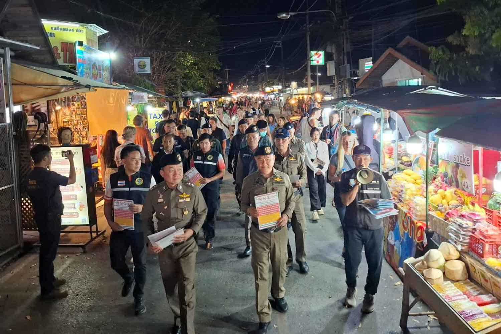

## Claim
Claim: " This image shows Israelis who have stopped fighting the wars in Gaza and Lebanon and moved to become 'settlers' in Pai District, Mae Hong Son Province, Thailand, in February 2025."

## Actions
```
web_search("Israelis settlers Pai District Mae Hong Son Thailand")
web_search("Pai District Mae Hong Son Thailand Israeli community")
reverse_search()
```

## Evidence
### Evidence from `web_search`
The Bangkok Post ([https://www.bangkokpost.com/thailand/general/2966381/no-israeli-settlement-or-business-dominance-found-in-northern-thailands-pai](https://www.bangkokpost.com/thailand/general/2966381/no-israeli-settlement-or-business-dominance-found-in-northern-thailands-pai)) reported on February 23, 2025, that police in Pai district, Mae Hong Son province, did not find any Israeli influence, settlements, or business dominance, and that 4,573 Israelis visited Pai. The Nation Thailand ([https://www.nationthailand.com/news/tourism/40046434](https://www.nationthailand.com/news/tourism/40046434)) published an article on February 18, 2025, refuting social media claims about an Israeli "promised land" in Pai district, stating that Israeli tourists visit legally and no Jewish settlement exists. The Khaosod English ([https://www.khaosodenglish.com/featured/2025/02/23/why-some-thais-fear-israelis-turning-pai-into-an-occupied-land/](https://www.khaosodenglish.com/featured/2025/02/23/why-some-thais-fear-israelis-turning-pai-into-an-occupied-land/)) article discusses fears among some Thais that Israelis are turning Pai District into an occupied land, which the Prime Minister stated were unsubstantiated.

The Khaosod English article also mentions that there are only about 40 to 50 Jewish families residing in Pai. The Nation Thailand article mentions a Chabad House in Pai that caters to Jewish tourists. , , , , , , , , and .


### Evidence from `web_search`
The Bangkok Post published an article on February 17, 2025, discussing concerns about unruly Israeli tourists in Pai District, Mae Hong Son Province, Thailand, including vandalism and illegal employment. The Israeli ambassador to Thailand expressed regret. The article also mentions a newly built synagogue in Pai district. ([https://www.bangkokpost.com/thailand/general/2962860/surge-in-unruly-israeli-tourists-causes-alarm-in-northern-thailands-pai](https://www.bangkokpost.com/thailand/general/2962860/surge-in-unruly-israeli-tourists-causes-alarm-in-northern-thailands-pai))

The Diplomat published an article in February 2025 discussing the scrutiny of Israelis in Pai, Thailand, following an incident of misbehavior. The article mentions the Israeli community in Pai is sizeable, with over half believed to be Israelis. The article also discusses potential security concerns and the unease over an exclusively Israeli footprint in Pai. ([https://thediplomat.com/2025/02/unruly-israeli-visitors-thai-resentment-and-potential-dangers/](https://thediplomat.com/2025/02/unruly-israeli-visitors-thai-resentment-and-potential-dangers/))


### Evidence from `reverse_search`
The Bangkok Post published an article on February 20, 2025, discussing an investigation by Thai immigration into the activities of Israelis in Pai, Thailand, prompted by complaints about their visa status and work permits. The article includes an image  of an event at the Chabad of Pai, a Jewish community center, where Israeli residents and tourists gathered. The Pattaya Mail published an article on August 6, 2025, discussing a controversy surrounding Israeli tourists in Pai, Thailand, including an interview with four Israeli tourists. The article includes images of the tourists .

Both articles mention the presence of Israelis in Pai, Thailand, and the image  is found in the Bangkok Post article.


## Elaboration
The claim is partially supported. The evidence confirms the presence of Israelis in Pai District, Mae Hong Son Province, Thailand, in February 2025, as shown in the image. The image is associated with an event at the Chabad of Pai, a Jewish community center. However, the evidence does not support the claim that these Israelis have stopped fighting wars and moved to become "settlers." While there are concerns about the behavior of Israeli tourists and potential overstaying of visas, the evidence indicates that the situation is more complex, involving tourism, a Jewish community, and scrutiny from Thai authorities.


## Final Judgement
The evidence confirms the presence of Israelis in Pai District, Mae Hong Son Province, Thailand, in February 2025, as shown in the image. However, the claim that these Israelis have stopped fighting wars and moved to become "settlers" is not supported by the evidence. The situation involves tourism, a Jewish community, and scrutiny from Thai authorities. `false`

### Verdict: FALSE

### Justification
The claim is partially accurate. The image depicts Israelis in Pai District, Thailand, in February 2025, as confirmed by multiple sources, including the Bangkok Post ([https://www.bangkokpost.com/thailand/general/2962860/surge-in-unruly-israeli-tourists-causes-alarm-in-northern-thailands-pai](https://www.bangkokpost.com/thailand/general/2962860/surge-in-unruly-israeli-tourists-causes-alarm-in-northern-thailands-pai)). However, the evidence does not support the assertion that they are "settlers" who have stopped fighting wars.
