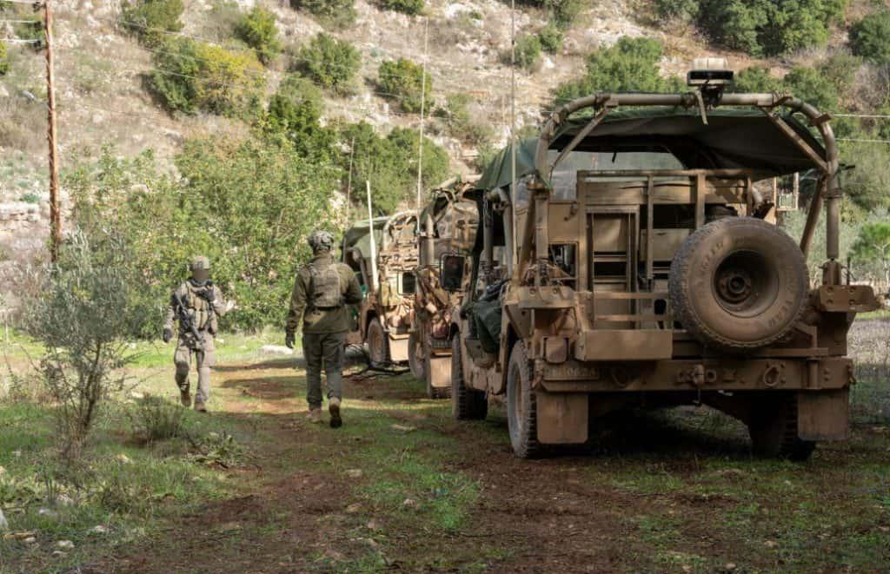

## Claim
Claim: "Commander of the Israeli Air Force, Major General Tomer Bar has been killed by Hеzbollаh in Tel Aviv in a drone attack in November 2024."

## Actions
```
web_search("Tomer Bar killed drone attack")
web_search("Tomer Bar Hezbollah November 2024")
```

## Evidence
### Evidence from `web_search`
The claim that Major General Tomer Bar was killed by Hezbollah in a drone attack is false. An article from aol.com, published on December 12, 2024, fact-checks the claim and states there is no evidence to support it (). Another article from Inshorts, published on December 9, 2024, confirms that Tomer Bar is alive and was not killed in a November drone attack (, , ).

The articles can be found at [https://www.aol.com/fact-check-israeli-general-not-150127650.html](https://www.aol.com/fact-check-israeli-general-not-150127650.html) and [https://inshorts.com/en/news/israeli-air-force-chief-tomer-bar-alive--not-killed-by-hezbollah-1733746115536](https://inshorts.com/en/news/israeli-air-force-chief-tomer-bar-alive--not-killed-by-hezbollah-1733746115536).


### Evidence from `web_search`
Press TV reports that Hezbollah claimed to have targeted the residence of Israeli Air Force Commander Major General Tomer Bar in Tel Aviv with a drone attack on November 18, 2024, which was subject to censorship by Israeli authorities (). The IDF Air Force commander Major General Tomer Bar visited Jabalia on November 17. The Islamic Resistance in the Land of the Two Holy Mosques claimed a drone attack targeting an unspecified target in Tel Aviv on November 17 (). The Long War Journal mentions that Major General Tomer Bar visited a site in southern Lebanon on December 27, 2024 ().

Sources: [https://www.presstv.ir/Detail/2024/11/27/738007/Lebanon-Hezbollah-residence-Tomer-Bar-attack-drones](https://www.presstv.ir/Detail/2024/11/27/738007/Lebanon-Hezbollah-residence-Tomer-Bar-attack-drones), [https://www.longwarjournal.org/archives/2024/12/israeli-forces-in-southern-lebanon-dismantle-more-hezbollah-sites.php](https://www.longwarjournal.org/archives/2024/12/israeli-forces-in-southern-lebanon-dismantle-more-hezbollah-sites.php), [https://www.understandingwar.org/backgrounder/iran-update-november-17-2024](https://www.understandingwar.org/backgrounder/iran-update-november-17-2024)


## Elaboration
The claim is false. While Hezbollah claimed to have targeted the residence of Major General Tomer Bar in Tel Aviv with a drone attack in November 2024, there is no evidence to support the claim that he was killed. Fact-check articles from aol.com and Inshorts confirm that Tomer Bar is alive.


## Final Judgement
The claim that Major General Tomer Bar was killed in a drone attack in November 2024 is demonstrably false. Multiple sources, including fact-check articles, confirm that he is alive.

`false`

### Verdict: FALSE

### Justification
The claim that Major General Tomer Bar was killed in a drone attack in Tel Aviv in November 2024 is false. Fact-checks from aol.com and Inshorts ([https://www.aol.com/fact-check-israeli-general-not-150127650.html](https://www.aol.com/fact-check-israeli-general-not-150127650.html), [https://inshorts.com/en/news/israeli-air-force-chief-tomer-bar-alive--not-killed-by-hezbollah-1733746115536](https://inshorts.com/en/news/israeli-air-force-chief-tomer-bar-alive--not-killed-by-hezbollah-1733746115536)) state there is no evidence to support the claim, and that he is alive.
