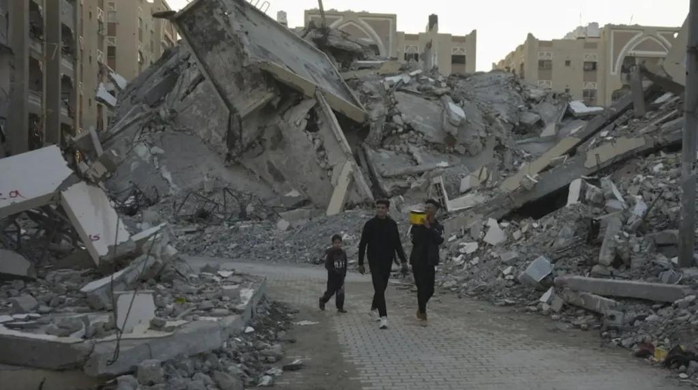

## Claim
Claim: "The population in Gaza has increased by 2.02% since Oct. 7, 2023."

## Actions
```
web_search("Gaza population increase October 7 2023")
web_search("Gaza population statistics")
```

## Evidence
### Evidence from `web_search`
According to a CNN article from January 1, 2025, Gaza's population decreased by 6% in 2024, with approximately 100,000 Palestinians leaving since October 7, 2023, and at least 45,553 killed in Israeli attacks (<image:k>, <image:j>, <image:i>). The Times of Israel also reported a 6% decline, citing the Palestinian Central Bureau of Statistics (PCBS), which indicates a decrease of about 160,000 people, and mentions around 45,500 Palestinians killed since the war began ().

Conversely, an article published by the New York City Foreign Policy Association (NYCFPA) on December 19, 2024, states that the population in Gaza has increased by 2.02% since October 7, 2023, based on growth forecasts from August 2023 ().


### Evidence from `web_search`
The Wikipedia article ([https://en.wikipedia.org/wiki/Gaza_Strip](https://en.wikipedia.org/wiki/Gaza_Strip)) estimates the population of Gaza to be around 2,050,000 in 2025 and mentions a 6% decrease since the start of the war <image:k>. Statista ([https://www.statista.com/topics/11678/gaza-strip/](https://www.statista.com/topics/11678/gaza-strip/)) reports a total population of 2.1 million and mentions casualties and internally displaced refugees since October 7, 2023, due to the war , .

World Population Review ([https://worldpopulationreview.com/cities/palestine/gaza](https://worldpopulationreview.com/cities/palestine/gaza)) estimates Gaza's 2025 population at 823,407, with a 2.84% annual growth.


## Elaboration
The evidence presents conflicting information regarding the population change in Gaza since October 7, 2023. While one source claims a 2.02% increase, other sources indicate a 6% decrease. The claim is based on growth forecasts from August 2023, which may not reflect the actual population changes due to the war.

The evidence from CNN and The Times of Israel indicates a population decrease of 6% since October 7, 2023. This is supported by the Wikipedia article, which also mentions a 6% decrease.

Therefore, the claim that the population increased by 2.02% is not supported by the majority of the evidence, which suggests a decrease.


## Final Judgement
The evidence presents conflicting information. While one source claims a 2.02% increase, other sources indicate a 6% decrease. The claim is based on growth forecasts from August 2023, which may not reflect the actual population changes due to the war.

The claim is demonstrably false as multiple sources indicate a population decrease, not an increase. `false`


### Verdict: FALSE

### Justification
The claim that Gaza's population increased by 2.02% since October 7, 2023, is demonstrably false. Multiple sources, including CNN and The Times of Israel, report a 6% decrease in population since that date, citing factors such as casualties and emigration due to the ongoing conflict. The claim's basis on growth forecasts from August 2023 does not align with the observed population decline.
