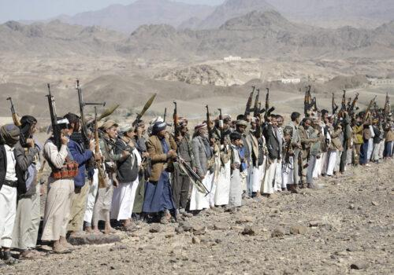
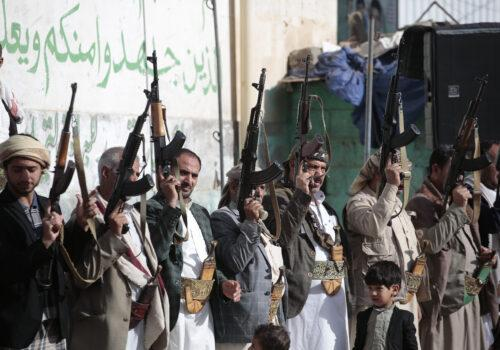

## Claim
Claim: "The Huthi rebels announced the final cessation of their military operations in international waters after Trump won the 2024 US presidential election."

## Actions
```
web_search("Huthi rebels military operations international waters Trump 2024")
```

## Evidence
### Evidence from `web_search`
The Atlantic Council published an article on March 18, 2025, discussing the US approach toward the Houthis, mentioning that Donald Trump ordered airstrikes against Yemen’s Houthi rebels in response to attacks on Red Sea shipping and that Russia has aided Houthi operations. (, , ) [Source](https://www.atlanticcouncil.org/blogs/new-atlanticist/trump-should-not-forget-the-russian-hand-behind-the-houthis/)

An ABC News article, published on July 8, 2025, reports that Houthi rebels attacked ships in the Red Sea, killing mariners, describing the attacks as a "renewed campaign targeting a key maritime route." The attacks are the first since late 2024, after Trump's administration targeted the rebels in airstrikes. [Source](https://abcnews.go.com/International/wireStory/yemens-houthi-rebels-attack-ship-red-sea-killing-123559774) A Wikipedia article discusses the Red Sea crisis, including the timeline, attacks, military operations, and diplomacy, including the 2025 U.S.–Houthi ceasefire. The article also mentions that on 6 May, US president Donald Trump announced a cessation of US strikes as a result of a bilateral ceasefire between the US and the Houthis. [Source](https://en.wikipedia.org/wiki/Red_Sea_crisis)


## Elaboration
The evidence suggests that the Houthis did not cease military operations in international waters after Trump won the 2024 US presidential election. Instead, the evidence indicates that the Houthis continued attacks on ships in the Red Sea, even after Trump ordered airstrikes against them.

The ABC News article from July 8, 2025, mentions a "renewed campaign" by the Houthis targeting a key maritime route, with attacks occurring after late 2024. Furthermore, the Wikipedia article mentions a 2025 U.S.–Houthi ceasefire, suggesting that military operations continued into 2025.

The Atlantic Council article also mentions that Russia has aided Houthi operations, which could imply that the Houthis' military operations were not solely dependent on Trump's actions.


## Final Judgement
The evidence indicates that the Houthis did not cease military operations in international waters after Trump won the 2024 US presidential election. Instead, attacks continued, and the situation evolved into a ceasefire in 2025.

`false`


### Verdict: FALSE

### Justification
The claim is false. Evidence from the Atlantic Council ([Source](https://www.atlanticcouncil.org/blogs/new-atlanticist/trump-should-not-forget-the-russian-hand-behind-the-houthis/)) and ABC News ([Source](https://abcnews.go.com/International/wireStory/yemens-houthi-rebels-attack-ship-red-sea-killing-123559774)) indicates that Houthi military operations continued after Trump's election, with attacks in the Red Sea. A Wikipedia article ([Source](https://en.wikipedia.org/wiki/Red_Sea_crisis)) mentions a 2025 ceasefire, suggesting that military operations persisted into 2025.
