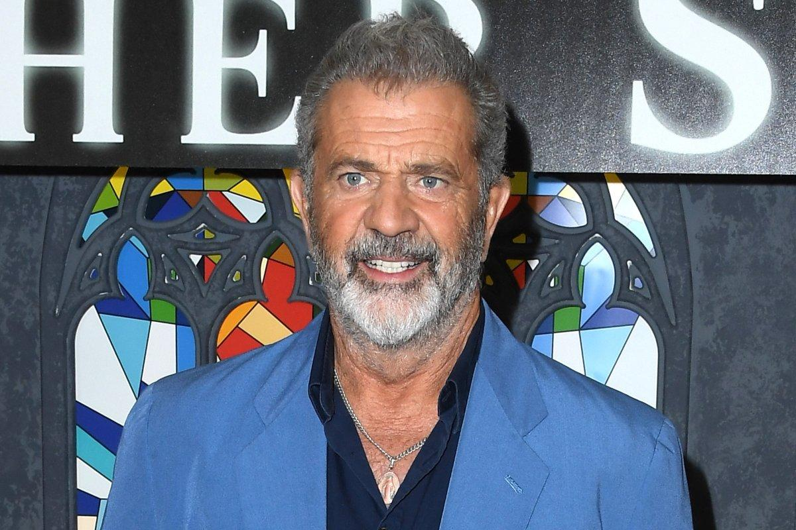
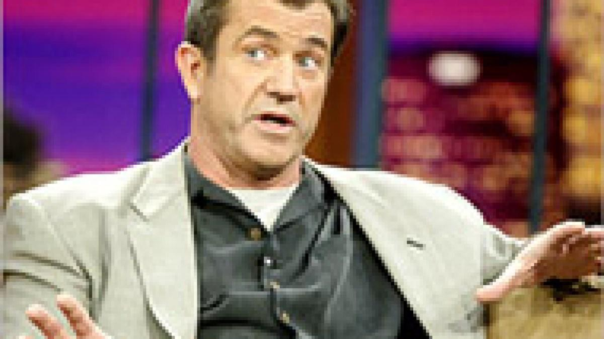

## Claim
Claim: " The image shows a screenshot of an authentic social media post from Mel Gibson saying that Israel will end soon and therefore destroy everything in its way together with a flag in the color of Israel that shows an hourglass."

## Actions
```
web_search("Mel Gibson Israel post")
image_search("Mel Gibson Israel hourglass flag")
reverse_search()
```

## Evidence
### Evidence from `web_search`
The Associated Press ([https://apnews.com/article/fact-check-mel-gibson-israel-post-342335121493](https://apnews.com/article/fact-check-mel-gibson-israel-post-342335121493)) and Yahoo Entertainment ([https://www.yahoo.com/entertainment/fact-check-mel-gibson-posted-235600604.html](https://www.yahoo.com/entertainment/fact-check-mel-gibson-posted-235600604.html)) both fact-checked the claim that Mel Gibson posted on social media about the end of Israel, and found it to be false. The image in the claim is made to look like a social media post, but it was not made by Gibson, who does not have any public social media accounts. 

Newsweek ([https://www.newsweek.com/mel-gibson-scrutiny-antisemitism-israel-palestinian-conflict-1846379](https://www.newsweek.com/mel-gibson-scrutiny-antisemitism-israel-palestinian-conflict-1846379)) published an article discussing Mel Gibson's past controversies, including racist and antisemitic comments. 


### Evidence from `image_search`
From [Source](https://www.aljazeera.com/news/2004/4/4/palestinians-love-mel-gibsons-film): 
Content: Al Jazeera published an article about Mel Gibson. 


## Elaboration
The claim is false. The provided evidence from the Associated Press ([https://apnews.com/article/fact-check-mel-gibson-israel-post-342335121493](https://apnews.com/article/fact-check-mel-gibson-israel-post-342335121493)) and Yahoo Entertainment ([https://www.yahoo.com/entertainment/fact-check-mel-gibson-posted-235600604.html](https://www.yahoo.com/entertainment/fact-check-mel-gibson-posted-235600604.html)) confirms that the image is not an authentic social media post by Mel Gibson. Gibson does not have any public social media accounts.


## Final Judgement
The claim is demonstrably false. Multiple reliable sources, including the Associated Press and Yahoo Entertainment, have fact-checked the image and determined it is not an authentic social media post by Mel Gibson. Gibson does not have any public social media accounts. `false`

### Verdict: FALSE

### Justification
The claim is false. Fact-checks by the Associated Press ([https://apnews.com/article/fact-check-mel-gibson-israel-post-342335121493](https://apnews.com/article/fact-check-mel-gibson-israel-post-342335121493)) and Yahoo Entertainment ([https://www.yahoo.com/entertainment/fact-check-mel-gibson-posted-235600604.html](https://www.yahoo.com/entertainment/fact-check-mel-gibson-posted-235600604.html)) confirm that the image is not an authentic social media post by Mel Gibson, who does not have any public social media accounts.
