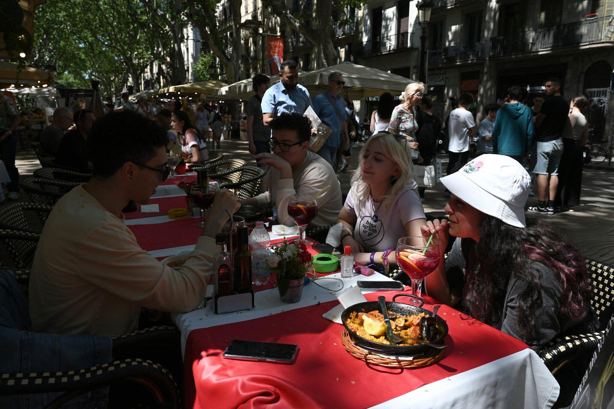

## Claim
Claim: " This image shows the President of FC Barcelona with Israel Embassy Representatives in September 2024 during the ongoing Gaza war."

## Actions
```
web_search("FC Barcelona Israel flag")
web_search("FC Barcelona Israel embassy")
image_search("FC Barcelona president Israel flag")
```

## Evidence
### Evidence from `web_search`
The Jerusalem Post published an article on February 17, 2023, stating that FC Barcelona's president Joan Laporta was presented with an Israeli flag by Israeli diplomats on February 16, 2023, recognizing the club's support for Israel. [] The New Arab published an article on September 11, 2023, discussing Barcelona's decision to reverse its decision to cut ties with Israel. []

Getty Images contains images of FC Barcelona players with Israeli officials and flags from 2013. [], [], [], [], [], [], []


### Evidence from `web_search`
FC Barcelona sent a message of support for Israel, and the president of FC Barcelona, Joan Laporta, invited representatives of the Israeli Embassy in Spain to a soccer match and was presented with an Israeli flag, according to an i24NEWS article published on February 16, 2023. 

In May 2024, The Times of Israel reported that Barcelona's city council voted to cut ties with the Israeli government and suspend its friendship agreement with Tel Aviv, citing the ongoing war in Gaza. 


### Evidence from `image_search`
From [Source](https://www.fcbarcelona.com/en/club/news/2192444/joan-laporta-meets-with-isaac-herzog-president-of-israel): 
Content: FC Barcelona's president, Joan Laporta, met with Isaac Herzog, the President of Israel. 


## Elaboration
The evidence indicates that the image shows FC Barcelona's president, Joan Laporta, with representatives of the Israeli Embassy. This event occurred in February 2023, not September 2024. The evidence also confirms that Barcelona's city council voted to cut ties with the Israeli government in May 2024, citing the ongoing war in Gaza. Therefore, the claim is inaccurate regarding the date and the context of the event.


## Final Judgement
The claim is inaccurate because the image was taken in February 2023, not September 2024. Additionally, the claim mentions the ongoing Gaza war, which is not directly related to the event depicted in the image. `false`

### Verdict: FALSE

### Justification
The image depicts FC Barcelona's president, Joan Laporta, with Israeli representatives in February 2023, as reported by the [Jerusalem Post](https://www.jpost.com/international/article-732077). This event occurred before the date mentioned in the claim and before Barcelona's city council voted to cut ties with the Israeli government in May 2024, as reported by [The Times of Israel](https://www.timesofisrael.com/barcelona-city-council-votes-to-cut-ties-with-israel-over-gaza-war/).
