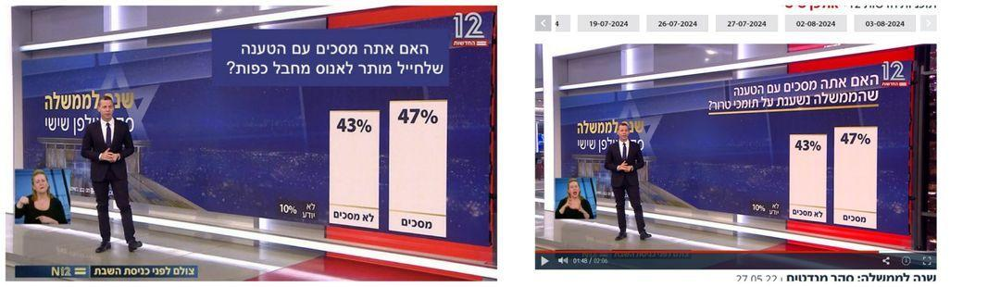

## Claim
Claim: " The image shows a screenshot of an authentic question from Israel's Channel 12 public opinion poll: 'Do you agree with the claim that a solder is allowed to rape a prisoner with his hands tied?'"

## Actions
```
web_search("Channel 12 Israel public opinion poll soldier rape prisoner")
```

## Evidence
### Evidence from `web_search`
The image is a doctored screenshot of a poll from Israel's Channel 12. The original poll, which aired on May 27, 2022, asked about the government's reliance on supporters of terrorism. Channel 12 did not broadcast the poll shown in the image. (, , )

The doctored poll, which claimed to ask about soldiers being allowed to rape prisoners, has been shared online. Another poll, published by the Israeli Institute for National Security Studies, found that 65% of Jewish Israelis oppose criminal prosecution for soldiers suspected of raping Palestinian detainees. ()

*   [https://cedmohub.eu/posts-share-doctored-prisoner-abuse-poll-from-israeli-tv-channel/](https://cedmohub.eu/posts-share-doctored-prisoner-abuse-poll-from-israeli-tv-channel/)
*   [https://komonews.com/news/nation-world/squad-member-shares-fake-poll-claiming-most-israelis-support-rape-of-palestinians-rashida-tlaib-noura-erakat-alex-zeldin-ritchie-torres-israel-palestine-hamas-war-terrorism-gaza](https://komonews.com/news/nation-world/squad-member-shares-fake-poll-claiming-most-israelis-support-rape-of-palestinians-rashida-tlaib-noura-erakat-alex-zeldin-ritchie-torres-israel-palestine-hamas-war-terrorism-gaza)
*   [https://mondoweiss.net/2024/08/65-of-israeli-jews-oppose-criminal-prosecution-for-soldiers-suspected-of-raping-palestinian-detainees/](https://mondoweiss.net/2024/08/65-of-israeli-jews-oppose-criminal-prosecution-for-soldiers-suspected-of-raping-palestinian-detainees/)


## Elaboration
The claim is false. The image is a doctored screenshot of a poll from Israel's Channel 12. The original poll, which aired on May 27, 2022, asked about the government's reliance on supporters of terrorism.


## Final Judgement
The claim is demonstrably false. The image is a manipulated screenshot of a poll from Israel's Channel 12. The original poll's subject was different.

`false`


### Verdict: FALSE

### Justification
The image is a doctored screenshot of a poll from Israel's Channel 12. The original poll, which aired on May 27, 2022, did not ask the question presented in the image, but rather asked about the government's reliance on supporters of terrorism. The claim is therefore demonstrably false.
