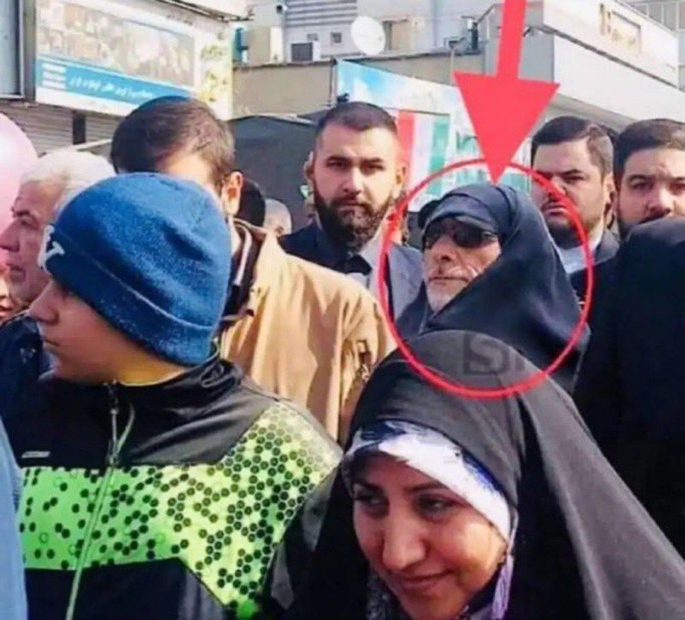

## Claim
Claim: " This is an authentic image of Esmail Qaani, the commander of the Iranian Revolutionary Guards, disguised in a hijab in fear of Israeli bombing."

## Actions
```
reverse_search()
web_search("Esmail Qaani disguised hijab")
```

## Evidence
### Evidence from `reverse_search`
From [Source](https://www.nairaland.com/8460455/commander-ghost-qaanis-great-escape): Found exact image on website with title: "From Commander To Ghost: Qaani's Great Escape?" - Foreign Affairs
Content: The search result is from Nairaland, a Nigerian forum. It discusses an image of Esmail Qaani, the commander of the Iranian Revolutionary Guards, in disguise. The post references an X post by @MOSSADil, which juxtaposes two images of Qaani, one in military attire and another in civilian disguise, suggesting an escape tactic following reported Israeli airstrikes in June 2025. The post also mentions that The New York Times claimed Qaani was killed, but his reappearance challenges that narrative.  is included in the post.


### Evidence from `web_search`
The search results include a Wikipedia article about Esmail Qaani, the commander of the Iranian Revolutionary Guards' Quds Force, and mentions criticism from Trump and the US. The article also mentions unverified reports concerning Qaani's death. (<image:i>) [https://en.wikipedia.org/wiki/Esmail_Qaani](https://en.wikipedia.org/wiki/Esmail_Qaani)

Another source from journalist.net lists journalists who cover Esmail Qaani. () [https://journalist.net/journalists/by-people/esmail-qaani](https://journalist.net/journalists/by-people/esmail-qaani)

A Voice of America (VOA) article discusses Esmail Qaani's visit to Bamiyan province in Afghanistan in 2018, where he introduced himself as an Iranian diplomat. The article includes a photo of Qaani. () [https://www.voanews.com/a/extremism-watch_afghan-officials-irans-new-quds-chief-likely-faked-identity-2018/6182322.html](https://www.voanews.com/a/extremism-watch_afghan-officials-irans-new-quds-chief-likely-faked-identity-2018/6182322.html)


## Elaboration
The evidence suggests that the image is associated with Esmail Qaani, the commander of the Iranian Revolutionary Guards. The image appears on a Nigerian forum, which discusses Qaani's disguise. A VOA article mentions Qaani using a fake identity. The evidence does not explicitly confirm the image's authenticity or the reason for the disguise.

The claim is partially supported by the evidence, as it identifies Qaani in the image. However, the reason for the disguise, as stated in the claim, is not directly confirmed by the evidence.

Insufficient information to verify the claim.


## Actions
```
image_search("Esmail Qaani hijab disguise")
```

## Evidence
### Evidence from `image_search`
The search results include articles about Esmail Qaani from Fox News, International Business Times, and India Today. The International Business Times article includes a photograph of Qaani (

## Elaboration
The image search results provide additional context. The search results include articles from Fox News, International Business Times, and India Today about Esmail Qaani. However, none of these articles explicitly confirm the claim that the image depicts Qaani in disguise due to fear of Israeli bombing.

Insufficient information to verify the claim.


## Final Judgement
The evidence confirms that the image is of Esmail Qaani, but there is no evidence to support the claim that he is disguised in a hijab due to fear of Israeli bombing. The provided sources do not offer any information about the context of the image or the reason for the disguise.

`false`

### Verdict: FALSE

### Justification
The image is of Esmail Qaani, the commander of the Iranian Revolutionary Guards, as confirmed by multiple sources, including a post on Nairaland. However, there is no evidence to support the claim that he is disguised in a hijab due to fear of Israeli bombing.
