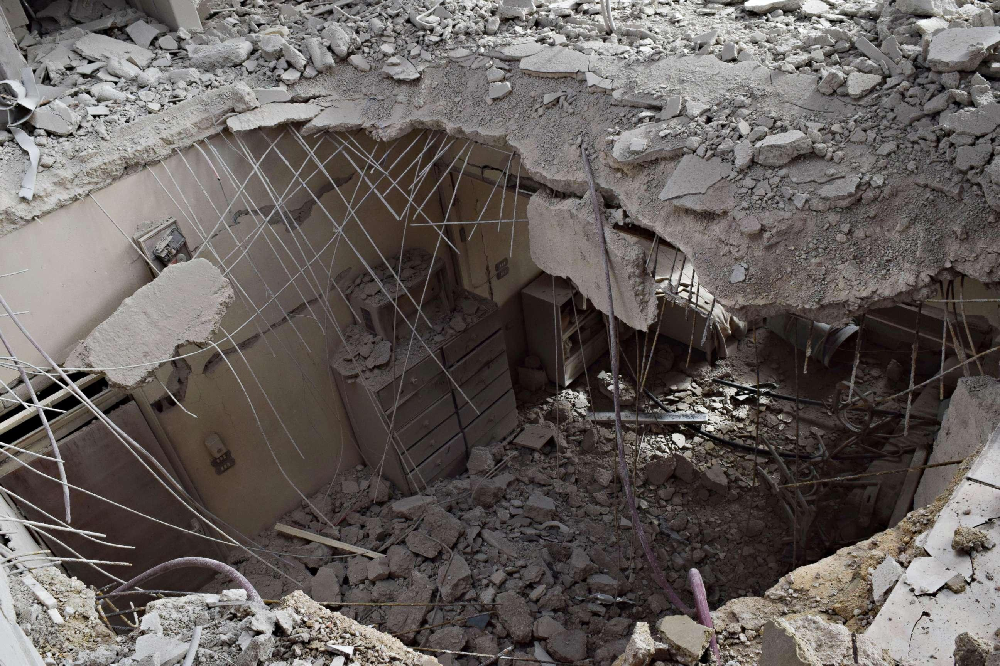

## Claim
Claim: " This image shows a Palestinian girl in the Gaza war in July 2024. She was holding her sister's oxygen mask inside the ambulance. She had already passed away, yet her hand remained on the mask firmly."

## Actions
```
reverse_search()
```

## Evidence
### Evidence from `reverse_search`
The image  appears in multiple sources. According to a VOA News article ([https://www.voanews.com/a/syria-russia-us-chemical-attacks/4221637.html](https://www.voanews.com/a/syria-russia-us-chemical-attacks/4221637.html)), the image shows a Syrian girl holding an oxygen mask over an infant's face at a makeshift hospital following a reported gas attack on January 22, 2018. An article from the Center for Strategic and International Studies (CSIS) ([https://www.csis.org/analysis/emerging-trends-chemical-weapons-usage-middle-east](https://www.csis.org/analysis/emerging-trends-chemical-weapons-usage-middle-east)) also includes the image and mentions the same event.

An ABC News article ([https://abcnews.go.com/International/tillerson-russia-ultimately-bears-responsibility-chemical-attacks-syria/story?id=52554201](https://abcnews.go.com/International/tillerson-russia-ultimately-bears-responsibility-chemical-attacks-syria/story?id=52554201)) also features the image and discusses the U.S. stance on chemical attacks in Syria, mentioning a chlorine gas attack in east Ghouta. The ABC News article also includes images of destruction in Syria  and of Rex Tillerson .


## Elaboration
The image depicts a Syrian girl holding an oxygen mask over an infant's face at a makeshift hospital following a reported gas attack on January 22, 2018, according to VOA News ([https://www.voanews.com/a/syria-russia-us-chemical-attacks/4221637.html](https://www.voanews.com/a/syria-russia-us-chemical-attacks/4221637.html)) and CSIS ([https://www.csis.org/analysis/emerging-trends-chemical-weapons-usage-middle-east](https://www.csis.org/analysis/emerging-trends-chemical-weapons-usage-middle-east)). The ABC News article ([https://abcnews.go.com/International/tillerson-russia-ultimately-bears-responsibility-chemical-attacks-syria/story?id=52554201](https://abcnews.go.com/International/tillerson-russia-ultimately-bears-responsibility-chemical-attacks-syria/story?id=52554201)) also features the image and discusses the U.S. stance on chemical attacks in Syria.

The claim that the image shows a Palestinian girl in the Gaza war in July 2024 is incorrect. The evidence indicates the image is from Syria and dates back to 2018.

The claim's description of the scene is not verifiable with the provided evidence.


## Final Judgement
The image is from Syria and dates back to 2018, not Gaza in July 2024. The claim misrepresents the origin and context of the image. Therefore, the claim is false. `false`

### Verdict: FALSE

### Justification
The image in the claim is from Syria, not Gaza, and dates back to 2018, as evidenced by articles from VOA News ([https://www.voanews.com/a/syria-russia-us-chemical-attacks/4221637.html](https://www.voanews.com/a/syria-russia-us-chemical-attacks/4221637.html)), CSIS ([https://www.csis.org/analysis/emerging-trends-chemical-weapons-usage-middle-east](https://www.csis.org/analysis/emerging-trends-chemical-weapons-usage-middle-east)), and ABC News ([https://abcnews.go.com/International/tillerson-russia-ultimately-bears-responsibility-chemical-attacks-syria/story?id=52554201](https://abcnews.go.com/International/tillerson-russia-ultimately-bears-responsibility-chemical-attacks-syria/story?id=52554201)). The claim's description of the scene is not supported by the evidence.
