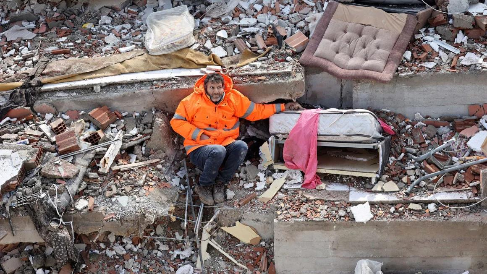

## Claim
Claim: " This image shows a man from Gaza holding the hand of his son killed in an Israeli bombing in July, 2024."

## Actions
```
reverse_search()
```

## Evidence
### Evidence from `reverse_search`
The image shows a father, Mesut Hancer, holding the hand of his 15-year-old daughter, Irmak, who died in an earthquake in Kahramanmaras, Turkey. The earthquake occurred on February 6 or 7, 2023. The photo was taken by Adem Altan.

The image is featured in articles from The Independent ([https://www.independent.co.uk/news/world/middle-east/turkey-earthquake-father-daughter-hold-hands-b2277655.html](https://www.independent.co.uk/news/world/middle-east/turkey-earthquake-father-daughter-hold-hands-b2277655.html)), SBS News ([https://www.sbs.com.au/news/article/the-story-behind-this-turkey-earthquake-photo-that-many-will-never-forget/2ijedstvo](https://www.sbs.com.au/news/article/the-story-behind-this-turkey-earthquake-photo-that-many-will-never-forget/2ijedstvo)), and CNN ([https://www.cnn.com/2023/02/13/middleeast/turkey-quake-man-daughter-hand-photo-intl](https://www.cnn.com/2023/02/13/middleeast/turkey-quake-man-daughter-hand-photo-intl)). 


## Elaboration
The evidence contradicts the claim. The image depicts Mesut Hancer holding the hand of his deceased daughter, Irmak, who died in an earthquake in Turkey in February 2023, not a bombing in Gaza in July 2024. The evidence includes links to articles from The Independent, SBS News, and CNN that confirm this information.


## Final Judgement
The image shows a man in Turkey holding the hand of his deceased daughter after an earthquake in February 2023, not a man from Gaza holding the hand of his son killed in an Israeli bombing in July 2024. The claim is therefore false.

`false`

### Verdict: FALSE

### Justification
The image shows a father, Mesut Hancer, holding the hand of his deceased daughter, Irmak, after an earthquake in Kahramanmaras, Turkey, in February 2023, as reported by sources like The Independent ([https://www.independent.co.uk/news/world/middle-east/turkey-earthquake-father-daughter-hold-hands-b2277655.html](https://www.independent.co.uk/news/world/middle-east/turkey-earthquake-father-daughter-hold-hands-b2277655.html)), SBS News ([https://www.sbs.com.au/news/article/the-story-behind-this-turkey-earthquake-photo-that-many-will-never-forget/2ijedstvo](https://www.sbs.com.au/news/article/the-story-behind-this-turkey-earthquake-photo-that-many-will-never-forget/2ijedstvo)), and CNN ([https://www.cnn.com/2023/02/13/middleeast/turkey-quake-man-daughter-hand-photo-intl](https://www.cnn.com/2023/02/13/middleeast/turkey-quake-man-daughter-hand-photo-intl)). The claim misrepresents the context and location of the event.
