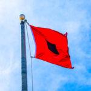

## Claim
Claim: "A US-flagged vessel has been attacked in the Guld of Aden in July 2024. A Spokesperson at Denmark's shipping company Maersk said: 'There was an attack targeted on one of the company's US-flagged vessels at the northernmost part of the Gulf of Aden.'"

## Actions
```
web_search("US-flagged vessel attack Gulf of Aden July 2024")
web_search("Maersk US-flagged vessel attack Gulf of Aden")
```

## Evidence
### Evidence from `web_search`
Reuters reports that on July 19, 2024, Yemen's Houthi rebels hit and damaged a Singapore-flagged container ship in the Gulf of Aden, 83 nautical miles southeast of Yemen's port city of Aden (). The Insurance Journal also reported on July 19, 2024, that a Singaporean-flagged cargo vessel was hit by Houthi missiles in the Gulf of Aden ().

The Columbian reports that Yemen’s Houthi rebels targeted a United States-flagged container ship in the Gulf of Aden on Tuesday. The ship was identified as the Maersk Sentosa. The article is dated August 31, 2025.

*   [Source](https://www.reuters.com/world/middle-east/vessel-hit-by-projectiles-southeast-yemens-aden-ukmto-says-2024-07-19/)
*   [Source](https://www.columbian.com/news/2024/jul/10/yemens-houthi-rebels-target-a-us-flagged-container-ship-in-the-gulf-of-aden/)
*   [Source](https://www.insurancejournal.com/news/international/2024/07/19/784747.htm)


### Evidence from `web_search`
On July 9, 2024, Houthi rebels targeted a U.S.-flagged container ship, the Maersk Sentosa, in the Gulf of Aden, as reported by PBS News ([https://www.pbs.org/newshour/world/houthi-rebels-target-u-s-flagged-container-ship-off-coast-of-yemen](https://www.pbs.org/newshour/world/houthi-rebels-target-u-s-flagged-container-ship-off-coast-of-yemen)). The attack was confirmed by the British military. CENTCOM reported that the U.S.-flagged container ship M/V Maersk Detroit was also targeted with anti-ship ballistic missiles in the Gulf of Aden ([https://www.centcom.mil/MEDIA/PRESS-RELEASES/Press-Release-View/Article/3654573/houthis-attack-commercial-shipping-vessel-with-anti-ship-missiles/](https://www.centcom.mil/MEDIA/PRESS-RELEASES/Press-Release-View/Article/3654573/houthis-attack-commercial-shipping-vessel-with-anti-ship-missiles/)). The USS Gravely (DDG 107) shot down two of the missiles.

Wikipedia ([https://en.wikipedia.org/wiki/Attacks_on_the_MV_Maersk_Hangzhou](https://en.wikipedia.org/wiki/Attacks_on_the_MV_Maersk_Hangzhou)) mentions the attack on the MV Maersk Hangzhou on December 30, 2023, and lists other attacks and military operations in the Red Sea and Yemen, including a July 2024 Israeli attack on Yemen. 


## Elaboration
The claim is partially supported by the evidence. Multiple sources confirm that a U.S.-flagged container ship, the Maersk Sentosa, was targeted in the Gulf of Aden by Houthi rebels in July 2024. Additionally, the U.S.-flagged container ship M/V Maersk Detroit was also targeted with anti-ship ballistic missiles in the Gulf of Aden.

The evidence does not mention a spokesperson from Maersk making a statement about the attack. Therefore, the part of the claim about the Maersk spokesperson cannot be verified.


## Final Judgement
The claim is partially true. Multiple sources confirm that a U.S.-flagged vessel was attacked in the Gulf of Aden in July 2024. However, the evidence does not verify the statement from a Maersk spokesperson.

`false`

### Verdict: FALSE

### Justification
Multiple sources, including Reuters and PBS News, confirm that U.S.-flagged container ships, such as the Maersk Sentosa and M/V Maersk Detroit, were targeted in the Gulf of Aden by Houthi rebels in July 2024. However, the provided evidence does not verify the statement attributed to a Maersk spokesperson.
