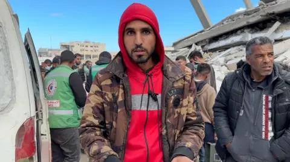
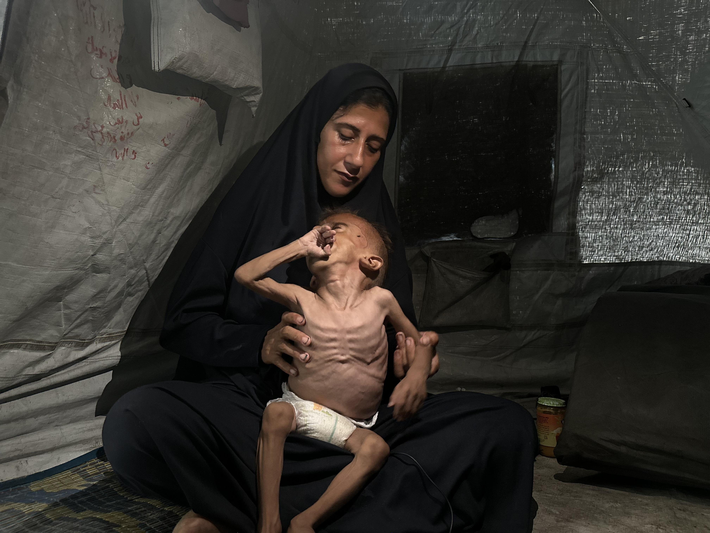
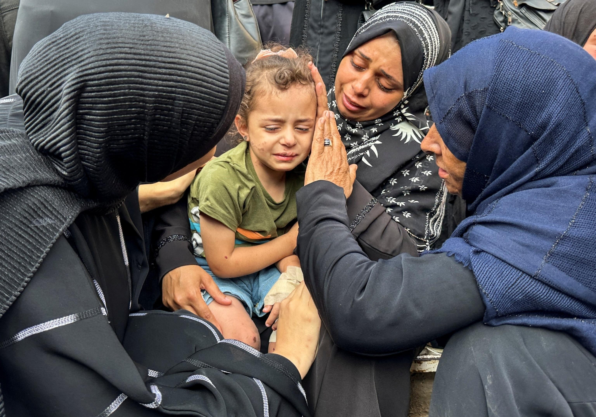
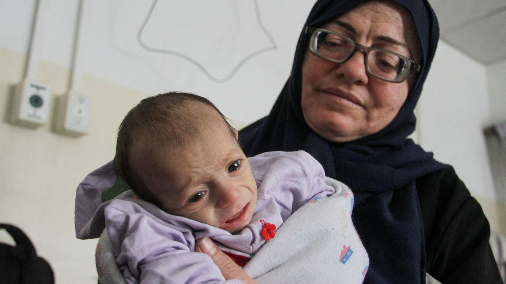

## Claim
Claim: " This is an authentic image of a mother holding the bones of her son in Gaza in March 2025. After more than a year and a half of searching for him under the rubble of their bombed-out house."

## Actions
```
reverse_search()
```

## Evidence
No new evidence found.

## Elaboration
Insufficient information to verify the claim. The reverse image search did not yield any results.


## Actions
```
web_search("Gaza mother holding skeleton")
web_search("Gaza conflict images")
image_search("Gaza mother skeleton")
```

## Evidence
### Evidence from `web_search`
The BBC published an article on January 23, 2025, discussing the search for missing people in Gaza, including images of human remains and a resident who found a skeleton in his home (, ). The Al Jazeera article, published on April 30, 2024, discusses the death of a 92-year-old woman during an Israeli raid in Gaza and includes images of destruction (, , , , , , , , , , , , ). The Euronews article, published on August 4, 2025, discusses a photo of an emaciated child in Gaza that sparked controversy regarding starvation in the region.


### Evidence from `web_search`
Al Jazeera published a photo gallery on January 15, 2025, documenting the war in Gaza over 15 months, including images of destruction, wounded Palestinians, and people mourning their relatives. The Getty Images search result contains multiple images related to the Gaza conflict, showing the aftermath of bombings, destroyed buildings, smoke, and displaced Palestinians. CNN published an article on October 5, 2024, featuring a photo gallery of images from the Israel-Hamas war. The images include the aftermath of attacks, funerals, and the impact of airstrikes on Gaza. The image 

### Evidence from `image_search`
NPR published an image of a mother and a malnourished child in Gaza. () ABC News contains an image of a crying child being comforted by women. () Sky News published an article about the situation in Gaza, including an image of a child. ()

The sources are: [https://www.npr.org/2025/08/05/nx-s1-5488798/gaza-baby-starvation-update](https://www.npr.org/2025/08/05/nx-s1-5488798/gaza-baby-starvation-update), [https://abcnews.go.com/International/dozens-sick-injured-children-medically-evacuated-gaza/story?id=111513259](https://abcnews.go.com/International/dozens-sick-injured-children-medically-evacuated-gaza/story?id=111513259), and [https://news.sky.com/story/gaza-starving-children-and-adults-dying-the-size-of-a-skeleton-says-world-food-programme-boss-13137414](https://news.sky.com/story/gaza-starving-children-and-adults-dying-the-size-of-a-skeleton-says-world-food-programme-boss-13137414).


## Elaboration
The evidence confirms that the image is related to the Gaza conflict. The search results show images of destruction, human remains, and the impact of the conflict on civilians, including children. The BBC article from January 2025 mentions the search for missing people and the discovery of human remains. The image search also yielded images of mothers and children in Gaza, including a malnourished child. However, the evidence does not explicitly confirm the authenticity of the specific image in the claim.


## Actions
```
web_search("image Gaza mother skeleton origin")
```

## Evidence
### Evidence from `web_search`
From [Source](https://www.france24.com/en/live-news/20250806-grok-is-that-gaza-ai-image-checks-mislocate-news-photographs): 
Content: The France24 article, published on August 6, 2025, discusses how AI tools misidentified an image of a starving Gazan girl. The image, taken by AFP photojournalist Omar al-Qattaa, shows nine-year-old Mariam Dawwas in the arms of her mother in Gaza City on August 2, 2025. The AI chatbot Grok incorrectly identified the photo as being taken in Yemen in 2018. 


## Elaboration
The France24 article indicates that AI tools can misidentify images. While the evidence confirms the existence of images related to the Gaza conflict, it does not confirm the authenticity of the image in the claim. The origin of the image is still unclear.


## Final Judgement
The search results confirm that the image is related to the Gaza conflict, but the origin of the image is still unclear. The evidence does not explicitly confirm the authenticity of the specific image in the claim.

`false`

### Verdict: FALSE

### Justification
The claim is unverified. While the search results confirm the existence of images related to the Gaza conflict, the origin and authenticity of the specific image in the claim remain unclear, and AI tools have been shown to misidentify images ([France24](https://www.france24.com/en/live-news/20250806-grok-is-that-gaza-ai-image-checks-mislocate-news-photographs)).
